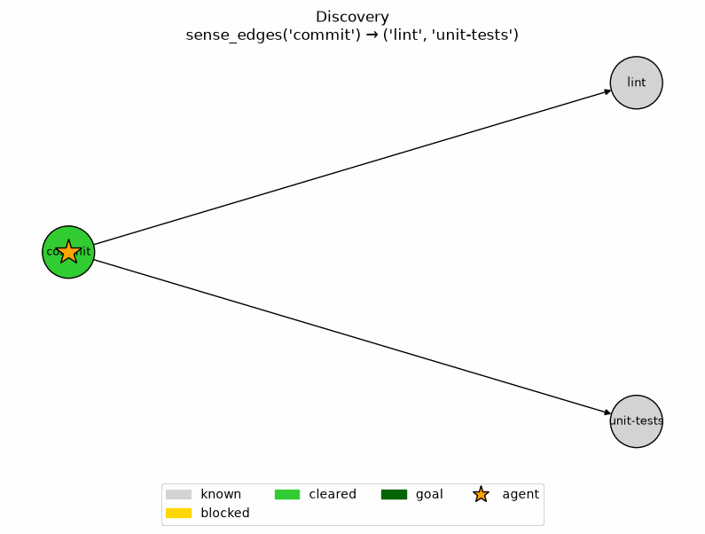
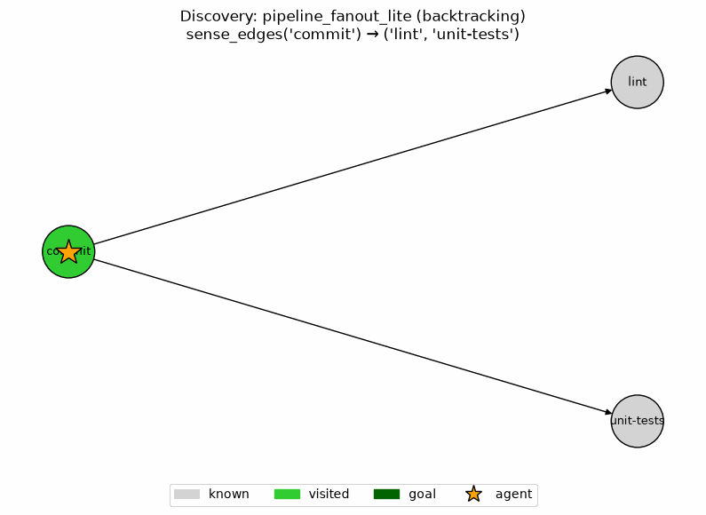
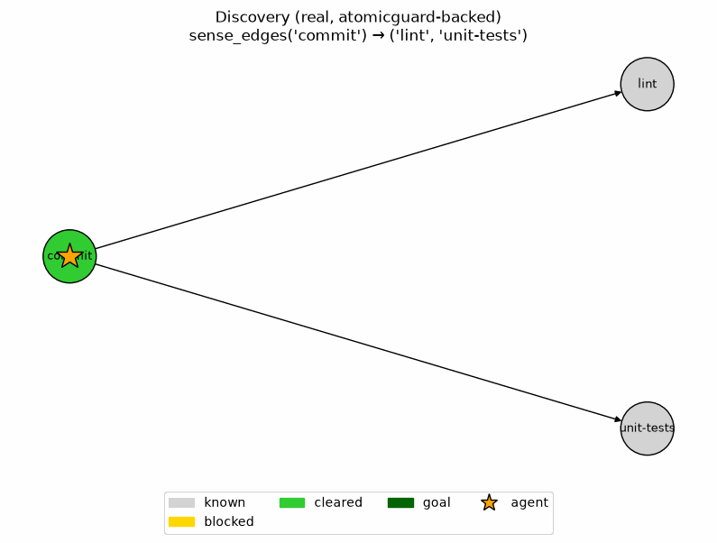

# Discovery: Documentation

This is a sibling document to [`README.md`](README.md), [`TASK_GRAPH_SOLVER.md`](TASK_GRAPH_SOLVER.md), and [`PATH_MAINTENANCE.md`](PATH_MAINTENANCE.md), for a third variation on what an agent can know about its environment:

- **`README.md`'s and `TASK_GRAPH_SOLVER.md`'s search algorithms** (BFS/DFS/Greedy/A*, D* Lite, AO*) assume the agent **knows** the environment — the whole maze or the whole DAG is given up front. Search means finding (or re-finding) a route through something already visible.
- **`PATH_MAINTENANCE.md`'s agent** also knows the environment, plus has committed to a specific path through it — its job is keeping the nodes on that path healthy, not finding routes at all.
- **This document's agents don't know the environment.** They have to build that knowledge incrementally, from bounded lookahead and experience, rather than reading it off a fully-specified graph.

## LRTA\* (Learning Real-Time A\*)

The one discovery algorithm actually built so far, living in `task_graph_solver/algorithms/lrta_star.py` — moved into this document from `TASK_GRAPH_SOLVER.md`, where it was previously grouped alongside D* Lite and AO* despite not sharing their "environment already known" assumption.

`LRTAStarLearner` learns `h_table` — a per-node cost estimate — for `retry_flavor="repair"` nodes only, over repeated trials via an `env_factory(trial_index)` callable. Each trial starts fresh; what persists across trials is the learned heuristic, not the environment state. The update rule mirrors LRTA*'s classic backup: `h(s) ← max(h(s), retries_spent(s) + min_over_successors(h(successor)))` — the estimate can only grow, never shrink, and stops moving once the true worst case has actually been observed. It composes backward over successor costs on a known graph, closer to an AO*-style backup than a flat max over a node's own retry cost alone. In the `repair_packages_lite` demo below specifically, `repair`'s only successor (`verify`) is `retry_flavor="sensing"`, so it never enters `h_table` and contributes `0` to the sum — the two forms of the rule coincide in this one scenario, which is why the frame-by-frame walkthrough below only ever shows `h(repair) = retries_spent(repair)`.

**Scenario**: `repair_packages_lite` (`task_graph_solver/scenarios/repair_packages_lite.py`) — the same scenario `TASK_GRAPH_SOLVER.md`'s D* Lite section uses, shared infrastructure rather than duplicated. It's the cleanest isolation of the "repair-attempt retry is learnable cost" signal: exactly one `repair`-flavor node, no sibling retry flavors to blend into the same estimate.

A node with `pass_probability=0.3` (`rmax=8`) run through `LRTAStarLearner` for 25 trials. `h(repair)` starts at 4 (an early, lucky sequence of failures), jumps to 7 the first time a worse trial is actually observed, and then holds. This is the same node used throughout `documentation/lrta/beyond_the_maze.md`'s repair-cost discussion, now actually learned rather than only described.

**Trial-by-trial walkthrough of the update rule, including why trial 1 doesn't start at the true worst case:** [`documentation/task-graph/experiments/03_lrta_star_convergence.md`](documentation/task-graph/experiments/03_lrta_star_convergence.md).

**Testing**: `task_graph_solver/tests/test_lrta_star.py`, `task_graph_solver/tests/test_learning_curve.py` (the convergence chart itself). Runs alongside `task_graph_solver`'s other tests — `make test-task-graph` / `uv run pytest task_graph_solver/tests/ -v`.

## Discovering the topology itself

LRTA* still starts each trial with the *node* it's learning about — and the whole `task_graph_solver` graph structure — fully known; only the *retry cost* is unknown. `discovery/` is a step further: an environment where the agent doesn't know what comes next at all, and has to sense it from the current node rather than reading it off a pre-built graph — the "should we make the environment unknown, agent finds the next node from information in the current node" question raised while working on `path_maintenance/`'s job-lifecycle step, and deliberately deferred there as out of scope for node-repair.

**`DiscoveryNode`/`DiscoveryEnvironment`/`DiscoveryAgent`**, in `discovery/` (a new top-level package, sibling to `maze_solver/`, `task_graph_solver/`, `path_maintenance/`, sharing no code with any of them). The edge direction flips relative to every prior environment: a node carries `notifies` — who it tells, push-direction — rather than `requires` — what it depends on, pull-direction — mirroring how a real CI pipeline only knows who it notifies when it finishes, not who depends on it. The environment exposes exactly one query, `sense_edges(node_id)`, and holds no position state at all: the agent tracks its own current position and start id, the same convention every prior environment already used. Movement is constrained to the current node's already-sensed `notifies` — no teleporting to a merely-known-but-unvisited id, and (since there's no backward edge either) no backtracking once a branch is committed to. AND-joins (`requires`) are deferred to a later step.

**Scenario**: `pipeline_fanout_lite` (`discovery/scenarios/pipeline_fanout_lite.py`) — six nodes, two fan-out branch points, reconvergent at a single AND-free join (`merge-gate`), exactly one reachable node with no `notifies` (`deploy`, the goal). Reconvergence is load-bearing, not decorative: since the agent can never backtrack, a strict tree would let an unlucky branch choice permanently strand it from the goal.

**Traversal (step 1)**: forward-committed, lowest-id tie-break — not classical DFS/BFS, since both assume the ability to return to a skipped branch, which this environment's one-way movement rule denies. `DiscoveryAgent` walks `commit → lint → merge-gate → deploy` in 4 senses, leaving `unit-tests`/`integration-tests` known-but-never-visited — correct behavior, not an incomplete walk, since the goal condition is "reach a node with no `notifies`," not "visit everything you've heard of."

**Full write-up, including the frame-by-frame GIF walkthrough**: [`documentation/discovery/experiments/01_pipeline_fanout_lite.md`](documentation/discovery/experiments/01_pipeline_fanout_lite.md).

**Backtracking exploration (step 2)**: the "no backtracking" line above was a real, structural limit of step 1's policy, not a permanent feature of the environment — it's what stranded `unit-tests`/`integration-tests`. Letting `DiscoveryAgent` retrace an already-walked path (never a jump to a merely-known id, and never re-sensing an already-known node) turns this into the classical "exploring an unknown graph" problem, where depth-first search with backtracking is the provably right answer once retracing is free — see [`documentation/discovery/backtracking-exploration/algorithm_fit.md`](documentation/discovery/backtracking-exploration/algorithm_fit.md) for the full comparison against BFS and learned/RL-style exploration. On `pipeline_fanout_lite`, unchanged: `DiscoveryAgent` now visits all 6 nodes in 10 moves (6 senses, `total_cost == 10`), comfortably inside the `2×|edges| = 12` bound.

**Full write-up**: [`documentation/discovery/experiments/02_pipeline_fanout_backtracking.md`](documentation/discovery/experiments/02_pipeline_fanout_backtracking.md). This is also the piece of groundwork the later `requires`/AND-joins step was blocked on.

**Testing**: `discovery/tests/` (25 tests). Runs alongside this repo's other suites — `make test-discovery` / `uv run pytest discovery/tests/ -v`.

**AND-joins (step 3)**: step 2's own walk shows the bug this step fixes: `deploy` got sensed at move 3, before `unit-tests`/`integration-tests` were ever touched. `DiscoveryNode` gains `requires` (pull-direction, mirroring `GraphNode`/`JobNode`), and `DiscoveryAgent` gains a third state — `cleared`, alongside `known`/`visited` — a node whose own `requires` are all themselves `cleared`. A `visited`-but-not-`cleared` node is blocked: treated as having no candidates, forcing an immediate backtrack. Plain backtracking alone isn't enough, though — a node can become clearable only *after* the walk has already backtracked past it entirely, which a naive "exclude only `cleared`" extension turns into a genuine non-termination bug (caught by hand-tracing before it became a runtime infinite loop). The fix: exploration stays exactly as step 2 built it, plus a Kahn-style readiness sweep between phases that resumes at a newly-clearable blocked node by replaying an already-known route — never a jump to an unvisited id. See [`documentation/discovery/and-joins/algorithm_fit.md`](documentation/discovery/and-joins/algorithm_fit.md) for the full derivation, the prior-art discussion (Kahn's algorithm / this repo's own `ready_nodes()`/`AOStarExecutor`, and the deliberate non-reuse of `task_graph_solver`'s parked, eager `PlanningExecutor._ensure()`).

On `merge-gate.requires = (lint, integration-tests)`: `DiscoveryAgent` now reaches `deploy` last (6th of 6 senses) instead of 4th, in 14 moves against 6 senses.

**Full write-up**: [`documentation/discovery/experiments/03_pipeline_fanout_and_joins.md`](documentation/discovery/experiments/03_pipeline_fanout_and_joins.md).

**Testing**: `discovery/tests/` (54 tests, up from 25 — every step 1/2 test still passes unmodified, since `requires=()` clears instantly and the new gating logic is a structural no-op on graphs that don't use it).

## Bridging to real, stateful nodes (`real_discovery/`)

Every step above runs `DiscoveryAgent` against `DiscoveryNode`, a frozen dataclass whose `notifies`/`requires` are static fields — right for "does the agent build up an unknown topology," but the node itself represents nothing real. `real_discovery/atomicguard_backed/` is a small, deliberately scoped experiment bridging this arc with the already-built, already-proven `atomicguard.ActionPair`/`DualStateAgent` machinery from `real_task_graph_solver/atomicguard_backed/`: `StatefulDiscoveryNode` carries a real, guard-checked `check_action_pair` instead of a static `notifies` field, and `StatefulDiscoveryEnvironment.sense_edges()` reads a node's real `notifies` off the `Artifact` a real subprocess call actually produces — "the node represents the state of the world," read fresh each time, no simulated ticking.

The validating claim: `discovery.agents.discovery_agent.DiscoveryAgent` runs **completely unmodified** against this new environment — its only environment dependencies (`sense_edges`/`sense_requires`/`get_move_cost`) are exactly this environment's public shape — and reproduces the identical walk (path, `nodes_sensed`, `total_cost`, `blocked_nodes`, `goal_reached`) as the plain `DiscoveryEnvironment` does over the same `pipeline_fanout_lite` topology, this time backed by real `cat`-over-fixture subprocess calls rather than dataclass fields: 6 senses / 10 moves ungated, 6 senses / 14 moves gated.

**Design and scope**: [`documentation/discovery/atomicguard-bridge/environment_design.md`](documentation/discovery/atomicguard-bridge/environment_design.md) — the node-ownership resolution (local guard-checked state vs. cross-node `requires`/cleared bookkeeping, matching `atomicguard`'s own `WorkflowStep`/`WorkflowState` split), and the explicit "small steps" scope (no repair, no dynamic node discovery, `discovery/` itself untouched).

The gated walk over `pipeline_fanout_lite`, run for real: `deploy` reached last (6th of 6 senses), 14 moves — identical to experiment 3's own numbers, this time driven by real `cat`-over-fixture subprocess calls instead of dataclass fields.

**Full write-up**: [`documentation/discovery/experiments/04_real_discovery_bridge.md`](documentation/discovery/experiments/04_real_discovery_bridge.md).

**Testing**: `real_discovery/atomicguard_backed/tests/` (31 tests, all against real subprocess calls, no mocking).

## Related documents

- [`documentation/lrta/beyond_the_maze.md`](documentation/lrta/beyond_the_maze.md) — the real-`atomicguard` stress test that motivated `retry_flavor`'s three-way split (sensing/generation/repair), and the repair-cost node LRTA*'s demo uses.
- [`documentation/task-graph/environment_design.md`](documentation/task-graph/environment_design.md) — `TaskNode`/`TaskGraphEnvironment`, shared infrastructure between this document and `TASK_GRAPH_SOLVER.md`.
- [`documentation/discovery/environment_design.md`](documentation/discovery/environment_design.md) — `DiscoveryNode`/`DiscoveryEnvironment`/`DiscoveryAgent`'s full design, including every resolved fork (arrival-gating, position-tracking, movement, goal, cost) and the AND-joins deferral later resolved in `and-joins/`.
- [`documentation/discovery/scenario.md`](documentation/discovery/scenario.md) / [`algorithm_fit.md`](documentation/discovery/algorithm_fit.md) — `pipeline_fanout_lite`'s topology and the traversal-policy reasoning.
- [`documentation/discovery/and-joins/environment_design.md`](documentation/discovery/and-joins/environment_design.md) — step 3's `requires`, the three-state (known/visited/cleared) model, and why the reachability constraint is heavier this time than step 1's goal-ambiguity caveat.
- [`documentation/discovery/and-joins/scenario.md`](documentation/discovery/and-joins/scenario.md) / [`algorithm_fit.md`](documentation/discovery/and-joins/algorithm_fit.md) — why `(lint, integration-tests)` specifically, and the readiness-sweep algorithm with its full worked trace.
- [`documentation/discovery/atomicguard-bridge/environment_design.md`](documentation/discovery/atomicguard-bridge/environment_design.md) — `StatefulDiscoveryNode`/`StatefulDiscoveryEnvironment`, the node-ownership resolution, and the real, unmodified-`DiscoveryAgent` proof against `real_discovery/atomicguard_backed/`.
- [`documentation/discovery/experiments/04_real_discovery_bridge.md`](documentation/discovery/experiments/04_real_discovery_bridge.md) — the bridge experiment run for real, frame-by-frame, with GIF: identical walk to experiment 3, this time driven by real subprocess sensing.
- [`documentation/discovery/backtracking-exploration/algorithm_fit.md`](documentation/discovery/backtracking-exploration/algorithm_fit.md) — step 2: backtracking turns this into the "exploring an unknown graph" problem, DFS-vs-BFS-vs-learned-exploration compared directly.
- [`documentation/discovery/experiments/02_pipeline_fanout_backtracking.md`](documentation/discovery/experiments/02_pipeline_fanout_backtracking.md) / [`03_pipeline_fanout_and_joins.md`](documentation/discovery/experiments/03_pipeline_fanout_and_joins.md) — steps 2 and 3 run for real, frame-by-frame, with GIFs.
- [`TASK_GRAPH_SOLVER.md`](TASK_GRAPH_SOLVER.md) — the sibling document for the "environment already known" side of `task_graph_solver`: `TopologicalExecutor`, `AOStarExecutor`, `DStarLiteExecutor`.
