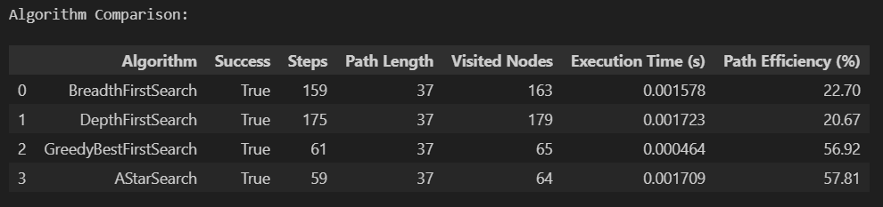
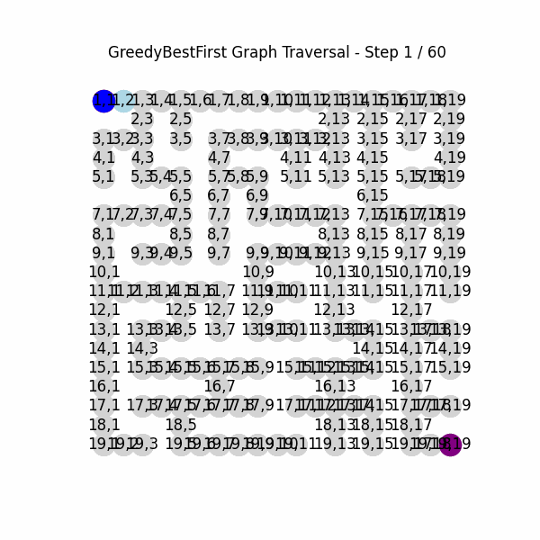
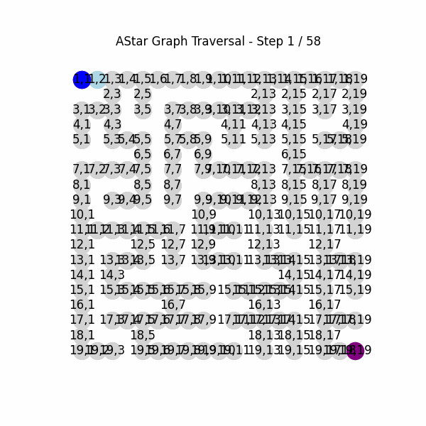

# Maze Solving Agents System Documentation

This project implements a comprehensive system for exploring, visualizing, and comparing different search algorithms in maze environments, with a focus on providing educational insights into algorithm behavior.

## Environment Setup Details

```bash
# Install uv in its own global location (using pipx)
pipx install uv
# Create a virtual environment
uv venv
# Activate the environment
source .venv/bin/activate
# Install the Jupyter notebook packages
uv pip install ipykernel jupyter notebook
# Install required packages
uv pip install networkx matplotlib pandas mazelib imageio
```

## System Architecture

The system is designed with a modular, extensible architecture that separates concerns into distinct components:

1. **Environment Generation** - Creates and manages maze environments
2. **Search Algorithms** - Implements various path-finding strategies
   - **Uninformed** - Algorithms that don't use domain knowledge (BFS, DFS)
   - **Informed** - Algorithms that use heuristics (Greedy Best-First, A*)
3. **Results Analysis** - Tracks and analyzes algorithm performance
4. **Visualization** - Renders maze states and algorithm execution
   - **Dashboards** - Interactive visualizations for each algorithm type
5. **Experimentation** - Provides tools for systematic algorithm comparison

This architecture allows easy addition of new search algorithms and experimental metrics. The code is organized in a modular structure:

```
maze_solver/
├── algorithms/            # Search algorithm implementations
│   ├── uninformed/        # Algorithms without heuristics (BFS, DFS)
│   └── informed/          # Algorithms using heuristics (Greedy, A*)
├── core/                  # Core functionality and data structures
└── visualization/         # Visualization and educational components
    └── dashboards/        # Algorithm-specific dashboards
```

## Class Overview

UML class diagram showing the relationships between all classes [class_diagram.md](class_diagram.md)

### Config

```python
@dataclass
class Config:
    """Configuration parameters for maze generation and search algorithms.

    This class centralizes all configuration options for maze environments and search
    algorithms to ensure consistent parameter usage throughout the system.

    Attributes:
        maze_size (int): Grid dimensions (nxn) of the maze. Default is 5x5.
        maze_id (Optional[int]): Seed for reproducible maze generation. If None, a random seed is used.
        visualization_delay (float): Delay in seconds between search algorithm steps for visualization.
        show_exploration (bool): Whether to visualize the exploration process.
        max_steps (Optional[int]): Maximum steps for search algorithm execution before termination.
    """
```

### MazeEnvironment

```python
class MazeEnvironment:
    """Handles maze generation, state management and visualization.

    This class encapsulates all maze-related functionality, including generating mazes,
    managing maze state, creating graph representations for search algorithms, and
    providing visualization capabilities.

    Attributes:
        config (Config): Configuration parameters for the maze.
        grid (numpy.ndarray): Binary maze representation (0=path, 1=wall).
        start (Tuple[int, int]): Starting position, typically (1,1).
        end (Tuple[int, int]): Goal position, typically at the bottom-right corner.
        optimal_path (List[Tuple[int, int]]): Shortest solution path from start to end.
        optimal_path_length (int): Length of the shortest solution path.
        graph (Dict): Graph representation of maze for search algorithms.

    Methods:
        generate(): Creates new maze using Sidewinder algorithm.
        is_valid_move(state): Checks if move is legal.
        visualize(path, visited, show_optimal, save_path): Displays/saves maze visualization.
        get_minimum_steps(): Returns optimal path length.
    """
```

### SearchResult

```python
@dataclass
class SearchResult:
    """Enhanced container for search algorithm results with educational metrics.

    This class stores and analyzes the results of search algorithm execution, providing
    not only basic path information but also educational metrics and insights about
    algorithm performance. It includes capabilities for generating reports and
    visualizations of search results.

    Attributes:
        path (List[Tuple[int, int]]): Solution path from start to goal, if found.
        visited (List[Tuple[int, int]]): List of nodes visited during search, in order.
        success (bool): Whether the search found a valid path to the goal.
        steps (int): Number of algorithm steps executed during search.
        execution_time (float): Time taken for the search execution in seconds.
        exploration_history (List): History of algorithm state for visualization/analysis.
        node_discovery (Dict): Maps each node to the step when it was first discovered.
        node_expansion (Dict): Maps each node to the step when it was expanded.

    Methods:
        to_dict(): Convert results to dictionary for analysis.
        generate_educational_report(): Generate educational report about the search.
    """
```

### SearchAlgorithmBase

```python
class SearchAlgorithmBase(ABC):
    """Abstract base class for search algorithms.

    This class provides a common interface and shared functionality for all search
    algorithms. It handles common tasks such as error handling, timing, and basic
    visualization capabilities. Specific search algorithms should inherit from this
    class and implement the abstract search method.

    Attributes:
        env (MazeEnvironment): Reference to maze environment being searched.
        config (Config): Configuration parameters for the search algorithm.
        name (str): Algorithm name, derived from class name.

    Methods:
        search(start, goal): Search for path (to be implemented by subclasses).
        run(start, goal): Run with timing and error handling.
        visualize_search(result, delay): Visualize the search process.
    """
```

### SearchAlgorithmBase

```python
class SearchAlgorithmBase(ABC):
    """Abstract base class for search algorithms with enhanced shared functionality.

    This class provides a common interface and shared functionality for all search
    algorithms. It handles common tasks such as error handling, timing, and basic
    visualization capabilities. Specific search algorithms should inherit from this
    class and implement the abstract search method.

    Attributes:
        env (MazeEnvironment): Reference to maze environment being searched.
        config (Config): Configuration parameters for the search algorithm.
        name (str): Algorithm name, derived from class name.

    Methods:
        search(start, goal): Abstract method to search for path.
        run(start, goal): Run search with timing and error handling.
        _reconstruct_path(parent, start, goal): Reconstruct path from parent pointers.
        create_search_result(...): Create standardized result object.
        visualize_search(result, delay): Abstract method for step-by-step visualization.
    """
```

### UninformedSearch

```python
class UninformedSearch(SearchAlgorithmBase):
    """Base class for uninformed search algorithms (BFS, DFS).

    Uninformed search algorithms don't use domain knowledge beyond the problem definition.
    They differ primarily in their frontier data structure and expansion strategy.

    Methods:
        search(start, goal): Generic uninformed search implementation.
        _initialize_frontier(start): Abstract method to initialize frontier data structure.
        _get_next_node(frontier): Abstract method to get the next node from frontier.
        _add_to_frontier(frontier, node): Abstract method to add a node to frontier.
        _frontier_representation(frontier): Abstract method for visualization.
        _create_step_info(...): Create step info dictionary for visualization.
    """
```

### InformedSearch

```python
class InformedSearch(SearchAlgorithmBase):
    """Base class for informed search algorithms (Greedy Best-First, A*).

    Informed search algorithms use domain knowledge (heuristics) to guide the search.

    Methods:
        _initialize_metrics(start, goal): Initialize common metrics for informed search.
        _calculate_f(g, h): Abstract method to calculate f-value based on g and h.
        _should_update_node(...): Abstract method to determine if a node's path should be updated.
        _create_step_info(...): Create step info for informed search visualization.
    """
```

### BreadthFirstSearch

```python
class BreadthFirstSearch(UninformedSearch):
    """Breadth-First Search implementation with enhanced educational output.

    This class implements the BFS algorithm for maze solving with detailed tracking
    of algorithm execution for educational purposes. BFS guarantees the shortest
    path in unweighted graphs by exploring nodes in order of their distance from
    the start node using a FIFO queue.

    The implementation provides comprehensive visualization and educational
    features to illustrate how BFS works step-by-step.

    Methods:
        _initialize_frontier(start): Initialize a queue with the start node.
        _get_next_node(frontier): Get the next node from the queue (FIFO).
        _add_to_frontier(frontier, node): Add a node to the end of the queue.
        _frontier_representation(frontier): Convert queue to list for visualization.
        _create_step_info(...): Create step info with queue terminology.
    """
```

### DepthFirstSearch

```python
class DepthFirstSearch(UninformedSearch):
    """Depth-First Search implementation.

    This class implements the DFS algorithm for maze solving. DFS explores deeply
    along each branch before backtracking, which can be more memory-efficient but
    may not find the shortest path.

    Methods:
        _initialize_frontier(start): Initialize a stack with the start node.
        _get_next_node(frontier): Get the next node from the stack (LIFO).
        _add_to_frontier(frontier, node): Add a node to the top of the stack.
        _frontier_representation(frontier): Return stack as list for visualization.
        _create_step_info(...): Create step info with stack terminology.
    """
```

### GreedyBestFirstSearch

```python
class GreedyBestFirstSearch(InformedSearch):
    """Greedy Best-First Search implementation.

    Greedy Best-First Search always expands the node that appears closest to the goal
    according to a heuristic function, without considering the cost to reach that node.
    It can find solutions quickly but is not guaranteed to find the optimal path.

    Methods:
        _calculate_f(g, h): For Greedy Best-First Search, f = h.
        _should_update_node(...): Update if node is not in frontier.
        search(start, goal): Perform Greedy Best-First Search.
        visualize_search(result, delay): Visualize search with heuristic information.
    """
```

### AStarSearch

```python
class AStarSearch(InformedSearch):
    """A* Search implementation with educational output.

    A* combines the cost-so-far (g-value) with a heuristic estimate (h-value)
    to guide search. It balances finding a short path with finding it quickly,
    and is guaranteed to find the optimal path if the heuristic is admissible.

    Methods:
        _calculate_f(g, h): Calculate f-value using g + h formula for A* search.
        _should_update_node(...): Update if node is not in frontier or we found a better path.
        search(start, goal): Perform A* Search from start to goal.
        visualize_search(result, delay): Visualize with educational information about f, g, h values.
    """
```

### MazeExperiments

```python
class MazeExperiments:
    """Manages experiments with maze search algorithms.

    This class provides tools for running systematic experiments on search
    algorithms across different maze configurations. It supports batch testing
    with multiple algorithms, maze sizes, and iterations to generate statistically
    meaningful performance data.

    Attributes:
        base_path (Path): Directory where experiment results are stored.
        experiment_id (str): Unique identifier for the current experiment run.

    Methods:
        run_maze_size_experiment(algorithm_classes, maze_sizes, iterations): Tests performance across maze sizes.
        visualize_maze_size_experiment(df): Creates visualizations of experiment results.
    """
```

### SearchAlgorithmDashboard

```python
class SearchAlgorithmDashboard(ABC):
    """Abstract base class for search algorithm educational dashboards.

    This class provides a common framework for creating educational dashboards
    for different search algorithms. It handles visualization, animation, and
    educational explanations of algorithm execution.

    Attributes:
        env (MazeEnvironment): The maze environment being searched.
        result (SearchResult): The results from running the algorithm.
        algorithm_name (str): Name of the algorithm being visualized.
        steps_data (List): Processed exploration history data for visualization.

    Methods:
        _extract_history_data(): Abstract method to process exploration history.
        get_frontier_name(): Abstract method for frontier data structure name.
        create_maze_graph(): Create a NetworkX graph from maze data.
        _plot_maze(ax, step_data): Plot the maze with current path and visited nodes.
        _plot_algorithm_state(ax, step_data): Abstract method for algorithm-specific state.
        _print_step_explanation(step_data): Abstract method for educational explanations.
        visualize_step(step_idx): Display a single step with educational information.
        animate_on_graph(output_file, fps, size): Animate algorithm on graph representation.
        create_gif(filename, fps, dpi): Create a GIF animation from algorithm steps.
    """
```

### BFSDashboard

```python
class BFSDashboard(SearchAlgorithmDashboard):
    """Educational dashboard for visualizing Breadth-First Search algorithm.

    This class provides a comprehensive educational tool for visualizing and
    understanding the Breadth-First Search algorithm. It includes capabilities
    for step-by-step visualization, animated GIF creation, graph visualization,
    and interactive explanations of BFS concepts.

    Methods:
        get_frontier_name(): Return "Queue (Frontier)".
        _extract_history_data(): Process BFS exploration history into visualization data.
        _plot_algorithm_state(ax, step_data): Plot BFS-specific state visualization.
        _draw_frontier_table(ax, step_data, before_label, after_label): Draw queue visualization.
        _print_step_explanation(step_data): Print BFS-specific educational explanations.
    """
```

### DFSDashboard

```python
class DFSDashboard(SearchAlgorithmDashboard):
    """Educational dashboard for visualizing Depth-First Search algorithm.

    This class provides tools for visualizing the DFS algorithm's execution,
    with emphasis on the stack-based frontier and depth-first exploration pattern.

    Methods:
        get_frontier_name(): Return "Stack (Frontier)".
        _extract_history_data(): Process DFS exploration history into visualization data.
        _plot_algorithm_state(ax, step_data): Plot DFS-specific state visualization.
        _draw_frontier_table(ax, step_data, before_label, after_label): Draw stack visualization.
        _print_step_explanation(step_data): Print DFS-specific educational explanations.
    """
```

### GreedyBestFirstDashboard

```python
class GreedyBestFirstDashboard(SearchAlgorithmDashboard):
    """Educational dashboard for visualizing Greedy Best-First Search algorithm.

    This dashboard focuses on visualizing heuristic-based search, highlighting
    how nodes are selected based on their estimated distance to the goal.

    Methods:
        get_frontier_name(): Return "Priority Queue (Frontier)".
        _extract_history_data(): Process exploration history with heuristic data.
        _plot_algorithm_state(ax, step_data): Plot state with heuristic information.
        _draw_frontier_table(ax, step_data): Draw priority queue with heuristic values.
        _print_step_explanation(step_data): Print explanations emphasizing heuristic-based decisions.
    """
```

### AStarDashboard

```python
class AStarDashboard(SearchAlgorithmDashboard):
    """Educational dashboard for visualizing A* Search algorithm.

    This dashboard provides visualizations that highlight the combination of
    path cost (g) and heuristic (h) that defines A* Search's f-value prioritization.

    Methods:
        get_frontier_name(): Return "Priority Queue (Frontier)".
        _extract_history_data(): Process exploration history with f, g, and h values.
        _plot_algorithm_state(ax, step_data): Plot state with f, g, h information.
        _draw_frontier_table(ax, step_data): Draw priority queue with f, g, h values.
        _print_step_explanation(step_data): Print explanations of A*'s balanced approach.
    """
```

## Example Usage

### Basic Example

```python
# Import necessary classes
from maze_solver.core.config import Config
from maze_solver.core.environment import MazeEnvironment
from maze_solver.algorithms.uninformed.breadth_first_search import BreadthFirstSearch

# Create a maze environment
config = Config(maze_size=10, visualization_delay=0.3)
env = MazeEnvironment(config)

# Create a BFS algorithm
bfs = BreadthFirstSearch(env)

# Run the search
result = bfs.run()

# Print the results
print(result)

# Visualize the final state
env.visualize(path=result.path, visited=set(result.visited))
```

### Using Different Algorithms

```python
from maze_solver.core.config import Config
from maze_solver.core.environment import MazeEnvironment
from maze_solver.algorithms.uninformed.breadth_first_search import BreadthFirstSearch
from maze_solver.algorithms.uninformed.depth_first_search import DepthFirstSearch
from maze_solver.algorithms.informed.greedy_best_first_search import GreedyBestFirstSearch
from maze_solver.algorithms.informed.a_star_search import AStarSearch

# Create a maze environment
config = Config(maze_size=10)
env = MazeEnvironment(config)

# Create algorithm instances
bfs = BreadthFirstSearch(env)
dfs = DepthFirstSearch(env)
greedy = GreedyBestFirstSearch(env)
astar = AStarSearch(env)

# Run each algorithm and collect results
bfs_result = bfs.run()
dfs_result = dfs.run()
greedy_result = greedy.run()
astar_result = astar.run()

# Compare path lengths
print(f"BFS path length: {len(bfs_result.path) if bfs_result.path else 0}")
print(f"DFS path length: {len(dfs_result.path) if dfs_result.path else 0}")
print(f"Greedy path length: {len(greedy_result.path) if greedy_result.path else 0}")
print(f"A* path length: {len(astar_result.path) if astar_result.path else 0}")
```

### Step-by-Step Visualization

```python
from maze_solver.core.config import Config
from maze_solver.core.environment import MazeEnvironment
from maze_solver.algorithms.uninformed.breadth_first_search import BreadthFirstSearch

config = Config(maze_size=5, show_exploration=True)
env = MazeEnvironment(config)

# Create an instance of the search algorithm
bfs = BreadthFirstSearch(env)

# Run and visualize
result = bfs.run()
bfs.visualize_search(result)
```

### Compare Multiple Algorithms

```python
from maze_solver.core.config import Config
from maze_solver.core.environment import MazeEnvironment
from maze_solver.algorithms.uninformed.breadth_first_search import BreadthFirstSearch
from maze_solver.algorithms.uninformed.depth_first_search import DepthFirstSearch
from maze_solver.algorithms.informed.greedy_best_first_search import GreedyBestFirstSearch
from maze_solver.algorithms.informed.a_star_search import AStarSearch
from maze_solver.visualization.reports import compare_search_algorithms

# Run the comparison function
comparison_df, results = compare_search_algorithms(maze_size=10, maze_id=42)

# Print comparison results
print(comparison_df)
```

### Educational Dashboards

```python
from maze_solver.core.config import Config
from maze_solver.core.environment import MazeEnvironment
from maze_solver.algorithms.uninformed.breadth_first_search import BreadthFirstSearch
from maze_solver.visualization.dashboards.breadth_first_search import BFSDashboard

config = Config(maze_size=5, show_exploration=True, visualization_delay=0.8)
env = MazeEnvironment(config)

# Create BFS instance and run search
bfs = BreadthFirstSearch(env)
result = bfs.run()

# Create an educational dashboard
dashboard = BFSDashboard(env, result)

# Visualize a specific step
dashboard.visualize_step(3)

# Create animations
dashboard.create_gif(fps=1.5)
dashboard.animate_on_graph(fps=3, size=6)
```

### Using Multiple Dashboards

```python
from maze_solver.core.config import Config
from maze_solver.core.environment import MazeEnvironment
from maze_solver.algorithms.uninformed.breadth_first_search import BreadthFirstSearch
from maze_solver.algorithms.uninformed.depth_first_search import DepthFirstSearch
from maze_solver.algorithms.informed.greedy_best_first_search import GreedyBestFirstSearch
from maze_solver.algorithms.informed.a_star_search import AStarSearch
from maze_solver.visualization.dashboards.breadth_first_search import BFSDashboard
from maze_solver.visualization.dashboards.depth_first_search import DFSDashboard
from maze_solver.visualization.dashboards.greedy_best_first_search import GreedyBestFirstDashboard
from maze_solver.visualization.dashboards.a_star_search import AStarDashboard
from maze_solver.visualization.reports import compare_search_algorithms

# Run comparison of all algorithms on the same maze
comparison_df, results = compare_search_algorithms(maze_size=10, maze_id=42)

# Get the environment used in the comparison
env = results["BreadthFirstSearch"].env

# Create dashboards for each algorithm
bfs_dashboard = BFSDashboard(env, results["BreadthFirstSearch"])
dfs_dashboard = DFSDashboard(env, results["DepthFirstSearch"])
greedy_dashboard = GreedyBestFirstDashboard(env, results["GreedyBestFirstSearch"])
astar_dashboard = AStarDashboard(env, results["AStarSearch"])

# Create GIFs for all algorithms
bfs_dashboard.create_gif(filename="bfs_animation.gif", fps=2)
dfs_dashboard.create_gif(filename="dfs_animation.gif", fps=2)
greedy_dashboard.create_gif(filename="greedy_animation.gif", fps=2)
astar_dashboard.create_gif(filename="astar_animation.gif", fps=2)

# Create graph animations
bfs_dashboard.animate_on_graph(output_file="bfs_graph.gif", fps=3, size=6)
dfs_dashboard.animate_on_graph(output_file="dfs_graph.gif", fps=3, size=6)
greedy_dashboard.animate_on_graph(output_file="greedy_graph.gif", fps=3, size=6)
astar_dashboard.animate_on_graph(output_file="astar_graph.gif", fps=3, size=6)
```

## Example Output

### Algorithm Performance Comparison

The system provides comprehensive comparison outputs showing the performance characteristics of different search algorithms on the same maze:



As shown in the table, all algorithms found the optimal path length (37), but with different efficiency characteristics:
- **BreadthFirstSearch** guarantees optimal paths in unweighted graphs with 22.70% path efficiency
- **DepthFirstSearch** explores deeply first, with slightly lower efficiency (20.67%)
- **GreedyBestFirstSearch** dramatically reduces steps (61) with excellent path efficiency (56.92%) and fastest execution time
- **AStarSearch** achieves the highest path efficiency (57.81%) with the fewest steps (59)

### Algorithm Visualization

Each algorithm's exploration process can be visualized as animated graphs, highlighting their distinctive search patterns:

**Breadth-First Search** explores nodes in layers, ensuring optimal paths in unweighted graphs:


**Depth-First Search** explores deeply along each branch before backtracking:


**Greedy Best-First Search** uses heuristics to prioritize nodes that appear closest to the goal:


**A* Search** combines path cost and heuristic estimates for efficient goal-directed search:


These visualizations show:
- **Path exploration**: Yellow nodes represent explored areas
- **Frontier**: Light blue nodes show the algorithm's current frontier
- **Current path**: Green highlighting shows the path being considered
- **Start/Goal**: Blue and purple nodes represent start and goal positions

The system uses intelligent frame sampling techniques to create readable visualizations even for algorithms with thousands of steps:
- Key frame selection focusing on significant algorithm state changes
- Adaptive sampling based on total step count
- Viewport management for large mazes
- Performance options for controlling animation detail level

Additional visualization formats include:
- Step-by-step interactive exploration
- Maze grid visualization with color-coded cells
- Summary multi-panel visualizations showing key algorithm stages
- Algorithm-specific state visualizations (queue, stack, priority queue)

### Results and Metrics

The `SearchResult` provides comprehensive metrics about the search:

```
✅ Search succeeded in 14 steps (0.003s)
📏 Path length: 9 nodes
🔍 Visited nodes: 15 nodes (1.07 nodes/step)
⚙️ Efficiency: 60.0% (path nodes / visited nodes)
🌲 Average branching factor: 1.50 neighbors/node
⏱️ Average time per step: 0.21 ms
```

## Implementation Deep Dive

Note: as of 22/04/2025 this needs reviewing as the code has been updated.

For a more detailed understanding of the inner workings of the system, explore the deep_dive.md file. This document provides:

- Sequence diagram illustrating the flow of method calls during execution
- Detailed explanation of algorithm implementation details
- Discussion of design choices and tradeoffs

The [deep_dive.md](deep_dive.md) file is particularly useful for developers looking to extend the system with new algorithms or to understand the educational aspects of the implementation.