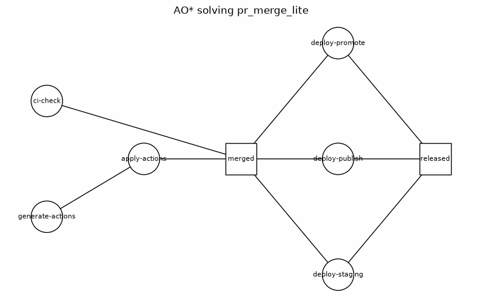
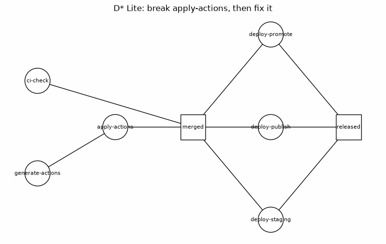
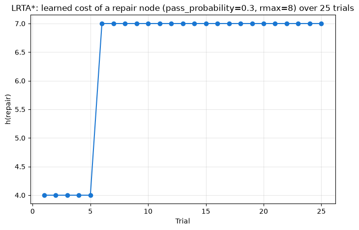
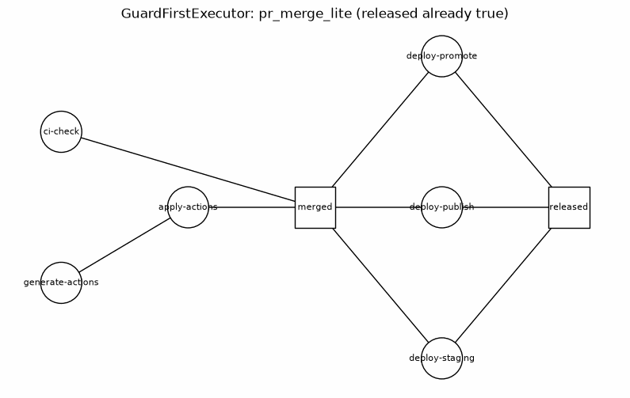
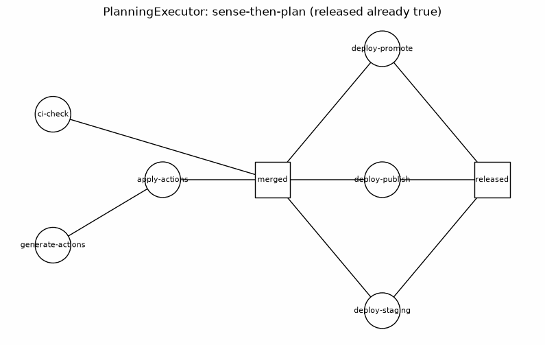
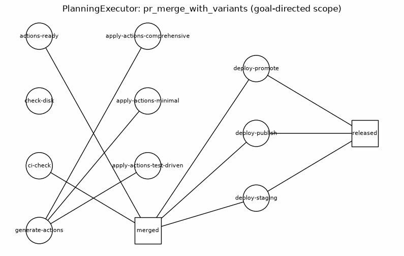
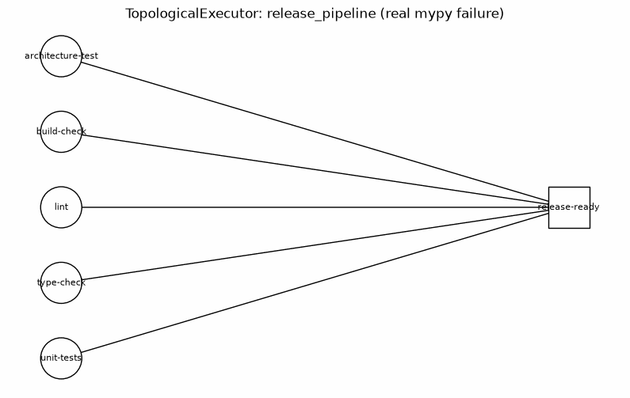
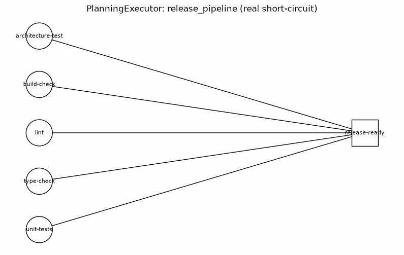

# Task Graph Solver: Documentation

This is a sibling document to [`README.md`](README.md), in the same spirit and structure, for a different environment: **`task_graph_solver`**, a toy simulation of DS-PDDL-style guard-graph workflows (GitHub PR merges, disk checks, package repair — anything shaped like [`atomicguard`](https://github.com/thompsonson/atomicguard)'s `examples/sysadmin/`), built to run and watch D* Lite, LRTA*, and AO* actually execute, rather than only read about them.

Where `maze_solver`'s environment is a grid — an agent occupies one cell, choosing which neighbor to move to (an OR-choice) — `task_graph_solver`'s environment is a DAG of guarded tasks connected by **AND**-only `requires` edges: a task is ready only once *every* one of its dependencies has succeeded. That's the one structural feature the maze can't produce without deliberately constructing it, and it's the reason this whole module exists — see [`documentation/task-graph/environment_design.md`](documentation/task-graph/environment_design.md) for the full design rationale.

## Environment Setup

```bash
# Same uv-based workflow as the maze_solver setup in README.md
uv venv
source .venv/bin/activate
uv pip install pytest networkx matplotlib imageio

# Run the test suite
uv run pytest task_graph_solver/tests/ -v
# or: make test-task-graph
```

No real `gh`/`bash` commands ever run — every task's outcome is a simulated draw from a configured probability. See [`documentation/task-graph/environment_design.md`](documentation/task-graph/environment_design.md)'s Environment Analysis for why.

## System Architecture

```
task_graph_solver/
├── core/
│   ├── config.py          # TaskGraphConfig - just the RNG seed
│   ├── domain.py           # TaskNode, AttemptOutcome
│   ├── environment.py      # TaskGraphEnvironment
│   └── results.py          # ExecutionResult
├── algorithms/
│   ├── topological.py      # TopologicalExecutor - baseline, no heuristic, no repair
│   ├── ao_star.py           # AOStarExecutor - AND-composition cost tracking + OR-group pruning
│   ├── d_star_lite.py       # DStarLiteExecutor - incremental repair via sensed breaks/fixes
│   ├── lrta_star.py         # LRTAStarLearner - learns retry cost over repeated trials
│   ├── guard_first.py       # GuardFirstExecutor - check invariant before paying for a repair
│   └── planning.py          # PlanningExecutor - goal-directed, sense-then-plan (recursive ensure())
├── scenarios/
│   ├── disk_check_lite.py         # 1 node, no edges - the trivial baseline
│   ├── repair_packages_lite.py    # 2-node linear chain - cleanest LRTA*/D* Lite demo
│   ├── pr_merge_lite.py           # 8 nodes, two AND-joins - the motivating case
│   └── pr_merge_with_variants.py  # pr_merge_lite + an OR-group (3 apply-actions variants) + a true orphan
└── visualization/
    ├── graph_view.py        # DAG rendering + GIF animation (networkx + matplotlib + imageio)
    └── learning_curve.py    # LRTA* convergence line chart
```

Full build order and the algorithm-to-scenario mapping: [`documentation/task-graph/algorithm_fit.md`](documentation/task-graph/algorithm_fit.md).

## Class Overview

### TaskNode

```python
@dataclass
class TaskNode:
    """A guarded task: one node in a task graph.

    Modeled on a DS-PDDL Action Pair (Guard + Generator + Effector), simplified
    to what a simulation needs. `kind` and `retry_flavor` are independent
    fields on purpose: conflating them (e.g. assuming "acting" always means
    "repair" flavor) was the mistake documentation/lrta/beyond_the_maze.md had
    to correct once already, when a pure local generation step turned out to
    be neither straightforwardly sensing nor acting in the real system's sense.

    Attributes:
        id: Unique identifier within a TaskGraphEnvironment.
        kind: "sensing" (idempotent, read-only) or "acting" (world-mutating).
        retry_flavor: What a retry at this node actually means - "sensing"
            (absorbing transient infra flakiness), "generation" (an LLM
            output failed local format validation), or "repair" (a real
            world-mutating action was attempted and failed). Only "repair"
            retries are real learnable cost for an LRTA*-style agent.
        pass_probability: Per-attempt chance of a Guard pass.
        rmax: Total attempt budget before this node is declared FATAL.
        r_patience: Consecutive-failure threshold that escalates to FATAL
            before rmax is exhausted. Must be strictly less than rmax,
            mirroring the invariant found in atomicguard's own source
            (application/workflow.py, "Extension 09").
        requires: AND-dependencies - every id here must be satisfied before
            this node is ready to attempt. There is no OR-equivalent.
        invariant_pass_probability: Chance this node's invariant already
            holds, checkable for free before ever attempting a repair.
            Defaults to 0.0 ("never already satisfied"), so every scenario
            built before this existed keeps its exact prior behavior. See
            documentation/task-graph/guard-first/environment_design.md.
    """
```

### GroupNode

```python
@dataclass
class GroupNode:
    """An OR-composition over existing TaskNodes: satisfied the instant any
    one of `members` is satisfied. Not attempted directly - no Guard, no
    pass_probability, no retry budget. Downstream nodes reference the
    group's id in their own `requires` exactly as they would a node id.
    See documentation/task-graph/or-groups/environment_design.md.

    Attributes:
        id: Unique identifier, must not collide with any TaskNode id.
        members: ids of TaskNodes that satisfy this group - any one is enough.
    """
```

### TaskGraphEnvironment

```python
class TaskGraphEnvironment:
    """Simulated DAG of guarded tasks with AND-only `requires` edges, plus
    optional OR-groups and an explicit goal.

    No real commands run - every node's outcome is drawn from its configured
    `pass_probability`. Mirrors MazeEnvironment's separation of concerns: the
    environment knows node validity/cost/readiness, but does not track which
    nodes an agent has already satisfied - that's the algorithm's job.

    Constructor: TaskGraphEnvironment(nodes, config, groups=(), goal=None).

    Methods:
        ready_nodes(satisfied): AND-gated frontier - nodes whose requires
            are all satisfied (a group counts as satisfied once any one
            member is) and aren't themselves satisfied yet. Group ids never
            appear here - a GroupNode has no Guard, so it's never attempted.
        is_goal_reached(satisfied): True once `goal` is satisfied; with no
            goal configured, falls back to "every node satisfied".
        check_invariant(node_id): A free sensor - draws from
            `invariant_pass_probability`, consumes no retry budget, blocked
            by break_task like attempt() is.
        attempt(node_id): One simulated attempt; consumes retry budget
            unless the node is Driver-broken.
        retries_spent(node_id): Attempts made so far.
        break_task(node_id) / fix_task(node_id): Driver hook, mirrors
            MazeEnvironment's break_edge/fix_edge.
        drain_changed_tasks(): The 'sense' step an incremental-repair agent
            polls once per move - mirrors drain_changed_edges().
    """
```

Constructing one validates the graph up front: `requires` referencing an unknown node or group, an unknown `goal`, a group id colliding with a node id, an unknown group member, or any cycle (direct, self-referential, longer, or routed through a group's members) all raise `ValueError` rather than silently deadlocking.

### ExecutionResult

```python
@dataclass
class ExecutionResult:
    """Result of running an algorithm over a TaskGraphEnvironment to completion.

    Attributes:
        success: True iff `goal` is satisfied (or, with no goal configured,
            iff every node in the graph is) - see is_goal_reached().
        satisfied: Nodes that reached PASS, including via a free check.
        fatal: Nodes that reached FATAL.
        unreachable: Nodes that never became ready because at least one of
            their `requires` ended up in `fatal` - distinct from `fatal`
            itself, since these were never attempted at all.
        trace: Ordered (node_id, outcome) pairs for every paid attempt made
            (free checks never appear here).
        not_needed: Losing OR-siblings never attempted because a different
            group member already satisfied it first.
        free_checks: Nodes satisfied via a free check_invariant() rather
            than a paid attempt() - distinct from a plain `satisfied` entry
            (a paid attempt occurred) and from `not_needed` (a different
            node did the work; here the same node's own invariant held).
    """
```

### The algorithms

| Class | What it adds over the baseline | Scenario it targets |
|---|---|---|
| `TopologicalExecutor` | Nothing - attempts whatever's ready, sorted by id, no learning, no repair | All scenarios; the smoke-test baseline |
| `AOStarExecutor` | `h`, a cost-to-solve estimate per solved node, composed as `own_attempts + max(h(child) for child in requires)` — the AND-composition rule from [`search_algorithms/ao_star.md`](search_algorithms/ao_star.md). Also prunes a satisfied OR-group's other members, recorded in `not_needed` | `pr_merge_lite`'s `merged`/`released` joins; `pr_merge_with_variants`'s `actions-ready` group |
| `DStarLiteExecutor` | Senses Driver `break_task`/`fix_task` calls via `drain_changed_tasks()` and returns a previously-FATAL node to consideration if it was fixed - the thing `TopologicalExecutor` structurally cannot do | `repair_packages_lite`, `pr_merge_lite`, and `pr_merge_with_variants` (recovery after every group member is exhausted), wherever a Driver break/fix is exercised |
| `LRTAStarLearner` | Learns `h_table` for `retry_flavor="repair"` nodes only, over repeated trials via an `env_factory(trial_index)` callable | `repair_packages_lite`'s `repair` node - the cleanest isolation of the "repair-attempt retry is learnable cost" signal |
| `GuardFirstExecutor` | `TopologicalExecutor` plus one addition: check `check_invariant()` for free before paying for a repair. Still walk-as-you-go - only checks the node it's currently standing on | `pr_merge_lite` with a node's invariant already true |
| `PlanningExecutor` | Goal-directed, sense-then-plan: a recursive, backward-chaining `_ensure(node_id)` from `goal` down. Goal-directed scope (a true orphan is never visited at all), sense-then-plan short-circuiting, and OR-group pruning all fall out of one function | `pr_merge_lite` (goal already satisfied) and `pr_merge_with_variants` (goal-directed scope) |

Each one's honest scope boundary is documented in its own docstring and in [`documentation/task-graph/algorithm_fit.md`](documentation/task-graph/algorithm_fit.md) - none of them claims to solve `pr_merge_lite` end to end by itself. `AOStarExecutor` and `PlanningExecutor` in particular are deliberately kept separate rather than one being a revision of the other - see the cross-reference note on `AOStarExecutor`'s own docstring.

## Scenarios

- **`disk_check_lite`** — 1 node, no edges, no repair path. Modeled on `atomicguard/examples/sysadmin/workflows-guard/disk_check.dspddl`.
- **`repair_packages_lite`** — `repair` (acting, repair-flavor) → `verify` (sensing, requires `repair`). Modeled on `repair_packages.dspddl`.
- **`pr_merge_lite`** — 8 nodes, two AND-joins (`merged` requires 2 children, `released` requires 3). Modeled on the `pr_merge` workflow family, with `released`'s fan-in deliberately made explicit (three `requires` edges) rather than hidden inside one opaque script the way the real system's `downstream-ci-passed` guard does — see [`documentation/lrta/beyond_the_maze.md`](documentation/lrta/beyond_the_maze.md).
- **`pr_merge_with_variants`** — `pr_merge_lite`'s exact topology, with `apply-actions` split into three OR-grouped variant strategies (`actions-ready`), plus `disk_check_lite`'s `check-disk` reused unmodified as a true orphan. Goal: `released`. See [`documentation/task-graph/or-groups/scenario.md`](documentation/task-graph/or-groups/scenario.md).

Full detail: [`documentation/task-graph/scenarios.md`](documentation/task-graph/scenarios.md) (the original three) and [`documentation/task-graph/or-groups/scenario.md`](documentation/task-graph/or-groups/scenario.md) (`pr_merge_with_variants`).

## Visualization Examples

Same idea as `README.md`'s animated graph GIFs for BFS/DFS/Greedy/A* — watching an algorithm's state evolve step by step, rather than reading a final answer. `task_graph_solver`'s DAG has two features the maze's grid doesn't: **AND-join nodes are drawn as squares** instead of circles, and node color reflects live status (white = pending, green = satisfied via a paid `attempt()`, cyan = satisfied via a free `check_invariant()`, red = fatal, gray = unreachable).

### AO* solving `pr_merge_lite`



All eight nodes resolve in 8 steps. Watch `merged` (a square) wait for both `ci-check` and `apply-actions` before turning green, and `released` (a square) wait for all three deploy branches — the AND-composition this environment exists to demonstrate, not asserted in prose but actually executing.

**Step-by-step walkthrough with the exact `h` arithmetic at each node:** [`documentation/task-graph/experiments/01_ao_star_pr_merge_lite.md`](documentation/task-graph/experiments/01_ao_star_pr_merge_lite.md).

### D* Lite: break a node, watch it recover



The Driver breaks `apply-actions` *before* it's ever attempted. `ci-check` and `generate-actions` proceed independently and turn green regardless. `apply-actions` turns red (fatal) the moment it's attempted while broken, which blocks `merged` and everything downstream — they turn gray (blocked by a fatal ancestor, not merely pending), not attempted at all. The Driver then fixes `apply-actions`; `DStarLiteExecutor` senses the change, returns it to consideration, and the whole graph completes. Critically: `ci-check`, already green before the break, is never touched again — the repair is local, not a full replan. Contrast with `TopologicalExecutor` run against the identical break: it has no sensing loop, so a fix arriving after its run has already finished is simply invisible to it — see `test_topological_executor_cannot_recover_from_a_fix_after_the_fact` in `task_graph_solver/tests/test_scenarios.py`.

**Step-by-step walkthrough, including the Driver/Agent sequence diagram and the `TopologicalExecutor` contrast:** [`documentation/task-graph/experiments/02_d_star_lite_pr_merge_lite.md`](documentation/task-graph/experiments/02_d_star_lite_pr_merge_lite.md).

### LRTA*: learning a node's true cost over repeated trials



**Trial-by-trial walkthrough of the update rule, including why trial 1 doesn't start at the true worst case:** [`documentation/task-graph/experiments/03_lrta_star_convergence.md`](documentation/task-graph/experiments/03_lrta_star_convergence.md).

A node with `pass_probability=0.3` (rmax=8) run through `LRTAStarLearner` for 25 trials. `h(repair)` starts at 4 (an early, lucky sequence of failures), jumps to 7 the first time a worse trial is actually observed, and then holds — the `max` update rule (`h(s) ← max(h(s), retries_spent(s))`) means the estimate can only grow, never shrink, and it stops moving once the true worst case has been seen. This is the same node used throughout `documentation/lrta/beyond_the_maze.md`'s repair-cost discussion, now actually learned rather than only described.

### Guard-first: check before you repair



`released` gets an `invariant_pass_probability` of `1.0` — the toy equivalent of "this workflow already completed in a previous, interrupted run." Every node turns green (a paid repair attempt) in frontier order, same as Experiment 1's animation, except `released`: it turns **cyan**, not green, satisfied via a free `check_invariant()` call instead of a paid `attempt()`. Grounded in a real gap in `atomicguard`'s own `ActionPair.execute()`, which always calls its generator unconditionally, with no phase that checks whether the invariant already holds first.

**Step-by-step walkthrough and the `TopologicalExecutor` cost contrast:** [`documentation/task-graph/experiments/04_guard_first_pr_merge_lite.md`](documentation/task-graph/experiments/04_guard_first_pr_merge_lite.md).

### Goal-directed planning: sense-then-plan and scope, from one recursive function



Same scenario as the guard-first animation above, solved by a different executor: `PlanningExecutor` works backward from the goal, so checking `released` is the *first* thing that happens, not the last. Two frames, total — nothing upstream of `released` is ever visited at all, not even checked.



Same OR-groups scenario as below, solved by `PlanningExecutor`: `check-disk` (a true orphan) and two of the three `apply-actions-*` variants stay white for the entire run — never checked, never attempted, absent from every result set. Contrast with `AOStarExecutor` on the identical graph, which still attempts `check-disk` since it walks the forward frontier.

**Both scenarios, with the full `_ensure()` walkthrough and the `AOStarExecutor`/`GuardFirstExecutor` contrasts:** [`documentation/task-graph/experiments/05_planning_executor_sense_and_scope.md`](documentation/task-graph/experiments/05_planning_executor_sense_and_scope.md).

### Real guards: the same executors against real `mypy`/`ruff`/`pytest`/`build`



Every animation above ran against a simulated `pass_probability`. This one runs `real_task_graph_solver`'s `release_pipeline` scenario — five real checks feeding one real AND-join, `release-ready` — using `TopologicalExecutor` completely unmodified. `type-check` turns red on an actual `mypy` type error (`typing_broken`'s one manufactured break); `release-ready` stays gray, blocked by a real fatal ancestor, never attempted.



Same idea as the goal-directed-planning animation above, now backed by a real, measured cost instead of a hypothetical one: on the `released` fixture state (`.status/*.ok` markers already present for all five checks — "this pipeline already succeeded in a previous run"), `PlanningExecutor` checks `release-ready` first, finds it already true, and never runs `mypy`, `ruff`, either `pytest` invocation, or `python -m build` at all. Measured by hand on the identical state: `PlanningExecutor` — 0.00s; `TopologicalExecutor`, which still has to walk the whole chain — 2.37s.

**Full walkthrough, the marker-file design correction, and why `GuardFirstExecutor` specifically doesn't get a demonstration here:** [`documentation/task-graph/experiments/06_real_guards_release_pipeline.md`](documentation/task-graph/experiments/06_real_guards_release_pipeline.md).

## Testing

```bash
make test-task-graph
# or directly:
uv run pytest task_graph_solver/tests/ -v
```

138 tests as of this writing, covering: graph validation (unknown deps, cycles), AND-gating and unreachable propagation, cost composition (AO*), repair locality (D* Lite, including on AND-join siblings), learned-cost convergence (LRTA*), OR-groups and explicit-goal gating, guard-first free checks, goal-directed sense-then-plan execution, and the visualization/animation code itself (smoke tests against real algorithm runs, not just static assertions).

## Design documentation

This module is design-doc-first, same discipline as the D* Lite maze work:

- [`documentation/task-graph/environment_design.md`](documentation/task-graph/environment_design.md) — the core primitives
- [`documentation/task-graph/scenarios.md`](documentation/task-graph/scenarios.md) — the three toy graphs
- [`documentation/task-graph/algorithm_fit.md`](documentation/task-graph/algorithm_fit.md) — which algorithm targets which scenario, and the explicit build order
- [`search_algorithms/ao_star.md`](search_algorithms/ao_star.md) — the AO* algorithm reference (notation, pseudocode, properties)
- [`documentation/d-star/`](documentation/d-star/) and [`documentation/lrta/`](documentation/lrta/) — the maze-side D* Lite/LRTA* design work and the real-`atomicguard` stress tests that motivated this whole module
- [`documentation/task-graph/or-groups/`](documentation/task-graph/or-groups/) — **implemented.** Extends `pr_merge_lite` (same topology, not a new domain) with `GroupNode` (`apply-actions` split into three variant strategies sharing one slot, only one needs to pass) and an explicit `goal` distinct from "every node satisfied" — grounded in `atomicguard`'s own real proposal for fixing its "single-exit corridor" RL bottleneck (`docs/archive/notes/2026-02-25T18-multi-path-rl-design.md`). Gives `AOStarExecutor` a real OR-choice to prune; `DStarLiteExecutor` gets its existing repair-locality capability applied to a whole group instead of one node, not a new "reroute" capability — corrected in `or-groups/algorithm_fit.md` after an earlier overclaim. Scenario: `pr_merge_with_variants` (`task_graph_solver/scenarios/pr_merge_with_variants.py`).
- [`documentation/task-graph/guard-first/`](documentation/task-graph/guard-first/) — **implemented.** Adds `TaskNode.invariant_pass_probability` and `env.check_invariant()` — a free, non-budget-consuming sensor, grounded in a real gap in `atomicguard`'s `ActionPair.execute()` (Phase 1 always generates unconditionally, with no phase that checks the live world state first). `GuardFirstExecutor`: `TopologicalExecutor` plus check-before-repair, still walk-as-you-go.
- [`documentation/task-graph/goal-directed-planning/`](documentation/task-graph/goal-directed-planning/) — **implemented.** `PlanningExecutor`: a new, separately-named executor (`AOStarExecutor` is deliberately left unchanged, with a cross-reference note explaining why) implementing a recursive, backward-chaining `_ensure(node_id)` from the goal down. Goal-directed scope, sense-then-plan short-circuiting, and OR-group pruning all fall out of the one function, rather than needing three separate mechanisms.
- [`documentation/task-graph/real-guards/`](documentation/task-graph/real-guards/) — **implemented (sensing only).** A new sibling environment, [`real_task_graph_solver/`](real_task_graph_solver/): the same node/DAG/executor machinery, but a node's Guard is a real, deterministic check (`mypy`, `ruff`, an architecture test, `python -m build`) run against `real_task_graph_solver/fixtures/example_pkg/` — a small, purpose-built example package with six manufactured states (`clean`, `typing_broken`, `lint_broken`, `architecture_broken`, `publish_broken`, `released`) — instead of a simulated `pass_probability` draw. Grounded in `atomicguard`'s own `ContainerSubprocessGuard` and `autonomous-goal-net`'s guard-determinism hierarchy (`Bounded-Indeterminacy-Theory.md`); `RealCheckNode` is a strict subset of `atomicguard`'s real Action Pair notation — the `a_guard_eff` slot alone, `a_gen`/`a_eff` both absent. `TopologicalExecutor`, `AOStarExecutor`, `DStarLiteExecutor`, and `PlanningExecutor` (all imported directly from `task_graph_solver.algorithms`, unmodified) run against this environment for real: `AOStarExecutor`'s `h` composes from real attempt counts alongside a new `time_spent()` instrumentation; `PlanningExecutor` checks the `release-ready` goal first and, on the `released` state, finishes in one free check with zero real subprocess calls, where `TopologicalExecutor` on the identical state still pays for all five. `GuardFirstExecutor` doesn't get a meaningful demonstration here, as predicted — check and attempt are the same operation without a repair to skip paying for. One design correction made while implementing, recorded rather than silently fixed: `release-ready` needed a genuinely non-vacuous check (marker files the other five touch on success) rather than a no-op `true`, since a vacuous goal check would make `PlanningExecutor` report success without ever running a real check. One real limitation surfaced and left open: `reset_to_state` swaps the whole working tree, so a Driver break/fix mid-run wipes every node's marker, not just the one changing — `DStarLiteExecutor`'s real recovery demonstration therefore uses a smaller subgraph without `release-ready` rather than overclaiming. One phase follows, not two: a second, `atomicguard`-backed variant of the identical example, where each node wraps a real `ActionPair` (Guard always; a real Generator+Effector for repair too, not deferred further) instead of re-deriving that machinery here.
- [`documentation/task-graph/atomicguard-variant/`](documentation/task-graph/atomicguard-variant/) — **implemented (lint repair only).** The second phase named above, resolved after two corrections recorded rather than smoothed over. Reading `atomicguard`'s real `WorkflowOrchestrator.add_step()` turned up a genuine convergence worth recording: it already has native `requires` (AND), `requires_any`/`group` (OR-groups), `goal`, and `required=False` (non-blocking steps) support — almost exactly `or-groups/` and `goal-directed-planning/`'s primitives, arrived at independently. Resolved in favor of keeping this repo's own executors doing the searching rather than handing traversal to `WorkflowOrchestrator`, which would replace the thing this project teaches rather than complement it — each node instead wraps a real, individually-callable `ActionPair` whose Guard can be checked for free and, if unsatisfied, repaired for real. Built as [`real_task_graph_solver/atomicguard_backed/`](real_task_graph_solver/atomicguard_backed/): `AtomicGuardCheckNode` (a real `check_action_pair` always, an optional real `repair_action_pair`) and `AtomicGuardCheckEnvironment`, the identical `ready_nodes()`/`attempt()`/`check_invariant()`/`is_goal_reached()` shape as `RealCheckEnvironment`. One `lint` node is wired end to end against `real_task_graph_solver/fixtures/example_pkg/lint_broken`: `check_action_pair` is a free `ruff check src/`, `repair_action_pair` is a real, deterministic `ruff check --fix src/` (no LLM needed) — `GuardFirstExecutor`, imported unmodified, gets its first meaningful demonstration in this project: a free win on `clean`, and on `lint_broken` a genuine repair (the unused import is actually gone from the file afterward, not a declared pass). One load-bearing difference from `RealCheckEnvironment` surfaced while building this: atomicguard's `SubprocessGenerator` bakes its `cwd` in at construction rather than resolving it lazily per check, so the scenario builder (`build_lint_repair(workdir)`) must be handed the workdir up front, before its `ActionPair`s are built. `type-check`/`architecture-test`/`build-check`'s repairs (the LLM-based and second-deterministic paths sketched in the design doc) are not yet built.
