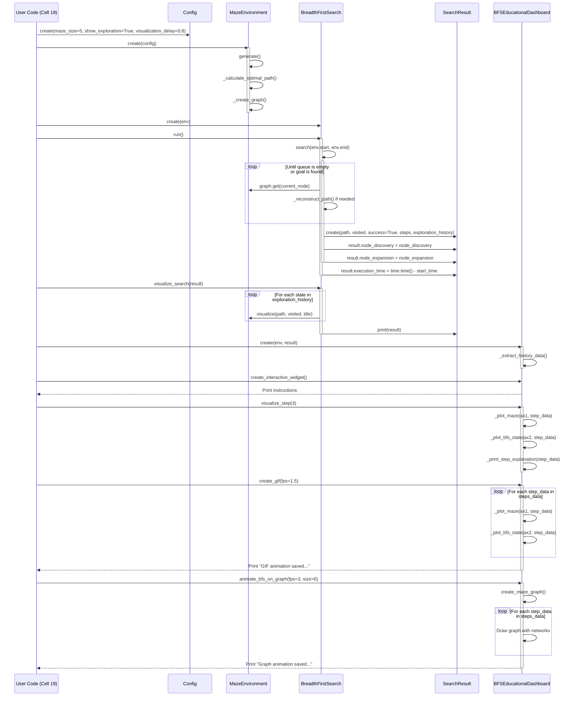

# Understanding the flow through the classes

This page gives a visual overview of the flow though the classes. I've done it to remind me what the code is doing and how other search algorithm can be included.

It also reminds me of the important sections of code, meaning I can trim the less import vibe-coded sections of code.

## the code

<details>
  <summary>The code this diagram relates to</summary>

```python
# Example of using the enhanced BFS visualization tools
from typing import Tuple, List, Dict, Optional, Union, Callable, Set, Any
from dataclasses import dataclass, field, asdict
from collections import deque


# Create a maze with the educational BFS implementation
config = Config(maze_size=5, show_exploration=True, visualization_delay=0.8)
env = MazeEnvironment(config)

# Create enhanced BFS instance
bfs = BreadthFirstSearch(env)

# Run the search and collect educational results
result = bfs.run()

# Option 1: Use the built-in enhanced visualization
print("Running enhanced BFS visualization...")
bfs.visualize_search(result)

# Option 2: Create an educational dashboard
dashboard = BFSEducationalDashboard(env, result)

# Show how to use the dashboard
print("\n\nCreating BFS Educational Dashboard")
print("-----------------------------------")
dashboard.create_interactive_widget()

# Visualize a specific step
print("\nShowing step 3 as an example:")
dashboard.visualize_step(3)

# Run the full animation (uncomment to see)
# dashboard.run_animation(delay=1.5)

# Analyze BFS performance
print("\n\nBFS Performance Analysis")
print("------------------------")
print(f"Search success: {result.success}")
print(f"Total steps: {result.steps}")
print(f"Visited nodes: {len(result.visited)}")
if result.path:
    print(f"Path length: {len(result.path)}")
    print(f"Path efficiency: {len(result.path)/len(result.visited):.2f} (path length / visited nodes)")
```

</details>

## the sequence flow

This sequence diagram illustrates:

1. Initial setup with Config and MazeEnvironment
2. Creating and running the BreadthFirstSearch algorithm
3. The search process with loops for exploration
4. Creating the SearchResult with metrics
5. Visualizing the search process
6. Creating and using the BFSEducationalDashboard
7. Various visualization methods including:
    - Interactive step visualization
    - GIF creation
    - Graph animation


