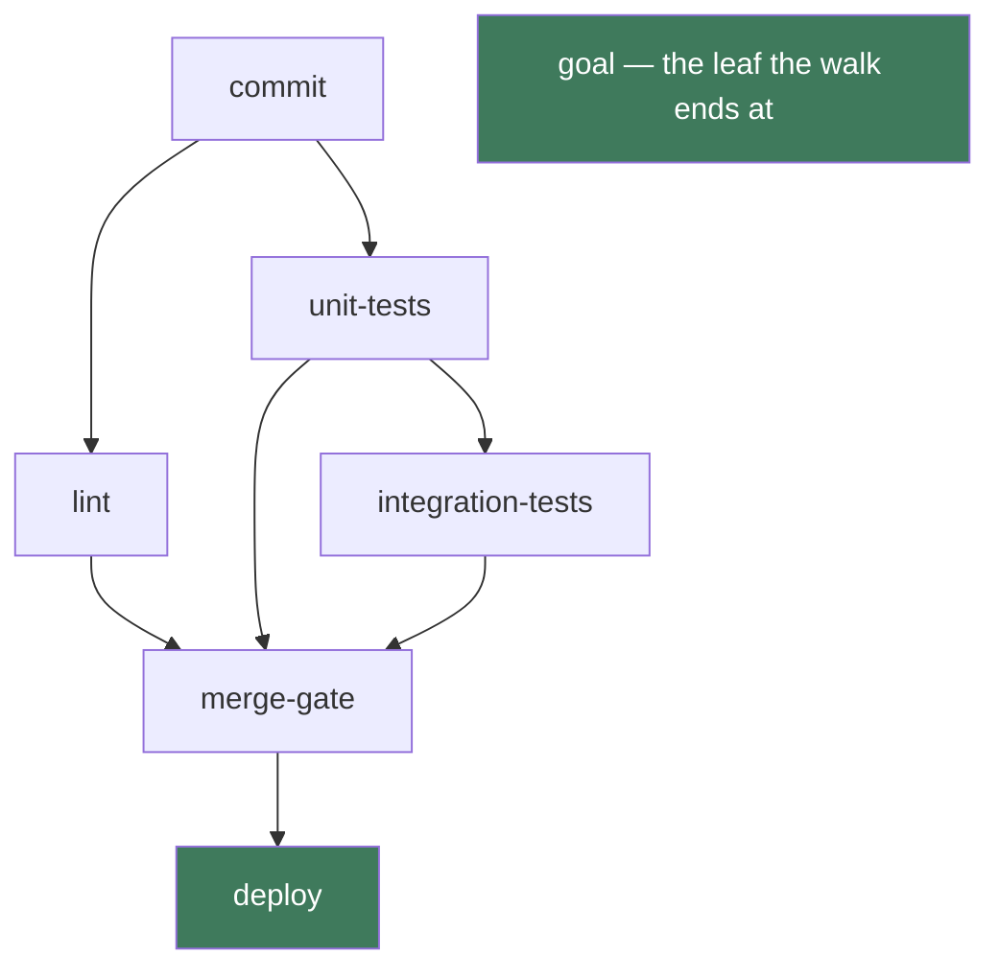
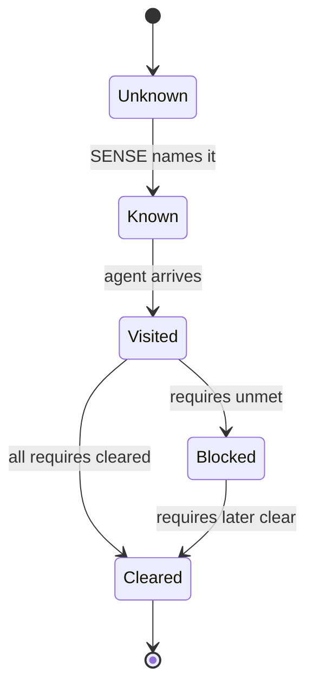
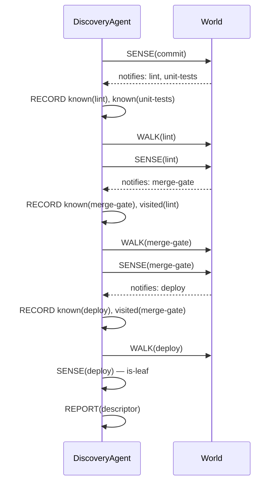

# [IA Series 13/n] Ontologies, Doctrine, and Ubiquitous Language

*This is an addition to the original term sheet. The core terminology is unchanged; the **[Agent Design Process](https://matt.thompson.gr/2025/05/16/ia-series-n-intelligent-agents.html)** has gained a Step 0 — Ontology / Vocabulary. The step introduces a living document you revisit.*

## Introduction

I've come around to ontology. It speaks to me, my interest in meaning goes back to reading the Thesaurus as a kid, grammar didn't interest me as much, but meaning is fascinating, probably the birth of Context Is All you Need :) 

I'm here building an agent that will navigate through a maze of infrastructure and writing a DSL to express the actions. I was creating a graph of nodes and edges where the nodes have domains, types, and legal actions; the edges connect the nodes to express dependancy.

This led to this comment in my session with Claude (spelling mistake is kept for honesty!): 

> "I am thinking that this could be a use case for one type of system however I am now thinking we need an ontological for the nodes and edges defined clearly. it would not be a generic discovery agent, rather an Infra Discovery Agent and use an ontology documented in the atomicguard repo: docs/design/notes/topology_sensing_dsa_belief_state_and_agent_function.md's 'Node and Edge ontology' section... take a step back and consider what an environment for that would look like."

The conversation has progressed to the point where I wanted to understand what an ontology really is and why it is making sense, central to my work, and where in my approach and workflow should I be defining it.

### What is an Ontology

Ontology definition from [Wikipedia](https://en.wikipedia.org/wiki/Ontology):

> Ontology is the philosophical study of being. 

This was a big blocker to why I thought it wasn't relevant, I do not buy into AI being conscious so this triggered me.

This is getting more useful as a definition - [Formal Ontology from Wikipedia](https://en.wikipedia.org/wiki/Formal_ontology):

> In philosophy, the term formal ontology is used to refer to an ontology defined by axioms in a formal language with the goal to provide an unbiased (domain- and application-independent) view on reality, which can help the modeler of domain- or application-specific ontologies to avoid possibly erroneous ontological assumptions encountered in modeling large-scale ontologies.

It's a graph of objects with specific relations. Voilà. 

### Context on application of Ontologies

I've been a big fan of these systems without really understanding the components of them. I'd thought of them as ways of acting in different contexts, and treated it like a skill, apparently common sense once I'd learnt the frameworks.

* **[Situational Leadership](https://en.wikipedia.org/wiki/Situational_leadership_theory):** The ontology defines the developmental level of the individual (their competence and commitment). The doctrine is the specific leadership style applied to that exact profile.
* **[Cynefin Framework](https://en.wikipedia.org/wiki/Cynefin_framework):** The ontology defines the state of the environment (Clear, Complicated, Complex, Chaotic). The doctrine dictates how you must alter your decision-making process for that specific state.
* **[Segmentation Technologies / Zero Trust](https://www.philvenables.com/post/segmentation-technologies---zero-trust) (Phil Venables):** The ontology defines your boundaries—what an asset, workload, or trusted zone actually is. The doctrine is the isolation strategy enforcing those boundaries.
* **[Domain-Driven Design](https://en.wikipedia.org/wiki/Domain-driven_design):** The ontology is the "Ubiquitous Language" defining bounded contexts, aggregates, and entities. The doctrine is the software architecture built on top of that shared meaning.

This quote from the DDD wiki page is key for any software engineering (formal or otherwise):

> Ubiquitous language is one of the pillars of DDD together with strategic design and tactical design.

The way to look at it is that ontology is a symbolic structure that defines the terrain. Doctrine and frameworks offer an imperfect way to navigate that terrain.

> If ontology is the map, doctrine is your strategy.

Here is how they stack together in system design:

* **Ontology (The "What"):** Defines what exists. It establishes the vocabulary, entities, boundaries, and relationships in your environment. You have to formally define what a "workload," "trusted zone," or "critical asset" actually is.
* **Doctrine (The "How"):** Defines how you behave. It establishes the rules, policies, and strategic intent governing those entities (e.g., "critical assets must be isolated from untrusted zones").
* **Structure (The "With What"):** The actual implementation, tools, or physical architecture used to enforce the doctrine.

In formal systems or orchestration layers, your ontology is the foundational state space and schema (like the definitions in a belief store). Your doctrine provides the deterministic constraints and logic applied to that state.

PEAS? Its a framework and vocabulary that helps define how an intelligent agent perceives and interacts with a given world.

This post is the synthesis of the two grammars in this series: the ontology's predicates are written in the [grammar of logic (Series 11)](../logic/blog.md), and its ubiquitous language is the [grammar of natural language (Series 12)](../natural-language/blog.md) vocabulary the design documents share.

## Adding Step 0 — Ontology / Vocabulary - to the Agent Design Process

In formal systems or orchestration layers, an ontology is the state space and schema (like a graph of infra) that an agent navigates. PEAS assumes you already know the vocabulary for the environment you are building - at least as I learnt it.

So defining your environment is a step that should be done as a first pass before PEAS; then a living document, re-entered whenever a later step exposes a gap. As with DDD, the model should be considered flexible, as you learn more about the domain you update the ontology.

Two artefacts, because they fail differently:

| Artefact | What it holds | Its failure mode |
|---|---|---|
| **Schema** | The types and predicates of the domain, each classified by its **Kind** — **controllable**, **exogenous**, **static**, or **derived** (the definitions live in the ubiquitous language) | *"I'm missing a predicate"* — the structure can't express something the design needs |
| **Ubiquitous language** | The shared naming and vocabulary for those types and predicates, agreed so every design document means the same thing by the same word | *"Two docs use the same word for different things"* — the naming drifts and the design reads inconsistently |

Scope it honestly: this is the **world ontology** — the environment the agent navigates and acts in: its entities, predicates, actions, and connections. It is not the **agent ontology**, which uses the PEAS meta-ontology to define the agent loop itself (percept, agent function). Confusing the two is the most common way the step goes wrong.

**When to re-enter Step 0:** it is a *normal, expected* loop-back, not a process violation. The clearest signals are in Step 2 (the environment's properties don't fit what Step 0 declared) and Step 3 (a persistent-state variable has no home in the schema). Discovering "I need an ontology" mid-build — usually after the Agent Function step — is how this step tends to be found in practice.

## The Agent Design Process in practice: the infra discovery agent

The infra discovery agent walks an unknown pipeline graph — `commit` → `lint`, `unit-tests` → `integration-tests` → `merge-gate` → `deploy` — building belief one sensed node at a time. The environment holds the whole topology but withholds it: the agent can only query a node it has already reached. Here the world is the point, and Step 0 earns its keep.

**The world, as instances:**

### The world ontology

**Entities:**

| Type | Meaning |
|---|---|
| `Node` | a stage in the estate — `commit`, `lint`, `unit-tests`, `merge-gate`, `deploy` |
| `Edge` | a connection between nodes, in one of two directions |
| `Domain` | the system a topology lives in |
| `Status` | a node's condition from the agent's point of view — known, visited, cleared, blocked |

**Predicates, classified by Kind:**

| Predicate | Kind | Why |
|---|---|---|
| `node(id)` | exogenous | sensed — the node exists in the estate |
| `notifies(id, target)` | exogenous | sensed per node — the push edge, who this node tells |
| `requires(id, target)` | exogenous | sensed per node — the pull edge, what this node needs |
| `known(id)` | controllable | the agent's belief — it has heard of this id |
| `visited(id)` | controllable | the agent's belief — it has been there |
| `cleared(id)` | controllable | the agent's belief — the node's requirements are met |
| `reachable(from, to)` | derived | a path over already-sensed edges |
| `is-leaf(id)` | derived | no `notifies` — a structural goal or dead end |

**Actions:** `SENSE(node)`, `WALK(edge)`, `BACKTRACK`, `RECORD(belief)`, `REPORT(descriptor)`.

**Connections:** `notifies` and `requires` edges link nodes; the agent's belief is the discovered subgraph.

**The belief state** — the point of this example. The world ontology is what gives the agent something to *hold belief about*: the minimal loop's world was the conversation, and there was nothing to model. Here the agent's belief is a real model of the world, built incrementally — `known` (heard of), `visited` (been there), `cleared` (requirements met) grow one sense at a time as the agent walks. This is the schema's controllable side doing real work.

**The world ontology, as a graph:**

**The belief state, as a lifecycle:**

**Building belief, as a sequence:**

### The ubiquitous language

The shared vocabulary, agreed once so the schema above is checkable:

**Kind definitions** — a Kind says what *determines* a predicate's truth (the determination defined in the [Grammar of Logic term sheet](../logic/blog.md)):

| Kind | Definition | Example here |
|---|---|---|
| **controllable** | Determined by the agent's own action | `known`, `visited`, `cleared` |
| **exogenous** | Determined by the world, outside the agent's control | `node`, `notifies`, `requires` |
| **static** | Determined at setup — fixed for the task lifetime | `domain` |
| **derived** | Determined by the system — computed from other predicates, never directly set | `reachable`, `is-leaf` |

**Term definitions — one agreed meaning each:**

| Term | Agreed meaning |
|---|---|
| `notifies` | the push edge — who this node tells when it finishes |
| `requires` | the pull edge — what this node needs before it can clear |
| `known` | the agent has heard of this id |
| `visited` | the agent has been there |
| `cleared` | the node's requirements are met |
| `leaf` | a node with no `notifies` — structurally the goal or a dead end |

### The degenerate contrast: the minimal LLM loop

Even the minimal loop needs Step 0 — a schema and a ubiquitous language are still required, and doing them from the start is right. But its world is the conversation: two exogenous facts (`received(prompt)`, `received(response)`), one accumulated state (`context`), and nothing to have belief *about*. Almost everything degenerates to exogenous, and there is no belief state. That is what this example fixes: the infra agent's ontology is the scaffold for a belief the minimal loop cannot hold. (The minimal loop's full walk-through is preserved as a draft for further work on the agent loop — `drafts/minimal-llm-loop.md`.)

### Re-entry stays open

The vocabulary was right from the start — nothing here needs re-entering yet. That is the point of doing it properly: when the design grows, re-entry is a deliberate change you make, not a defect you discover.

