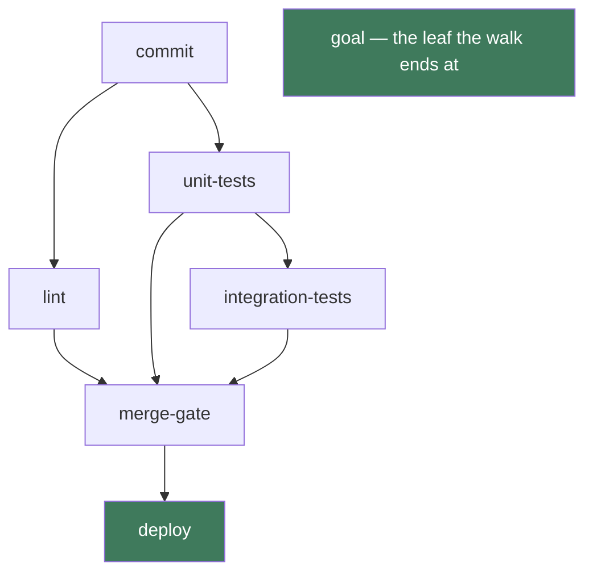
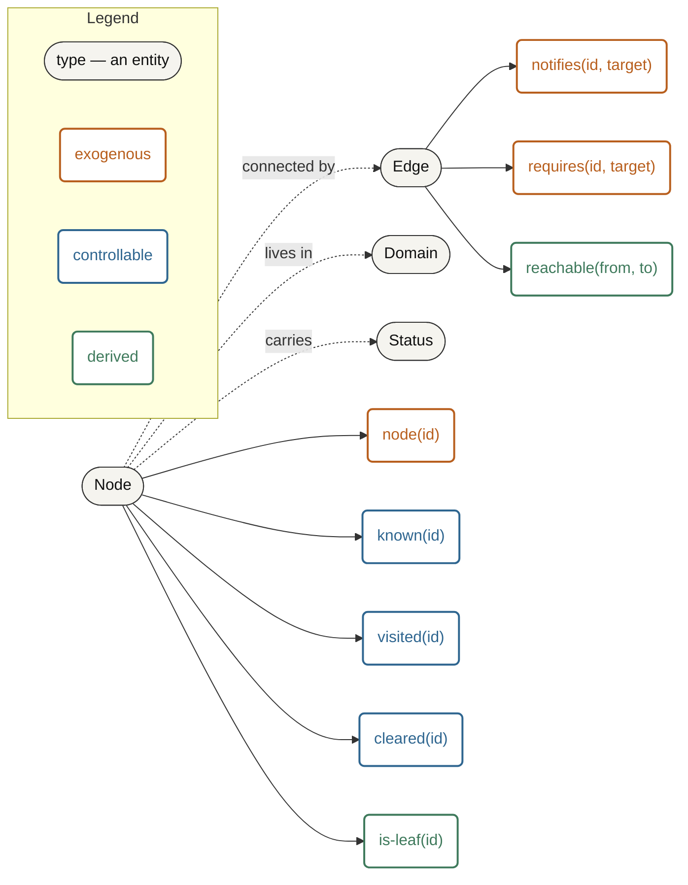
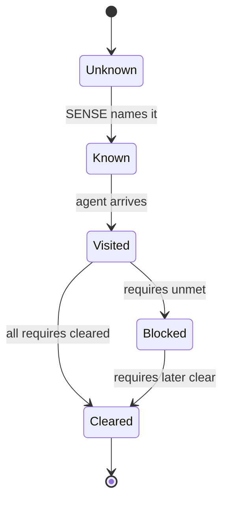
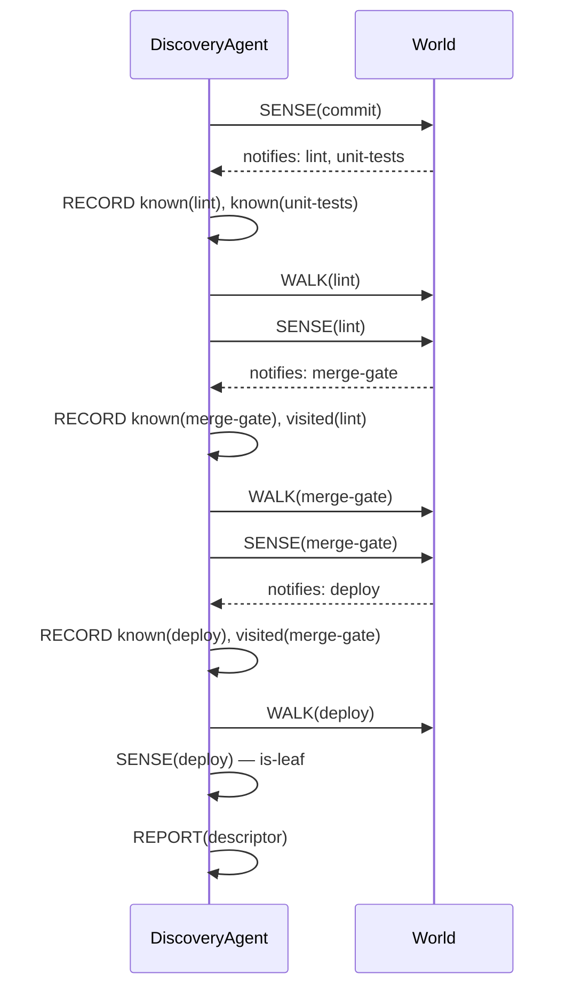

# [IA Series 13/n] Ontologies, Doctrine, and Ubiquitous Language

*This is an addition to the original term sheet. The core terminology is unchanged; the **[Agent Design Process](https://matt.thompson.gr/2025/05/16/ia-series-n-intelligent-agents.html)** has gained an **Ontology / Vocabulary** layer — a living document you revisit without end, not a numbered step in a sequence.*

## Introduction

I've come around to ontology. It speaks to me, my interest in meaning goes back to reading the Thesaurus as a kid, grammar didn't interest me as much, but meaning is fascinating, probably the birth of Context Is All you Need :) 

I arrived at this point whilst building an agent that navigates through a maze of infrastructure. The agent creates a typical graph of nodes and edges: the nodes are labelled by domains, types, and legal actions, and the edges are labelled to express the relation between the nodes.

This led to this comment in my session with Claude (spelling mistake is kept for honesty!): 

> "I am thinking that this could be a use case for one type of system however I am now thinking we need an ontological for the nodes and edges defined clearly. it would not be a generic discovery agent, rather an Infra Discovery Agent and use an ontology documented in the atomicguard repo: docs/design/notes/topology_sensing_dsa_belief_state_and_agent_function.md's 'Node and Edge ontology' section... take a step back and consider what an environment for that would look like."

The conversation has progressed to the point where I wanted to understand what an ontology really is and why it is making sense, central to my work, and where in my approach and workflow should I be defining it.

### What is an Ontology

Ontology definition from [Wikipedia](https://en.wikipedia.org/wiki/Ontology):

> Ontology is the philosophical study of being. 

This was a big blocker to why I thought it wasn't relevant, I do not buy into AI being conscious so this triggered me.

This is getting more useful as a definition - [Formal Ontology from Wikipedia](https://en.wikipedia.org/wiki/Formal_ontology):

> In philosophy, the term formal ontology is used to refer to an ontology defined by axioms in a formal language with the goal to provide an unbiased (domain- and application-independent) view on reality, which can help the modeler of domain- or application-specific ontologies to avoid possibly erroneous ontological assumptions encountered in modeling large-scale ontologies.

It's a graph of objects with specific relations. Voilà. 

### Frameworks with ontologies

In connecting the dots I like to refer to frameworks that help me understand the world I work in. These are frameworks I've actively applied, which I've found to be common sense and to make situations flow. 

In looking at ontology in greater detail, I see that these frameworks themselves have inherent ontologies that define the world and provide approaches to navigate the situation. For a given context I find them excellent for their simplicity and clarity.

* **[Situational Leadership](https://en.wikipedia.org/wiki/Situational_leadership_theory):** The ontology defines the developmental level of the individual (their competence and commitment). The doctrine is the specific leadership style applied to that exact profile.
* **[Cynefin Framework](https://en.wikipedia.org/wiki/Cynefin_framework):** The ontology defines the state of the environment (Clear, Complicated, Complex, Chaotic). The doctrine dictates how you must alter your decision-making process for that specific state.
* **[Segmentation Technologies / Zero Trust](https://www.philvenables.com/post/segmentation-technologies---zero-trust) (Phil Venables):** The ontology defines your boundaries—what an asset, workload, or trusted zone actually is. The doctrine is the isolation strategy enforcing those boundaries.
* **[Domain-Driven Design](https://en.wikipedia.org/wiki/Domain-driven_design):** The ontology is the "Ubiquitous Language" defining bounded contexts, aggregates, and entities. The doctrine is the software architecture built on top of that shared meaning.

This quote from the DDD wiki page is key for any software engineering (formal or otherwise):

> Ubiquitous language is one of the pillars of DDD together with strategic design and tactical design.

The way to look at it is that ontology is a symbolic structure that defines the terrain. Doctrine and frameworks offer an imperfect way to navigate that terrain.

> If ontology is the map, doctrine is your strategy.

Here is how they stack together in system design:

* **Ontology (The "What"):** Defines what exists. It establishes the vocabulary, entities, boundaries, and relationships in your environment. You have to formally define what a "workload," "trusted zone," or "critical asset" actually is.
* **Doctrine (The "How"):** Defines how you behave. It establishes the rules, policies, and strategic intent governing those entities (e.g., "critical assets must be isolated from untrusted zones").

In formal systems or orchestration layers, your ontology is the foundational state space and schema (like the definitions in a belief store). Your doctrine provides the deterministic constraints and logic applied to that state.

PEAS? Its a framework and vocabulary that helps define how an intelligent agent perceives and interacts with a given world.

This post is the synthesis of the two grammars in this series: the ontology's predicates are written in the [grammar of logic (Series 11)](../logic/blog.md), and its ubiquitous language is the [grammar of natural language (Series 12)](../natural-language/blog.md) vocabulary the design documents share.

## Facts as justifiably held belief

A fact, in the philosophically accepted sense, is a [justified true belief](https://en.wikipedia.org/wiki/Justified_true_belief) — the analysis of knowledge that runs from Plato's *Theaetetus* forward: a proposition you hold, that is true, and that you are justified in holding. Everything the world ontology names is exactly that: a belief the agent holds about the world. And **Kind is the justification** — what entitles the agent to hold it.

| Kind | Justified by |
|---|---|
| **exogenous** | sensing the world — the world itself is the justification |
| **controllable** | the agent's own action — it made the fact so |
| **static** | setup — granted once, fixed for the task |
| **derived** | inference — entailed by other justified beliefs |

These four kinds are not new coinage — each is an established concept:

- **static** predicates are standard in planning ([PDDL](https://en.wikipedia.org/wiki/Planning_Domain_Definition_Language))
- **exogenous** state variables — "one whose dynamics are independent of the agent's actions" — come from planning under uncertainty ([Chitnis & Lozano-Pérez 2019](https://arxiv.org/abs/1909.13870))
- **derived** predicates appear in [PDDL 2.2](https://en.wikipedia.org/wiki/Planning_Domain_Definition_Language) (Edelkamp & Hoffmann 2004), in Datalog's intensional predicates (the [EDB/IDB split](https://en.wikipedia.org/wiki/Datalog)), and in situation calculus's defined fluents ([Reiter 2001](https://en.wikipedia.org/wiki/Situation_calculus))

What this project contributes is the sharper **synchronous-entailment test** — *does the effector's successful return entail the fact?* — which draws the controllable/exogenous boundary without ambiguity, and the decision to tag every predicate with an explicit kind.

Two consequences worth holding onto:

- **Justification is not truth.** A belief can be well-justified and false — truth is determined relative to a model (the Grammar of Logic's Determination, Series 11), and a model can be wrong. The minimal loop's `"FINAL:"` marker is a belief justified by the very system being measured — an "irrational performance measure" — not by the world.
- **The belief state is the controllable side.** Which facts the agent holds is justified by its own actions (sensing, recording); the exogenous facts are justified for it by the world at the point in time the sensing or acting happens. Kind draws that line before the agent's belief state appears later in this post.

## Ontology / Vocabulary — a living layer of the Agent Design Process

In formal systems or orchestration layers, an ontology is the state space and schema (like a graph of infra) that an agent navigates. PEAS assumes you already know the vocabulary for the environment you are building - at least as I learnt it.

So defining your environment is a practice that begins before PEAS — a first pass, then a living document, re-entered whenever a later step exposes a gap. As with DDD, the model should be considered flexible: as you learn more about the domain, you update the ontology.

Two artefacts, because they fail differently:

| Artefact | What it holds | Its failure mode |
|---|---|---|
| **Schema** | The types and predicates of the domain, each classified by its **Kind** — **controllable**, **exogenous**, **static**, or **derived** (the definitions live in the ubiquitous language) | *"I'm missing a predicate"* — the structure can't express something the design needs |
| **Ubiquitous language** | The shared naming and vocabulary for those types and predicates, agreed so every design document means the same thing by the same word | *"Two docs use the same word for different things"* — the naming drifts and the design reads inconsistently |

Scope it honestly: this is the **world ontology** — the environment the agent navigates and acts in: its entities, predicates, actions, and connections. It is not the **agent ontology**, which uses the PEAS meta-ontology to define the agent loop itself (percept, agent function). Confusing the two is the most common way this goes wrong.

**When the ontology is re-entered:** it is a *normal, expected* loop-back, not a process violation. The clearest signals are in Step 2 (the environment's properties don't fit what the ontology declared) and Step 3 (a persistent-state variable has no home in the schema). Discovering "I need an ontology" mid-build — usually after the Agent Function step — is how it tends to be found in practice.

## The Agent Design Process in practice: the infra discovery agent

The infra discovery agent walks an unknown pipeline graph — `commit` → `lint`, `unit-tests` → `integration-tests` → `merge-gate` → `deploy` — building belief one sensed node at a time. The environment holds the whole topology but withholds it: the agent can only query a node it has already reached. Here the world is the point, and the ontology earns its keep.

**The world, as instances:**



### The world ontology

**Entities:**

| Type | Meaning |
|---|---|
| `Node` | a stage in the estate — `commit`, `lint`, `unit-tests`, `merge-gate`, `deploy` |
| `Edge` | a connection between nodes, in one of two directions |
| `Domain` | the system a topology lives in |
| `Status` | a node's condition from the agent's point of view — known, visited, cleared, blocked |

**Predicates, classified by Kind:**

| Predicate | Kind | Why |
|---|---|---|
| `node(id)` | exogenous | sensed — the node exists in the estate |
| `notifies(id, target)` | exogenous | sensed per node — the push edge, who this node tells |
| `requires(id, target)` | exogenous | sensed per node — the pull edge, what this node needs |
| `known(id)` | controllable | the agent's belief — it has heard of this id |
| `visited(id)` | controllable | the agent's belief — it has been there |
| `cleared(id)` | controllable | the agent's belief — the node's requirements are met |
| `reachable(from, to)` | derived | a path over already-sensed edges |
| `is-leaf(id)` | derived | no `notifies` — a structural goal or dead end |

**Actions:** `SENSE(node)`, `WALK(edge)`, `BACKTRACK`, `RECORD(belief)`, `REPORT(descriptor)`.

**Connections:** `notifies` and `requires` edges link nodes; the agent's belief is the discovered subgraph.

**The belief state** — the point of this example. The world ontology is what gives the agent something to *hold belief about*: the minimal loop's world was the conversation, and there was nothing to model. Here the agent's belief is a real model of the world, built incrementally — `known` (heard of), `visited` (been there), `cleared` (requirements met) grow one sense at a time as the agent walks. This is the schema's controllable side doing real work.

**The world ontology, as a graph:**



**The formal ontologies — schema.org, RDF(S), and OWL:**

The world ontology above is informal — entities, predicates, actions, and connections, with a Kind for each fact. When the ontology must be shared, queried, or reasoned over by tools, it gets written in a formal ontology language. Three stand out:

- **schema.org** — the practical vocabulary of the web: a large shared set of types and properties (THINGS) that sites use to describe themselves. You *reuse* its types rather than define your own — the ready-made cousin of the ontology's ubiquitous language. Its cost: it's someone else's vocabulary; the terms aren't yours to agree.
- **RDF / RDFS** — the triple model: every fact is a `subject predicate object` statement. The post's predicates map straight onto it — `notifies(lint, merge-gate)` is the triple `lint notifies merge-gate`. RDFS layers class and property hierarchies on top (`subClassOf`, `subPropertyOf`).
- **OWL** — the Web Ontology Language, built on description logic: classes, properties, individuals, and axioms, with a reasoner that *entails* what follows. This is where the post's `derived` predicates meet the Grammar of Logic's entailment (⊨) — OWL axioms are the rules, and the reasoner computes `reachable` and `is-leaf` exactly as the logic sheet's Determination describes. What OWL does not express is **Kind**: nothing in RDF(S)/OWL says whether a fact is exogenous, controllable, static, or derived. That determination axis is this post's addition — the one the formal standards leave to you.

**The schema.org decision — serialisation, not semantics:**

In the project this has been applied to, I made the decision to use schema.org — and only as serialisation, so the project adheres to a common understanding. That rests on a distinction worth naming:

| | **Serialisation** | **Semantics** |
|---|---|---|
| **Answers** | *how is the fact written down?* | *what does the fact mean?* |
| **Concern** | form — storage, sharing, auditing, interop | meaning — truth, entailment, legality |
| **A serialised fact is…** | inert: structure but no truth yet | true or false only once interpreted |
| **schema.org gives** | ✓ vocabulary + shape (JSON-LD) | ✗ — no preconditions, effects, derived facts, reasoner |
| **In this project** | the JSON-LD audit record | the planning layer, where the facts are determined and entailed |
| **This post's terms** | the serialised record | Kind, and the Grammar of Logic's Determination (no truth without a model) |

Serialisation is the form a fact takes to be shared; semantics is what determines its truth. schema.org buys a common *shape* — two systems agree on the record's form because they share its vocabulary — but not common *meaning*: agreement on what follows, what is legal, what is true. That is why the decision uses schema.org only as the audit view, keeping the authority in the semantics layer.

The world ontology's facts serialize onto schema.org Action types and properties: `actionStatus` (the lifecycle + guard verdict), `agent` (the acting entity), `object` (the entity acted on), `result` (the verdict), `instrument` (the effector), `target` (the grounded task), `error` (the failure cause).

This is also where the ubiquitous language artefact does real work: schema.org has no `Agent`, `SensedFact`, `WorldState`, or `passed`/`predicate`/`args`/`value`, so the custom terms are scoped to a `dev:` namespace in the JSON-LD context. That is the ontology's UL in action — the terms that don't exist in the shared vocabulary are namespaced into your own, so they never collide with schema.org's.

Which leaves the post's point standing: the Kind axis is exactly what schema.org cannot express. `reachable` and `is-leaf` are derived facts with no serialization home — their determination must live in the semantics layer, not the audit view. Using schema.org *only* is a decision about which layer carries what, not a claim that the ontology is shallow.

**The world ontology, as JSON-LD — the audit record:**

```json
{
  "@context": {
    "@vocab": "https://schema.org/",
    "dev": "https://dev.example.org/",
    "Agent": { "@id": "dev:Agent", "@subClassOf": "https://schema.org/Organization" },
    "Node": "dev:Node",
    "SensedFact": "dev:SensedFact",
    "notifies": "dev:notifies",
    "requires": "dev:requires"
  },
  "@type": "Action",
  "actionStatus": "CompletedActionStatus",
  "agent": { "@type": "Agent", "@id": "dev:discovery-agent" },
  "object": { "@type": "Node", "@id": "dev:merge-gate" },
  "result": {
    "@type": "SensedFact",
    "notifies": "dev:deploy",
    "requires": "dev:lint, dev:integration-tests"
  }
}
```

The serialization carries the facts — there is no Kind field. How each fact is determined stays in the semantics layer, exactly as the serialisation/semantics split above sets out.

### The belief state — storing a fact as a belief

The world ontology names facts; the agent stores them as *beliefs*. A fact is what is the case in the world; a belief is the agent's stored, justified representation of it. Storing a fact as a belief is the loop's core move — **SENSE → RECORD**: the agent senses the world's exogenous predicates (`node`, `notifies`, `requires`) and records them into its own controllable predicates (`known`, `visited`, `cleared`).

This is where Kind does its real work, tying back to the facts section: the exogenous facts are justified by the world at the moment they are sensed; the belief is justified by the agent's own actions of sensing and recording. The lifecycle below shows a fact entering belief, and the belief evolving as the agent acts.

**The belief state, as a lifecycle:**



**Building belief, as a sequence:**



**The belief state, as JSON-LD:**

```json
{
  "@context": {
    "@vocab": "https://schema.org/",
    "dev": "https://dev.example.org/",
    "BeliefState": "dev:BeliefState",
    "known": "dev:known",
    "visited": "dev:visited",
    "cleared": "dev:cleared",
    "blocked": "dev:blocked"
  },
  "@type": "BeliefState",
  "known": ["dev:commit", "dev:lint", "dev:unit-tests", "dev:integration-tests", "dev:merge-gate", "dev:deploy"],
  "visited": ["dev:commit", "dev:lint", "dev:merge-gate", "dev:deploy"],
  "cleared": ["dev:commit", "dev:lint", "dev:unit-tests", "dev:integration-tests", "dev:merge-gate"],
  "blocked": []
}
```

This serializes the lifecycle's states (`known`/`visited`/`cleared`/`blocked`) as the belief object.

A stored belief is not a guaranteed fact — it is justified by the agent's actions, not guaranteed by the world. A belief can be well-stored and false, exactly as the facts section's "justification is not truth" set out.

### The ubiquitous language

The shared vocabulary, agreed once so the schema above is checkable:

**Kind definitions** — a Kind says what *determines* a predicate's truth (the determination defined in the [Grammar of Logic term sheet](../logic/blog.md)):

| Kind | Definition | Example here |
|---|---|---|
| **controllable** | the effector's successful return entails the fact — determined by the agent's own action | `known`, `visited`, `cleared` |
| **exogenous** | the effector's return does not entail it — set by other agents or world processes | `node`, `notifies`, `requires` |
| **static** | true at setup, never changed by any action or sensing | `domain` |
| **derived** | computed by the state model, never asserted — entailed from other predicates | `reachable`, `is-leaf` |

**Term definitions — one agreed meaning each:**

| Term | Agreed meaning |
|---|---|
| `notifies` | the push edge — who this node tells when it finishes |
| `requires` | the pull edge — what this node needs before it can clear |
| `known` | the agent has heard of this id |
| `visited` | the agent has been there |
| `cleared` | the node's requirements are met |
| `leaf` | a node with no `notifies` — structurally the goal or a dead end |

### The degenerate contrast: the minimal LLM loop

Even the minimal loop needs an ontology — a schema and a ubiquitous language are still required, and doing them from the start is right. But its world is the conversation: two exogenous facts (`received(prompt)`, `received(response)`), one accumulated state (`context`), and nothing to have belief *about*. Almost everything degenerates to exogenous, and there is no belief state. That is what this example fixes: the infra agent's ontology is the scaffold for a belief the minimal loop cannot hold. (The minimal loop's full walk-through is preserved as a draft for further work on the agent loop — `drafts/minimal-llm-loop.md`.)

### Re-entry stays open

The vocabulary was right from the start — nothing here needs re-entering yet. That is the point of doing it properly: when the design grows, re-entry is a deliberate change you make, not a defect you discover.

## Appendix — a predicate as RDF triple and JSON-LD

The world ontology's predicates are atomic sentences of the grammar of logic (Series 11). A single fact, shown three ways:

`notifies(lint, merge-gate)`

as an RDF triple:

```text
<https://dev.example.org/lint>  dev:notifies  <https://dev.example.org/merge-gate>
```

and the same fact as compact JSON-LD:

```json
{
  "@context": {
    "@vocab": "https://schema.org/",
    "dev": "https://dev.example.org/",
    "notifies": "dev:notifies"
  },
  "@id": "dev:lint",
  "notifies": "dev:merge-gate"
}
```

The predicate, the triple, and the JSON-LD are the same statement — the grammar determines the shape, the serialization chooses the form.

