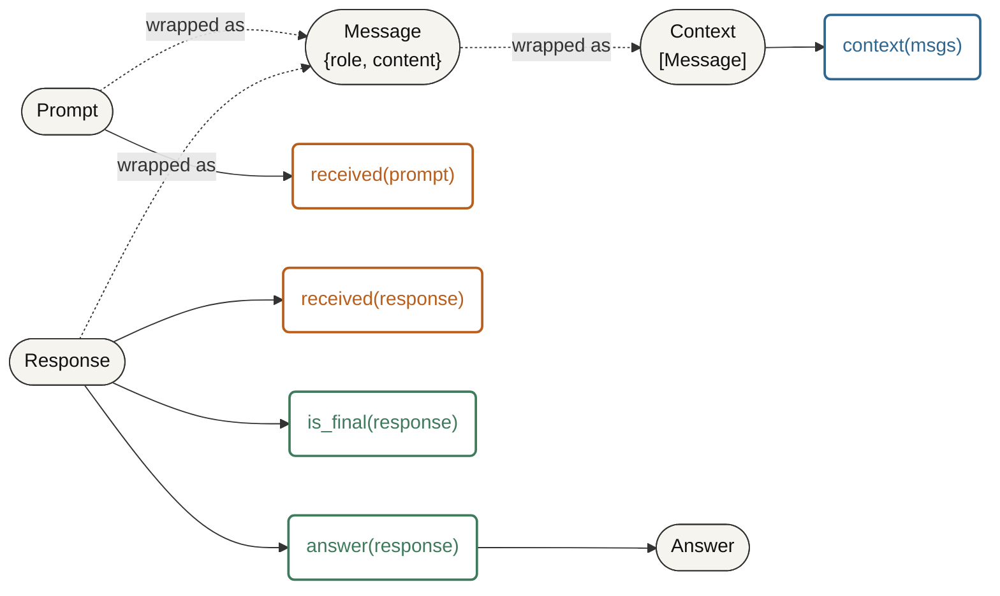
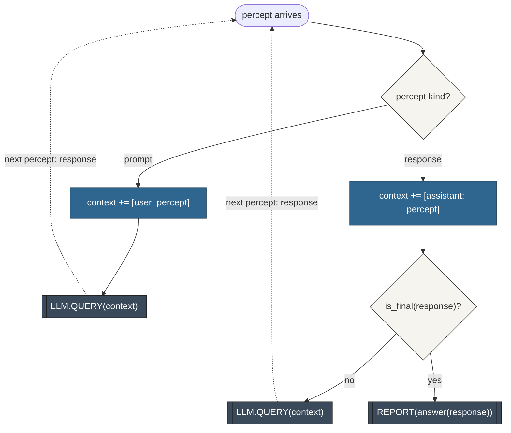

# [IA Series 12/n] Ontologies, Doctrine, and Ubiquitous Language

*This is an addition to the original term sheet. The core terminology is unchanged; the **[Agent Design Process](https://matt.thompson.gr/2025/05/16/ia-series-n-intelligent-agents.html)** has gained a Step 0 — Ontology / Vocabulary. The step introduces a living document you revisit.*

## Introduction

I've come around to ontology. It speaks to me, my interest in meaning goes back to reading the Thesaurus as a kid, grammar didn't interest me as much, but meaning is fascinating, probably the birth of Context Is All you Need :) 

I'm here building an agent that will navigate through a maze of infrastructure and writing a DSL to express the actions. I was creating a graph of nodes and edges where the nodes have domains, types, and legal actions; the edges connect the nodes to express dependancy.

This led to this comment in my session with Claude (spelling mistake is kept for honesty!): 

> "I am thinking that this could be a use case for one type of system however I am now thinking we need an ontological for the nodes and edges defined clearly. it would not be a generic discovery agent, rather an Infra Discovery Agent and use an ontology documented in the atomicguard repo: docs/design/notes/topology_sensing_dsa_belief_state_and_agent_function.md's 'Node and Edge ontology' section... take a step back and consider what an environment for that would look like."

The conversation has progressed to the point where I wanted to understand what an ontology really is and why it is making sense, central to my work, and where in my approach and workflow should I be defining it.

### What is an Ontology

Ontology definition from [Wikipedia](https://en.wikipedia.org/wiki/Ontology):

> Ontology is the philosophical study of being. 

This was a big blocker to why I thought it wasn't relevant, I do not buy into AI being conscious so this triggered me.

This is getting more useful as a definition - [Formal Ontology from Wikipedia](https://en.wikipedia.org/wiki/Formal_ontology):

> In philosophy, the term formal ontology is used to refer to an ontology defined by axioms in a formal language with the goal to provide an unbiased (domain- and application-independent) view on reality, which can help the modeler of domain- or application-specific ontologies to avoid possibly erroneous ontological assumptions encountered in modeling large-scale ontologies.

It's a graph of objects with specific relations. Voilà. 

### Context on application of Ontologies

I've been a big fan of these systems without really understanding the components of them. I'd thought of them as ways of acting in different contexts, and treated it like a skill, apparently common sense once I'd learnt the frameworks.

* **[Situational Leadership](https://en.wikipedia.org/wiki/Situational_leadership_theory):** The ontology defines the developmental level of the individual (their competence and commitment). The doctrine is the specific leadership style applied to that exact profile.
* **[Cynefin Framework](https://en.wikipedia.org/wiki/Cynefin_framework):** The ontology defines the state of the environment (Clear, Complicated, Complex, Chaotic). The doctrine dictates how you must alter your decision-making process for that specific state.
* **[Segmentation Technologies / Zero Trust](https://www.philvenables.com/post/segmentation-technologies---zero-trust) (Phil Venables):** The ontology defines your boundaries—what an asset, workload, or trusted zone actually is. The doctrine is the isolation strategy enforcing those boundaries.
* **[Domain-Driven Design](https://en.wikipedia.org/wiki/Domain-driven_design):** The ontology is the "Ubiquitous Language" defining bounded contexts, aggregates, and entities. The doctrine is the software architecture built on top of that shared meaning.

This quote from the DDD wiki page is key for any software engineering (formal or otherwise):

> Ubiquitous language is one of the pillars of DDD together with strategic design and tactical design.

The way to look at it is that ontology is a symbolic structure that defines the terrain. Doctrine and frameworks offer an imperfect way to navigate that terrain.

> If ontology is the map, doctrine is your strategy.

Here is how they stack together in system design:

* **Ontology (The "What"):** Defines what exists. It establishes the vocabulary, entities, boundaries, and relationships in your environment. You have to formally define what a "workload," "trusted zone," or "critical asset" actually is.
* **Doctrine (The "How"):** Defines how you behave. It establishes the rules, policies, and strategic intent governing those entities (e.g., "critical assets must be isolated from untrusted zones").
* **Structure (The "With What"):** The actual implementation, tools, or physical architecture used to enforce the doctrine.

In formal systems or orchestration layers, your ontology is the foundational state space and schema (like the definitions in a belief store). Your doctrine provides the deterministic constraints and logic applied to that state.

PEAS? Its a framework and vocabulary that helps define how an intelligent agent perceives and interacts with a given world. 

## Adding Step 0 — Ontology / Vocabulary - to the Agent Design Process

In formal systems or orchestration layers, an ontology is the state space and schema (like a graph of infra) that an agent navigates. PEAS assumes you already know the vocabulary for the environment you are building - at least as I learnt it.

So defining your environment is a step that should be done as a first pass before PEAS; then a living document, re-entered whenever a later step exposes a gap. As with DDD, the model should be considered flexible, as you learn more about the domain you update the ontology.

Two artefacts, because they fail differently:

| Artefact | What it holds | Its failure mode |
|---|---|---|
| **Schema** | The types and predicates of the domain, each classified by its **Kind** — **controllable**, **exogenous**, **static**, or **derived** (the definitions live in the ubiquitous language) | *"I'm missing a predicate"* — the structure can't express something the design needs |
| **Ubiquitous language** | The shared naming and vocabulary for those types and predicates, agreed so every design document means the same thing by the same word | *"Two docs use the same word for different things"* — the naming drifts and the design reads inconsistently |

Scope it honestly: this is the **world ontology** — the environment the agent navigates and acts in: its entities, predicates, actions, and connections. It is not the **agent ontology**, which uses the PEAS meta-ontology to define the agent loop itself (percept, agent function). Confusing the two is the most common way the step goes wrong.

**When to re-enter Step 0:** it is a *normal, expected* loop-back, not a process violation. The clearest signals are in Step 2 (the environment's properties don't fit what Step 0 declared) and Step 3 (a persistent-state variable has no home in the schema). Discovering "I need an ontology" mid-build — usually after the Agent Function step — is how this step tends to be found in practice.

## The Agent Design Process in practice: the minimal LLM loop

The smallest agent that is still an agent: a percept→action loop with a persistent `context`, two actions (`LLM.QUERY`, `REPORT`), and a `stop-check` that reads the model's self-declared `"FINAL:"` marker. No tools, no belief, no world to model. The vocabulary is fixed correctly from the start — this is what a Step 0 done properly looks like.

### The schema

**Types:**

| Type | Meaning |
|---|---|
| `Prompt` | Initial input from the user; one-shot, no follow-ups |
| `Response` | Raw model output from `LLM.QUERY`; may or may not be final |
| `Answer` | The extracted content the agent reports — distinct from the raw response |
| `Message` | `{role, content}` entry — the building block of the conversation |
| `Context` | Ordered list of `Message`s; the agent's only persistent state |

**Predicates, classified by Kind:**

| Predicate | Kind | Why |
|---|---|---|
| `received(prompt)` | exogenous | a prompt arrived from the user |
| `received(response)` | exogenous | a response arrived from the LLM service |
| `answer(response)` | derived | Extracted from the response, not carried as a raw prefix |
| `is_final(response)` | derived | `response.startswith("FINAL:")` — computed, not sensed |
| `context(msgs)` | controllable | Maintained by the agent's own append action, though its *content* is exogenous-sourced |

**Action vocabulary:** `LLM.QUERY(context)` and `REPORT(answer)` — both controllable, and the only two things the agent can emit.

**Connections:** `Prompt` and `Response` are wrapped into `Message`s, which assemble into `Context`; `answer` derives from `Response`.

The honest takeaway: **almost everything degenerates to exogenous.** There is no world to model — two exogenous facts, two actions, one accumulated state — yet the vocabulary is complete: the agent can name what it produces. An honestly thin ontology is the correct Step 0 output; Step 0 is not an excuse to invent structure the domain does not have.

**The world ontology, as a graph:**



### The ubiquitous language

The shared vocabulary, agreed once so the schema above is checkable:

**Kind definitions:**

| Kind | Definition | Example here |
|---|---|---|
| **controllable** | Set by the agent's own action | `context` |
| **exogenous** | Sensed from the world, outside the agent's control | `received(prompt)`, `received(response)` |
| **static** | Fixed for the task lifetime | — (none yet) |
| **derived** | Computed from other predicates, never directly set | `answer(response)`, `is_final(response)` |

**Term definitions — one agreed meaning each:**

| Term | Agreed meaning |
|---|---|
| `"FINAL:"` | The stop marker the `stop-check` reads — a signal, distinct from the answer |
| `answer` | The extracted content the agent reports |
| `context` | The conversation history — here the model input and the agent's only state are one object, so one word covers both |
| `received` | A world event — a prompt or response arrived from the user/LLM; distinct from the agent's `percept` (the loop's input) |

One deliberate exclusion: the stub's `turn_count` is test fixture, not domain ontology, and is kept out of the schema above. A clean Step 0 keeps scaffolding out of the domain model.

### Step 1 — Environment Specification (PEAS)

The integration point from Step 0, made concrete: the PEAS rows cite the schema's predicates rather than restate them in fresh prose.

| Element | Cites Step 0 | Description |
|---|---|---|
| **Performance** | `answer(response)`, `is_final(response)` | Produce the answer to the prompt; success is the model's self-declared `"FINAL:"` marker — no ground-truth check (the "irrational performance measure" caveat) |
| **Environment** | the `LLM.QUERY` target | The LLM service + the user, who supplies `received(prompt)` once |
| **Actuators** | `LLM.QUERY`, `REPORT` | Send `context(msgs)`; report the extracted `answer` |
| **Sensors** | `received(prompt)`, `received(response)` | From the user and the LLM service — the only two inputs |

### Step 2 — Environment Analysis

| Property | This toy | Why |
|---|---|---|
| **Structurally known / observationally unknown** | Thin — only the percept/action vocabulary is fixed in advance | No world to sense *about*; the schema is everything the agent can perceive |
| **Partially observable** | Yes, trivially — cannot verify its own answer; trusts `"FINAL:"` | One unverifiable signal, not many fallible tool results |
| **Stochastic** | Yes in principle (a real client would be); this stub is deterministic | Unchanged in kind |
| **Sequential** | Sequential in structure — `context` accumulates turn to turn | The wiring exists; nothing depends on it yet |
| **Static** | Static — nothing outside the LLM and the user changes between turns | No external world is sensed |
| **Single-agent** | Single — the LLM is a stochastic service, not a strategic participant | No delegation, no subagents |
| **Known** | Known — the physics are fully hardcoded | Unchanged |
| **Discrete** | Yes — two actions, two percept kinds | Unchanged in kind, small in degree |

**The ontology adequacy check** — the property that asks whether Step 0 is complete relative to what Step 1 needs. The verdict here: **adequate but thin**. The schema names every percept, output, and signal the environment can deliver; there is nothing the environment could expose that the schema lacks a predicate for — precisely because there is no world to sense *about*. If a second percept ever appears, Step 0 is re-entered. That is the loop-back this property exists to trigger.

### Step 3 — Agent Function

Step 3 defines the ideal behaviour — a mapping from percept sequences to actions — and requires the persistent state to be checkable against Step 0's schema, not assembled ad hoc.

**The state, checked against the schema:**

| State variable | Kind (in schema) | Home |
|---|---|---|
| `context(msgs)` | controllable | Declared in the schema — the only thing the function maintains |
| everything else | — | exogenous facts or derived predicates (`is_final`, `answer`), never held in state |

The Step 3 loop-back signal never fires: no state variable appears that the schema lacks.

**The percept sequence → action mapping:**

| Percept sequence | Action |
|---|---|
| `[prompt]` | `LLM.QUERY(context)` |
| `[prompt, response₁]` with `¬is_final(response₁)` | `LLM.QUERY(context)` |
| `[prompt, response₁, response₂]` with `is_final(response₂)` | `REPORT(answer(response₂))` |

**The ideal agent function (pseudocode):**

```
function MINIMAL-LLM-LOOP-AGENT(percept) returns an action
    persistent: context ← the conversation so far

    if percept is a prompt:
        context ← context + [user: percept]
        return LLM.QUERY(context)
    elif percept is a response:
        context ← context + [assistant: response]
        if is_final(response):
            return REPORT(answer(response))
        else:
            return LLM.QUERY(context)
```

Only declared vocabulary appears: the two actions, `context`, and the derived `is_final`/`answer` — no `turn_count`, no undeclared predicates.

**The agent function, as a flow:**



#### A worked trace

A concrete run of the function, following the same percepts through to the final report:

| Percept sequence | State of `context` | Action |
|---|---|---|
| `[prompt: "What is 2 + 2?"]` | `[user: "What is 2 + 2?"]` | `LLM.QUERY(context)` |
| `[response: "Let me think about this further."]` — `¬is_final` | `+ [assistant: "Let me think..."]` | `LLM.QUERY(context)` |
| `[response: "FINAL: 4"]` — `is_final` | `+ [assistant: "FINAL: 4"]` | `REPORT(answer = "4")` |

The report carries the extracted `answer`, not the raw `"FINAL: 4"` — the vocabulary fix paying off — and the whole trace uses only schema-declared state and actions.

### Step 4 — Agent Type Selection

Step 4 chooses the architecture that can implement the agent function — grounded against the named alternatives, with a soundness argument rather than a menu pick.

**The named alternatives, ruled in or out:**

| Agent type | Decision | Why |
|---|---|---|
| **Simple Reflex** | out | Acts on the current percept only, holds no state — but `LLM.QUERY(context)` needs the accumulated `context`; a reflex agent cannot carry it |
| **Model-Based Reflex** | **in** | Maintains internal state tracking the conversation; fixed condition-action rules (`is_final` → `REPORT` else `LLM.QUERY`) |
| **Goal-Based** | out | No goal predicate, no goal-selected action — the rule never searches toward a goal state |
| **Utility-Based** | out | No utility function over outcomes; `REPORT` doesn't maximize anything |
| **Learning** | out | No performance-based improvement over time |

**The soundness argument:** the agent function's only persistent variable is `context` — a controllable state tracking the conversation, required by the `LLM.QUERY` action. Model-based reflex is the minimal architecture with state; the decision rules are pure reflex (current percept in, action out). No goal or utility structure appears anywhere in the function. Therefore model-based reflex implements the function soundly and is the least complex type that does.

**The honest caveat:** the decision rule is reflex-like — it never *reads* `context` to decide. The state is carried but not consulted. Structurally the toy is model-based reflex; behaviorally it's nearly simple reflex. The soundness argument holds on the structure — the state exists and must be maintained — but the toy exercises state far less than a richer agent would. This is the same observation as Step 2's "the wiring exists; nothing depends on it yet."

This is the same classification the repo's own self-consistency agent receives — model-based reflex — the type shows up unchanged once a state requirement exists.

### Step 5 — Agent Program

Step 5 implements the chosen architecture within physical constraints. The toy's agent function maps almost line-for-line onto a program — a thin driver loop plus the two actions.

**The translation:**

| Agent function element | Program element |
|---|---|
| `context` (controllable state) | the only variable the program maintains |
| percept dispatch | `if kind == "prompt"` / `elif kind == "response"` |
| `is_final(response)` | `is-final`: `response.startswith("FINAL:")` |
| `answer(response)` | `answer-of`: strips the `"FINAL:"` marker |
| `LLM.QUERY(context)` | stub `llm-query` — the documented swap point |
| `REPORT(answer)` | the driver's terminal branch |

**The corrected Hy program** (fixed to this post's vocabulary; the runnable live-server version lives at `examples/minimal_llm_loop.hy`):

```hy
;; the only persistent state — context, Kind: controllable
(setv context [])

;; --- stub for a real LLM call. The loop does not care what sits behind
;; LLM.QUERY — swap this body for an openai/anthropic client. ---
(defn llm-query [ctx]
  (if (< (len ctx) 2)
      "Let me think about this further."
      "FINAL: 4"))

;; the derived predicates: is_final(response), answer(response)
(defn is-final [response]
  (.startswith response "FINAL:"))

(defn answer-of [response]
  (.strip (cut response (len "FINAL:") None)))

(defn agent-function [percept]
  (setv kind    (get percept 0)
        content (get percept 1))
  (cond
    (= kind "prompt")
      (do (.append context {"role" "user" "content" content})
          ["LLM.QUERY" context])
    (= kind "response")
      (do (.append context {"role" "assistant" "content" content})
          (if (is-final content)
              ["REPORT" (answer-of content)]
              ["LLM.QUERY" context]))))

;; the driver: dispatch on the returned action
(defn run [prompt]
  (setv percept ["prompt" prompt])
  (while True
    (setv result (agent-function percept))
    (setv action (get result 0)
          arg    (get result 1))
    (cond
      (= action "LLM.QUERY")
        (do (setv response (llm-query arg))
            (print f"  LLM.QUERY -> {response}")
            (setv percept ["response" response]))
      (= action "REPORT")
        (do (print f"REPORT: {arg}")
            (break)))))
```

Run: `(run "What is 2 + 2?")` →

```
  LLM.QUERY -> Let me think about this further.
  LLM.QUERY -> FINAL: 4
REPORT: 4
```

Ties back to the Step 3 worked trace — same percepts, same final `REPORT: 4`, but the report carries the extracted answer.

The stub is a teaching stand-in. A runnable version that makes the swap concrete lives at `examples/minimal_llm_loop.hy`: it reads `LLM_BASE_URL`, `LLM_MODEL`, `LLM_API_KEY`, and `LLM_TEMPERATURE` from the environment (the repo's `.env`), calls the server as an OpenAI-compatible endpoint, and — because a real model won't emit the marker unprompted — seeds a system message instructing the `"FINAL:"` format the `stop-check` depends on. The agent function and driver are unchanged; only the stub body was swapped. A real run is non-deterministic: the model's actual answer replaces `"4"`.

**Physical constraints** — the step's actual subject:

- **Compute**: trivial — O(1) per turn, O(turns) total; the LLM is the only real cost, and the performance measure budgets none (self-attested `"FINAL:"` stop)
- **Context window**: `context` accumulates every turn — unbounded growth would eventually exceed the model's context; the `"FINAL:"` stop keeps it short in practice, the one real constraint a longer loop would hit
- **Dependency**: model-agnostic — swap the stub body and nothing else changes
- **Scaffolding**: the stub's behavior lives in `llm-query`, outside the domain model (consistent with Step 0's `turn_count` exclusion)

The original toy carried `REPORT(response)` and a `turns` counter; this version extracts the answer and lets the stub decide by `context` length — so `turn_count` never enters the domain, matching Step 0.

### Re-entry stays open

The vocabulary was right from the start — nothing here needs re-entering yet. That is the point of doing it properly: when the design grows (a second percept, a second output), re-entry is a deliberate change you make, not a defect you discover.

