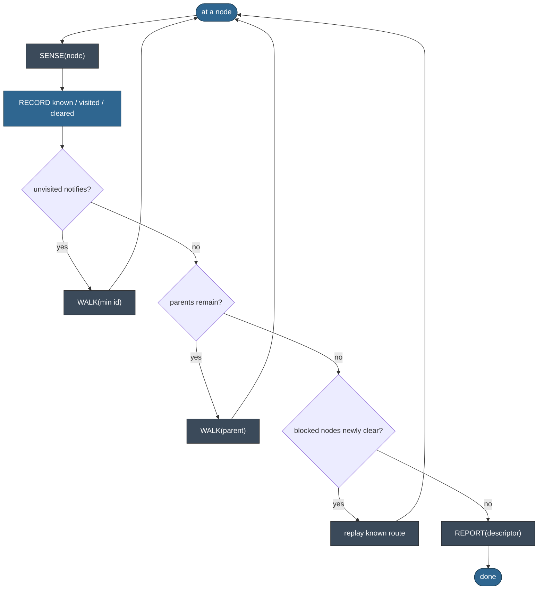
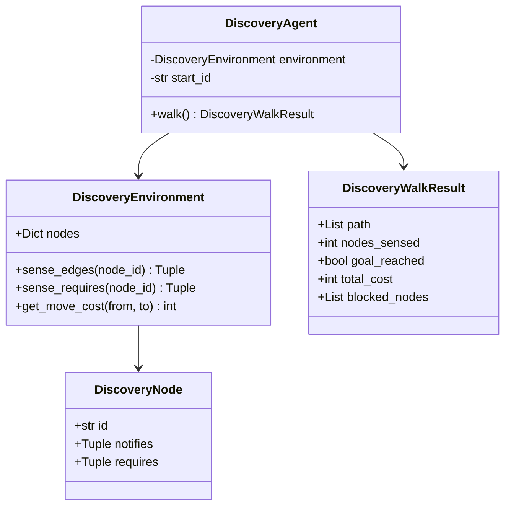

# Draft: The infra discovery agent — the agent loop

*Draft material for future work on modelling the infra discovery agent's loop. These two diagrams are the agent side (the **agent ontology**), not the world ontology — the world-ontology diagrams (vocab graph, instance topology, belief lifecycle, belief-building sequence) live in the [IA Series 13 post](../blog.md). Reviewed here before deciding where the agent-loop treatment goes.*

## The walk loop, as a flow

The discovery agent's decision loop: sense the node you're at, fold it into belief, and move on — forward while there are unvisited candidates, backtrack when there are none, and a readiness sweep re-opens blocked nodes once their requirements clear.

## The implementation, as a class diagram

The program surface of `discovery/` — the environment withholds the graph and answers only sense queries; the agent owns position and belief; the result reports the walk.

