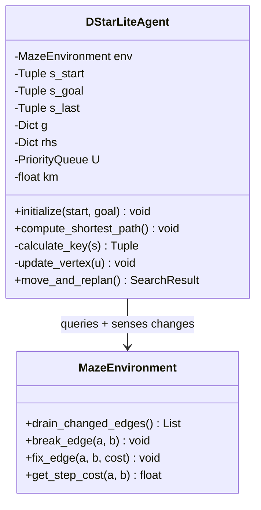
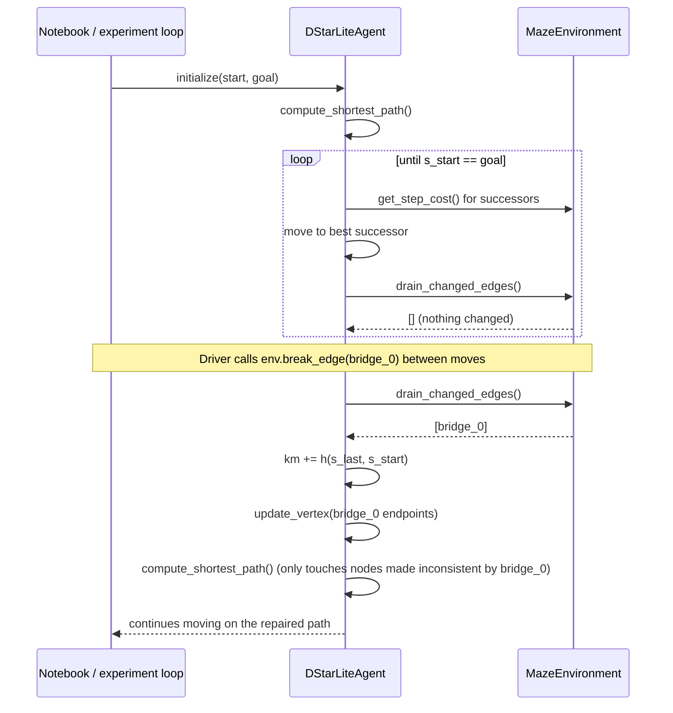

# D* Lite: Agent Changes

## Purpose

`environment_changes.md` covered what the maze needs to expose (mutable edge costs, a changed-edges feed). This document covers the other half: what happens to the *agent* once the thing it's planning over can change out from under it mid-traversal. The short version — every algorithm in `maze_solver/algorithms/` today is a stateless function; D* Lite is not, and that difference cascades through the class design, not just the search loop.

## Updated PEAS Analysis

| Element | Current (A* / GBFS / BFS / DFS) | Proposed (D* Lite agent) |
|---|---|---|
| **Performance** | Find *a* path from start to goal in one call | Keep the agent's path to the goal valid *continuously*, repairing it as cheaply as possible when the world changes |
| **Environment** | Static grid maze | Grid maze with a scripted bridge break/fix schedule (see `environment_changes.md`) |
| **Actuators** | Return a `SearchResult` (path + metrics) | **Move** the agent one cell at a time; **replan** (patch `g`/`rhs`) when a change is sensed; eventually return a result once at the goal |
| **Sensors** | `env.graph`, `env.get_step_cost()` — queried once per `search()` call | Same, plus `env.drain_changed_edges()` — queried once **per move**, not once per call |

The Actuators row is the crux: today's agents have one actuator (*return an answer*). A D* Lite agent has three (*move*, *replan*, *eventually return an answer*), exercised repeatedly over the life of the traversal.

## Agent Function Evolution

**Current (`SearchAlgorithmBase.run` → any `search()` implementation):**

```python
function SEARCH-AGENT(env, start, goal) returns SearchResult
    initialize g, h, f, frontier, closed_set    # all local to this call
    while frontier not empty:
        current ← extract node with best f from frontier
        if current == goal:
            return SUCCESS(reconstruct_path())
        expand current's neighbors, update frontier
    return FAILURE
```

Nothing here survives past the `return`. Call `search()` again and it starts from zero — which is exactly right for a static graph, and exactly wrong once the graph can change mid-walk.

**Proposed (D* Lite agent):**

```python
function D-STAR-LITE-AGENT(env, start, goal) returns final SearchResult
    g, rhs, U, km ← INITIALIZE(start, goal)     # persists for the whole traversal
    COMPUTE-SHORTEST-PATH(g, rhs, U, km, start)

    s_last ← start
    while start ≠ goal:
        start ← MOVE-TO-BEST-SUCCESSOR(start, g, env)
        changed_edges ← env.drain_changed_edges()      # the new sense step

        if changed_edges not empty:
            km ← km + h(s_last, start)
            s_last ← start
            for (u, v) in changed_edges:
                UPDATE-VERTEX(u, g, rhs, U, env)
                UPDATE-VERTEX(v, g, rhs, U, env)
            COMPUTE-SHORTEST-PATH(g, rhs, U, km, start)   # only touches inconsistent nodes

    return SUCCESS(path_taken_so_far)
```

Two things worth calling out for anyone coming from the A* implementation in this repo:

- **The loop is now over moves, not over frontier pops.** `search()` today has one `while frontier:` loop that runs to completion inside a single call. The D* Lite loop is over the agent physically advancing through the maze; replanning is a nested activity that happens *within* a move, not instead of one.
- **`g`, `rhs`, `U`, and `km` must outlive a single method call.** They're not local variables inside `search()` anymore — they're instance state on the agent, exactly the kind of state `SearchAlgorithmBase.__init__` doesn't currently hold (it only stores `env`, `config`, `name`).

## Percept Sequence

Extending the percept-sequence table style used for the self-reflection agent (`documentation/self-reflection/development_from_self_consistency.md`):

| Percept sequence | Action |
|---|---|
| `[start, goal, static graph]` | `COMPUTE-SHORTEST-PATH()` (identical cost to a full A* search) |
| `[..., agent moved to s, no changed edges]` | Move again — no replanning work at all |
| `[..., agent moved to s, bridge_0 broke]` | `UPDATE-VERTEX` on both endpoints of `bridge_0`, then a **bounded** `COMPUTE-SHORTEST-PATH()` pass — only the nodes made inconsistent by that edge, not the whole maze |
| `[..., agent moved to s, bridge_0 fixed]` | Same mechanism, opposite direction (node becomes *overconsistent* instead of *underconsistent*) — D* Lite doesn't distinguish "got worse" from "got better" as separate code paths, both just call `UpdateVertex` |
| `[..., start == goal]` | Return final result — done |

The percept that doesn't exist anywhere in the current codebase is the second row's negative case — *nothing changed*. Every existing algorithm has no notion of "keep going without redoing work," because every existing algorithm never stops to check.

## Agent type reclassification

`CLAUDE.md` classifies the LLM agents in this repo by PEAS + agent type (model-based reflex, utility-based, etc.) — worth applying the same lens here for a direct comparison:

- **A* / GBFS / BFS / DFS today are stateless goal-based agents.** `SearchAlgorithmBase.run()` creates fresh tracking dicts every call and returns a self-contained result; nothing persists, so in AIMA's terms these are as close to "simple goal-based" as a search algorithm gets — no memory of past invocations, no internal model of the world beyond what's passed in.
- **A D* Lite agent is a model-based, goal-based agent with persistent internal state.** It maintains an explicit internal model of the graph's *believed* cost structure (`g`, `rhs`) that it updates incrementally as percepts (`drain_changed_edges()`) arrive, and it uses that model — not a fresh recomputation — to decide its next action. That's the textbook definition of "model-based" in the AIMA agent taxonomy: state that persists across percepts and is updated by a transition-model-like rule (`UpdateVertex`), rather than a reflex mapping from the latest percept alone.
- It is **not** utility-based in the sense the self-reflection agent is (no cost/confidence tradeoff being weighed) — it's still single-mindedly goal-directed. The novelty is purely the *persistent state*, not a new decision criterion.

## Class diagram (proposed — not yet implemented)



Deliberately **not** shown as inheriting from `SearchAlgorithmBase` or `InformedSearch` — see "Where this breaks the current base classes" below.

## Sequence diagram: one break/fix cycle



## Where this breaks the current base classes

`SearchAlgorithmBase.search(start, goal) -> SearchResult` (`maze_solver/algorithms/base.py`) is built around one call producing one complete answer. `DStarLiteAgent` doesn't fit that shape for two reasons:

1. **It has no single terminal call.** `move_and_replan()` needs to be invoked repeatedly by whatever's driving the traversal (a notebook cell, a step loop, an "experiment" runner) — there's no equivalent of `run()` that both starts and finishes the job in one call, unless the class internally loops until `s_start == goal`, which then makes intermediate states (useful for the dashboard-style visualization every other algorithm gets) invisible to the caller.
2. **`SearchResult` is a single-shot snapshot** (`path`, `visited`, one `exploration_history`). A D* Lite run's interesting output is a *sequence* of replanning events, each with its own small `exploration_history` — closer in spirit to what `reports.py::compare_search_algorithms` produces across multiple algorithm runs than to what one algorithm's `SearchResult` holds today.

Recommendation to weigh before any code is written: **don't force `DStarLiteAgent` into the `InformedSearch` hierarchy.** It's a sibling concept (both use `g`, heuristics, and a priority queue) but not a subtype (it isn't a one-shot `search()`). A cleaner fit is a new, separate base — something like an `IncrementalSearchAlgorithm` with a `step()` method returning one replanning event at a time — that the dashboard/report layer can consume as a stream, the same way it currently consumes `exploration_history` as a list of snapshots. That's a design decision for whenever implementation starts, flagged here rather than settled.

## Key differences summary

| | `SearchAlgorithmBase` today | `DStarLiteAgent` proposed |
|---|---|---|
| Call shape | One `search(start, goal)` call → one `SearchResult` | Repeated `move_and_replan()` calls, driven externally, over the agent's lifetime |
| State lifetime | Local to one `search()` call | `g`, `rhs`, `U`, `km` persist for the whole traversal |
| Work per environment change | N/A — environment never changes | Bounded by the number of newly-inconsistent nodes, not the whole graph |
| Agent classification | Stateless goal-based | Model-based, goal-based, with persistent internal state |
| Result shape | One `SearchResult` snapshot | A sequence of replanning events (needs a new result/history shape) |
