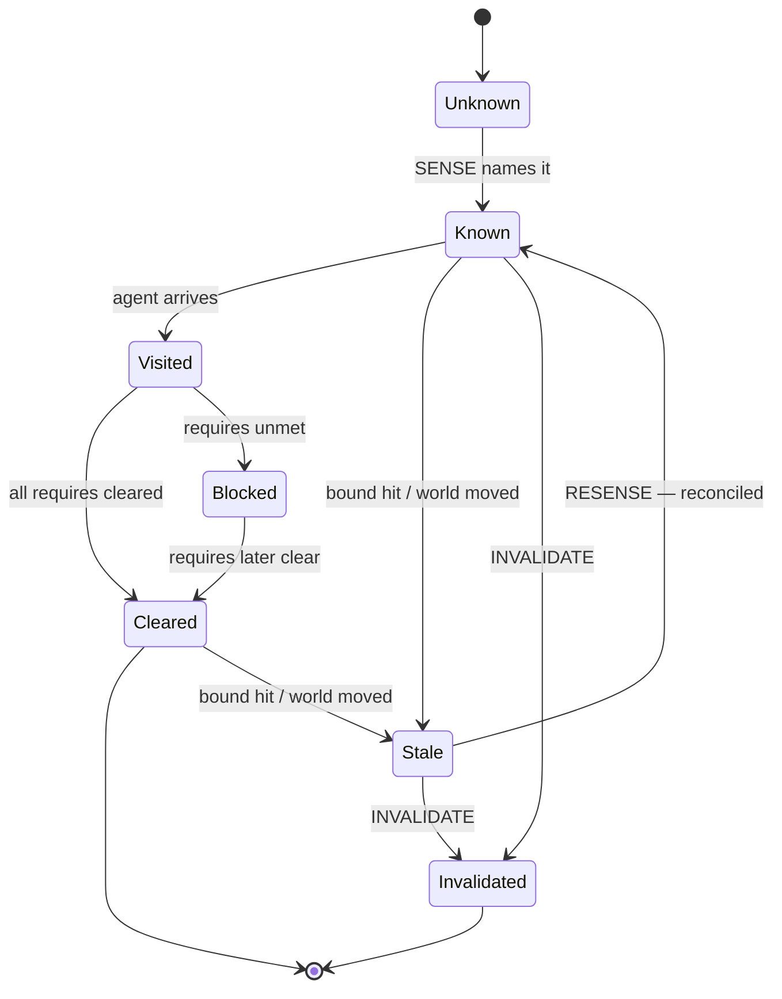

# [IA Series 14/n] Managing a Belief State

*Draft. Following on from [Ontologies, Doctrine, and Ubiquitous Language](../13-ontologies/blog.md), which stored a fact as a belief. This post is about what happens after you hold one — and the vocabulary the agent needs the moment the world won't sit still.*

## Defining the belief state

"Belief state" has two meanings in the literature. In AIMA it is the set of possible states consistent with what the agent has perceived — an epistemic record. In POMDP planning it is a probability distribution over states. This post means the AIMA sense: the belief state is what the agent knows, not a distribution over what might be.

Two terms carry the definition.

**Epistemic** — pertaining to knowledge: what an agent holds as known, as distinct from what is the case. The agent's grip on the world is always epistemic — incomplete, possibly stale, possibly false. The world is **ontic**: whatever it actually is, regardless of what the agent holds.

**Belief state** — the agent's epistemic record: the persistent, entity-indexed store of its held copies of world facts, each carrying provenance (when, how, by what it was obtained) and a Kind (who determines its truth). It is not the world it models, not the agent's declared commitments, and not the loop that reads and writes it.

AIMA already names the store: the **knowledge base** — "the set of sentences an agent holds to be true," from the Grammar of Logic term sheet (IA 11). The belief state is the runtime instance of that KB: the KB is the declarative structure, the belief state its held, versioned form.

Managing it has its own literature. **Belief revision** (Alchourrón, Gärdenfors & Makinson 1985) is the theory of how beliefs change — revision, contraction, expansion. **Truth maintenance** (Doyle 1979; de Kleer 1986) holds beliefs with justifications and retracts them when a justification fails — which is the Kind story: justification is what Kind names, retraction is what the freshness axis must make declarative. The planning tradition that assumes a fully-known initial state — HTN planners among them — needs no belief state, because there is nothing uncertain to hold. The unknown world is where it earns its keep.

The gap the rest of this post is about: **the world is ontic; the belief state is epistemic; and the two can drift apart.**

## Storing was the easy half

The [previous post](../13-ontologies/blog.md) established the acquisition half: a fact is a justified true belief, and storing it as a belief is **SENSE → RECORD** — the agent senses the world's exogenous predicates (`node`, `notifies`, `requires`) and records them into its own controllable ones (`known`, `visited`, `cleared`). The temporal caveat was already there: *a fact was true at the point in time it was sensed, or the action was taken.*

That caveat is the whole problem in miniature. The held belief *was* a fact — true at the moment it was sensed. But it is **exogenous**: its truth is set by the world, and the world can change after the sensing. So between one sense and the next, a belief gained by visiting a node can **drift out of sync with the world state** — not because it was a guess, but because the world it was sensed from won't sit still. The world is what the search moves through; the belief is what the search holds. They are different things, and the gap between them is the subject of this post.

## Five layers

An agent working an unknown world operates over five layers, each distinct from the others.

A generalization of the **Dual-State Architecture** in [Managing the Stochastic (Thompson 2025)](https://arxiv.org/abs/2512.20660v1): that paper split the agent's state between deterministic workflow control and the stochastic environment where the LLM lives — the LLM treated as a component of the environment, not the decision-maker. These five layers keep that boundary — NL reasoning is the environment's stochastic generation, Declared the deterministic workflow control — and add the world, the belief state, and the repository the dual-state framing left implicit.

| Layer | What it holds | Source | Reasoning |
|---|---|---|---|
| **World** (ontic) | the actual infra estate | mutable; observed via sensing — copies only | — (it *is*; not reasoned) |
| **Belief** (epistemic) | held copies of world facts — a projection of the repository | append-only; the agent's model | symbolic — atoms, predicates, the derived closure (the grammar of logic, IA 11) |
| **NL reasoning** | the LLM's reasoning context — where the model thinks | the generator; self-attested | stochastic — the model's generation, a component of the environment (IA 12) |
| **Repository** | generator artifacts + effector output + guard verdicts + sensed facts — the append-only artifact DAG | the single evidentiary store | — (an evidentiary store, not a reasoner) |
| **Declared** | the agent's own commitments and workflow state | the agent's intent | symbolic — the agent's stated commitments |

The relationships that matter:

- The belief state **reads from the repository** — it is a projection of it, not a parallel store. The repository holds the evidentiary record; the belief state is the view the agent reasons over. The repository is the artifact DAG; the belief state is its projection — it holds graph-shaped facts (edges, requirements) but is not itself a DAG.
- **Belief and Declared are two projections of the same repository**: the belief state is the repository projected onto the world model; the declared is the same repository projected onto the workflow's requirements — plus the agent's own commitments.
- The NL reasoning is self-attested and ephemeral; the repository is durable and verified.

One ontic world behind them all. The belief state is the projection the agent reasons over; the NL reasoning is where the model thinks; the repository is the single store everything reads from; the declared is the agent's own commitments.

The drift problem lives in the middle layer: **the epistemic copy stored in the belief state can diverge from the ontic world**, and nothing in the current vocabulary names that divergence.

## Two channels

Beliefs arrive through two channels, and the channel decides what can go wrong with them.

| Channel | Source | What can go wrong | Managed by |
|---|---|---|---|
| **Sensed** | the world — a node's `notifies`, `requires` | the copy goes stale | re-sensing (the freshness axis) |
| **Reported** | the model's reasoning — `"FINAL:"` | the reasoning is self-attested | confidence (a different mechanism) |

The sensed channel is the one this post manages: the belief state reasons symbolically (IA 11), and re-sensing keeps its copies in sync with the world.

The reported channel is the boundary: the model reasons stochastically (IA 12), and a self-attested belief cannot be re-sensed against the world — only judged. That judgement is a different kind of management, its own subject; here it marks where the freshness axis stops.

## Kind is justification, not freshness

The post on ontologies classified every predicate by **Kind** — controllable, exogenous, static, derived — which is *who determines the atom's truth*. That is the justification axis.

What it is *not* is the **freshness axis**. Kind says nothing about how current your copy is. An exogenous atom is *ground truth at the moment of sensing* — but the copy can go stale the moment the world moves. Justification and freshness are orthogonal: one is about who makes the fact true, the other about when to re-sense.

Why not just add a predicate, `stale(fact)`? Because of the closed-world assumption. An atom absent from the world model is read as false — so `stale(?fact)` would be *entailed false* for every unasserted atom, which is nonsense. Freshness is a property **of a copy** — when it was sensed, by which effector, with what verdict — not a property of the world. It must be **metadata on the epistemic copy, never an atom**.

## The freshness axis: declared doctrine, recorded metadata

There are three questions hiding inside "freshness," and they don't all have the same answer:

| Question | Answer |
|---|---|
| **Storage** — where does freshness live? | metadata on the epistemic copy, never an atom in the world model |
| **Meaning** — is it ontology or bookkeeping? | a **declared staleness bound** per predicate, carried beside `:kind` in the ontology — the freshness *doctrine* |
| **Policy** — who decides when to re-sense? | the loop executes the declared bound — re-sensing becomes ontology-driven |

The sharp claim is the middle row. A bound like *"`ci-green` is fresh for N minutes"* is itself a fact about the world (how fast it changes) — static or derived — so declaring it in the ontology is world content, not a loop concern. This is IA 13's own framing made concrete: **`:kind` is the justification axis; a staleness bound is the freshness doctrine on the same map.** And D4's "always re-sense" turns out to be the degenerate case — no declared bounds, re-sense everything. The doctrine upgrades it to *"re-sense when the declared bound is hit,"* without touching what an atom is.

One rule the doctrine must handle: **derived predicates inherit freshness.** `reachable`, `is-leaf` (and the earlier post's `cleared`) are computed from base atoms — their staleness is a function of their dependencies', not an independent bound. A derived head's freshness bound is the **minimum** (most conservative) of its body's bounds — if any base belief goes stale, everything derived from it is stale — and stale signals **OR-compose** across the body. A derived head may override `:fresh-for` only when re-sensing the aggregate is cheaper than re-sensing its parts. **Consistency is downstream of sync.**

The whole axis in one line: **the ontology declares how fresh each fact must be; the metadata records how fresh it actually is; the loop reconciles the gap.**

[IA 13 ended by deciding what schema.org carries](../13-ontologies/blog.md): facts and their form, never semantics — no Kind, no preconditions, no derived. The freshness axis inherits the same split. A copy's metadata — when it was sensed, by what, with what verdict — is a fact *about the copy*, and it serialises: the belief state's JSON-LD gains `sensed_at` and `sensed_by`. The declared bound — *ci-green is fresh for five minutes* — is doctrine, and like `:kind` it stays in the semantics layer. Schema.org carries the record; the ontology declares how fresh it must be.

## The management actions

With a declared bound and recorded metadata, the loop's job is reconciliation:

- **RESENSE(id)** — re-query a node when its bound is hit or a signal fires, to detect drift
- **RECONCILE(id)** — compare the recorded belief against the fresh sense and update
- **INVALIDATE(id)** — mark a belief stale without yet knowing the truth

These are belief revision and truth maintenance made operational — the theory named in this post's opening, given verbs. RESENSE is the re-observation that supplies new information, the re-sensing stance of planning under uncertainty; RECONCILE is **belief revision** — accommodating new information, even when it contradicts what is held ([Alchourrón, Gärdenfors & Makinson 1985](https://en.wikipedia.org/wiki/Belief_revision)); INVALIDATE is **contraction** — withdrawing a belief whose justification no longer holds, the retraction a truth-maintenance system performs ([Doyle 1979](https://en.wikipedia.org/wiki/Truth_maintenance_system); [de Kleer 1986](https://en.wikipedia.org/wiki/Assumption-based_truth_maintenance)).

These are the actions the earlier post's "when the ontology is re-entered" predicted: the vocabulary the agent needs the moment the world won't sit still.

### The lifecycle, extended

[IA 13's appendix](../13-ontologies/blog.md) drew the acquisition lifecycle: *unknown → known → visited → cleared or blocked.* Its one revision edge — *blocked → cleared, when requires later clear* — was management without the vocabulary. The freshness axis supplies what the diagram lacked: a held belief can go **stale** when its bound is hit or the world moves, and the management actions are the missing transitions.



The additions are the management overlay: **Stale** is a belief whose bound is hit or whose world may have moved; **RESENSE** re-observes it and reconciles the copy; **INVALIDATE** withdraws a belief whose justification no longer holds. The lifecycle no longer only grows — it is kept in sync.

## Worked example: a `:predicate` extension

The concrete shape, in the DS-PDDL flavour of the atomicguard work — staleness bounds declared beside `:kind`:

```
:predicates ((branch-exists ?b - branch         :kind static        :stale-on <never>)
             (pr-open ?p - pr                   :kind controllable  :stale-on <effect-retract>)
             (ci-run ?c - commit ?p - pr        :kind exogenous     :fresh-for "5m")
             (ci-green ?c - commit ?p - pr      :kind exogenous     :fresh-for "5m")
             (merge-ready ?p - pr               :kind exogenous     :fresh-for "1m"))
```

- `:fresh-for N` — a wall-clock bound: the copy is trustworthy for N; re-sense when the bound is hit
- `:stale-on <signal>` — an event bound: the copy is stale the moment a named signal fires (a reverse effector returns, an `:effect` retracts it, a downstream invalidation fires)
- omitted — D4's default: always re-sense

And derived heads **compose** rather than declare:

```
(:derived (checks-green ?p)
    (forall (?c - commit) (imply (ci-run ?c ?p) (ci-green ?c ?p))))
;; freshness(checks-green) = min over the body's bounds; stale signals OR-compose
```

The bound lives in the declared ontology; the metadata (`sensed_at`, `effector`, `verdict`) threads the existing guard-result and DAG-timestamp structures, and the declared-state document's `updated_at`. No new atoms, no change to the world model's semantics, D4's closed-world stance intact.

## Re-entry stays open

The ontology was re-entered the moment the world wouldn't sit still — that was the signal. And writing this has been managing my own belief state: the last post's claim that the belief state was "the controllable side" was a belief I held, and it went out of sync with the world the moment the atomicguard work pointed out the epistemic copies. Justification is not truth; freshness is not Kind; and the belief I hold about my own work needs the same re-sensing I've been describing.
