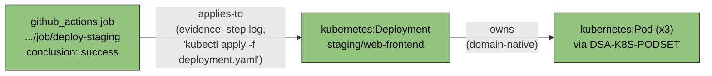
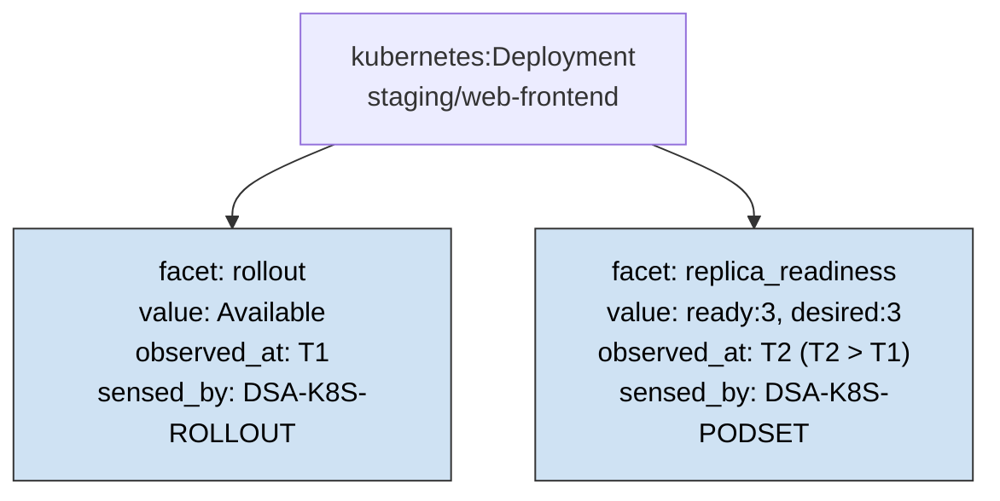
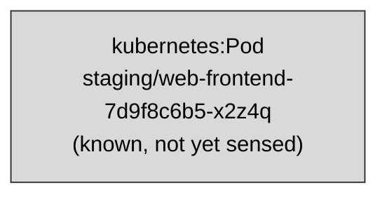
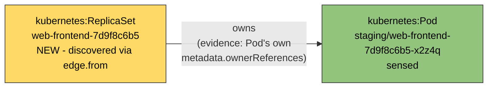

# Infra Discovery: Example Visualizations

## Purpose

`step0_schema.md` gives the types and the registered vocabulary; this document instantiates them - concrete `NodeId`/`Edge`/`Facet` examples, diagrammed. **Illustrative only.** No `infra-discovery` implementation exists yet - unlike `discovery/`'s GIFs (real `DiscoveryAgent.walk()` output, rendered frame by frame) or `atomicguard-bridge/`'s (real subprocess-backed sensing), every diagram below is hand-authored from the schema and the real `atomicguard` ontology document's own worked trace, not generated from a running walk. Treat these as "what the shape looks like," not "what was observed."

## Example 1: the canonical `applies-to` trace

Reused directly from `atomicguard`'s own worked example (`topology_sensing_dsa_belief_state_and_agent_function.md`, Step 3) - a `github_actions.job` senses successfully, and its step-log content (already fetched, no new DSA call) reveals it applied a Kubernetes manifest.

Both edges here are the *forward* case - the sensed node (`Job`, then `Dep`) is always `edge.from`, the newly-discovered node is always `edge.to`. This is the only direction the original, unfixed `RESOLVE-BRIDGES`/`RELEVANT` propagation ever handled - see Example 3 for why that was never actually guaranteed by the ontology itself, just true of every example used to derive it.

## Example 2: multi-facet state, accumulated over separate sense calls

One node, two facets, sensed by two different DSAs at two different times - not one call learning everything, the property `step2_environment_analysis.md`'s "Observable: Partially, and now partially *within* a node too" row is about.

Between `T1` and `T2`, this node is "known and partially observed" - a state `discovery/`'s binary `known`/`visited` can't represent at all, and `real_discovery/`'s single `sense_edges()` call never produces either (one call, one artifact, done). Nothing forces `replica_readiness` to ever get sensed - `DECIDABLE(Ψ, belief_state)` might already be true off `rollout` alone, in which case `F2` never appears.

## Example 3: bidirectional discovery, made concrete (and where it gets genuinely hard)

`findings.md`'s F-001, worked through with a real, well-documented Kubernetes mechanism rather than a guessed one - PR #16's own review correctly flagged uncertainty about an earlier illustration (whether a `Service` object really reveals its own `Ingress`); `metadata.ownerReferences` is standard, universally-present Kubernetes API behavior, not a guess, and `owns` is one of the ontology's own named example verbs (`domain, kind, id, state, legal_actions`'s edge_type bullet: *"a domain's own native verb (`owns`, `selects`, `contains`)"*).

**Before** - a `Pod` is already known (surfaced some other way, e.g. from an alert), not yet sensed:

**After sensing the `Pod`** - its own artifact's `metadata.ownerReferences` reveals `kind: ReplicaSet, name: web-frontend-7d9f8c6b5`:

Here the sensed node (`Pod`) is `edge.to`, and the newly-discovered node (`ReplicaSet`) is `edge.from` - the exact case `RESOLVE-BRIDGES`/`RELEVANT`'s original, unfixed propagation (`edge.to` only) would have silently missed. This is genuinely how the real chain works: `ownerReferences` points *up* (child names its owner), so sensing the child reveals the parent, backward relative to the top-down `Job → Deployment` direction Example 1 walked.

**Where this gets genuinely hard, not just a clean win:** `ReplicaSet` is not a registered `kind` in this environment's own `DSA-CATALOGUE[kubernetes]` (`step0_schema.md` - Pods are grouped directly under `Deployment` via `DSA-K8S-PODSET`, matching the source catalogue's own choice not to give `ReplicaSet` a separate entry). So once `ReplicaSet` is discovered as `edge.from` here, `RELEVANT(BRIDGE-CATALOGUE[owns](edge.from), edge.from, Ψ, belief_state)` has nowhere to go - `DSA-CATALOGUE[(kubernetes, ReplicaSet)]` doesn't exist. This is a sharper, deeper version of the finding originally raised on `atomicguard` PR #369 - not the same problem, and now the distinction matters concretely, not just rhetorically: PR #369's own finding ("the *wrong* catalogue might get selected for the new end" - `BRIDGE-CATALOGUE[edge_type]` reused unchanged for both ends, offering `edge.to`'s DSAs as candidates for `edge.from`'s subject) is **fixed** as of commit `fdc0f51` - `BRIDGE-CATALOGUE[edge_type]` is now a function of the end being resolved, so it never again offers the wrong domain/kind's DSAs. That fix does **not** touch this example's problem: "no catalogue may exist for the new end's kind *at all*," for a real, standard Kubernetes relationship, not a contrived one. `BRIDGE-CATALOGUE[owns](edge.from)` now correctly evaluates to `DSA-CATALOGUE[(kubernetes, ReplicaSet)]` - which still isn't a registered key, and nothing in the fixed pseudocode says what a lookup against an unregistered kind actually does. Two ways this could still go, illustrated here rather than resolved:

- **(a) Discovery genuinely stops one hop short.** `RELEVANT` returns empty; `ReplicaSet` gets recorded as an edge endpoint but never itself becomes a sensed node, and the real owning `Deployment` (one more `ownerReferences` hop up) is never reached this way.
- **(b) The `Pod`-sensing DSA is authored to resolve past unregistered intermediate kinds itself** - package "owning `Deployment`" directly as evidence (following the `ReplicaSet → Deployment` chain internally, the same way `DSA-K8S-PODSET` already treats `Deployment` as pod-set's effective parent rather than exposing `ReplicaSet` at all), so the edge discovered is `Deployment --owns--> Pod` directly, skipping `ReplicaSet` as a node entirely.

Not decided which. Worth keeping visible as a real design fork this one worked example surfaces, not a corner case invented for the diagram.

## Related documents

- [`step0_ubiquitous_language.md`](step0_ubiquitous_language.md) - the canonical definition of every term used above.
- [`step0_schema.md`](step0_schema.md) - the types and registered vocabulary these examples instantiate.
- [`findings.md`](findings.md) - F-001, "Discovery is bidirectional," the finding Example 3 works through concretely.
- [`step4_algorithm_fit.md`](step4_algorithm_fit.md) - `SWEEP-CLEARED`/`RELEVANT`/`IN-SCOPE`, the mechanisms these examples' edges and facets feed into.
- `thompsonson/atomicguard` PR #369 - the `BRIDGE-CATALOGUE`/`edge.from` type-mismatch finding Example 3's "where this gets genuinely hard" section distinguishes itself from. Fixed there (commit `fdc0f51`); Example 3's own "no catalogue at all" problem is not the same finding and is not fixed by it.
- [`step5_agent_program.md`](step5_agent_program.md) - Example 3's still-open fork ((a) vs. (b), above) scheduled as Step 4 (`RECORD-UNCATALOGUED`), not left open indefinitely.
