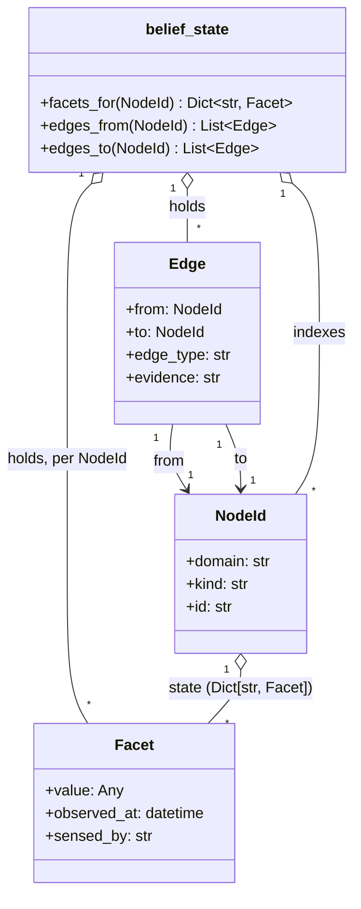

# Infra Discovery: Ontology Schema

## Purpose

`environment_design.md` sketched `NodeId`/`Facet`/`Edge` as signatures only, deliberately not a full reference - the point there was showing *why* the shape has to change from `real_discovery/`'s, not pinning down every field. This document is that reference: the actual field-level schema, and - just as load-bearing - the actual registered vocabulary (which `domain`s, which `kind`s per domain, which `edge_type`s) this environment would validate against. That vocabulary isn't invented here; it's reused verbatim from `atomicguard`'s own `DSA-CATALOGUE`/`BRIDGE-CATALOGUE` content (`platform_topology_peas_and_cli_actions.md` §5, `topology_sensing_dsa_belief_state_and_agent_function.md`'s Step 3), the same discipline every other document in this track has followed - checked against the real source, not reconstructed from memory.

No code exists yet. This is schema-as-documentation, not a Python module or a deployed JSON-LD context.

**Restructured, not just flagged, as of this revision.** The previous version of this document led with Python dataclass-like pseudocode - a methodology gap the user identified directly: it let an implementation-language type system stand in for the vocabulary itself, before the vocabulary was agreed independently of any implementation. `ubiquitous_language.md` fixed the vocabulary half (the canonical, implementation-agnostic term definitions this document now *projects*, rather than defines). This revision fixes the structural half: the ontology's shape now leads with a JSON-LD-style `@context`, not a dataclass, for the reason `schema.md`'s own prior note already argued - concretely closer fitting than full OWL/RDF, since `domain`/`kind` is already meant to be decentralized and extensible "by the domain, not global," exactly what JSON-LD vocabularies support without requiring a formal reasoner. The Python dataclasses are retained, demoted to an appendix - one possible implementation projection, not the primary definition.

## The ontology as a JSON-LD-style `@context`

A `@context` maps every term this ontology uses to a stable identifier, and - where a value is itself another `NodeId` - marks that explicitly with JSON-LD's own `"@type": "@id"` idiom ("this value is a reference to another node," not a bare string). That's exactly the fix the dataclass-first version was making implicitly (`Edge.from_`/`Edge.to` are typed as `NodeId`, not `str`) but had no vocabulary-level way to *say* independent of Python's type system - a `@context` says it once, in a form a non-Python reader (or a non-Python implementation) can read directly.

**Honesty about what this is and isn't**, matching this document's existing "no code exists yet" caveat: no `https://...#` namespace below is actually registered or dereferenceable anywhere. `@vocab` is a placeholder standing in for wherever these terms eventually get a real, resolvable home - possibly reusing OpenTelemetry Resource Semantic Convention terms per-property, the option `atomicguard`'s own ontology survey flagged as "the most likely future reuse candidate" and `ubiquitous_language.md`'s "Not decided" section leaves open. What this section buys over the dataclasses-first version isn't resolvability - it's that the vocabulary is now expressed independent of any one programming language's type system, which is the actual gap that was raised.

```jsonld
{
  "@context": {
    "@vocab": "https://infra-discovery.example/terms#",

    "NodeId":       "@id",
    "domain":       { "@id": "domain",      "@type": "@id" },
    "kind":         { "@id": "kind" },
    "id":           { "@id": "id" },

    "state":        { "@id": "state",       "@container": "@index" },
    "Facet":        "Facet",
    "value":        "value",
    "observed_at":  { "@id": "observed_at", "@type": "xsd:dateTime" },
    "sensed_by":    { "@id": "sensed_by",   "@type": "@id" },

    "Edge":         "Edge",
    "from":         { "@id": "from",        "@type": "@id" },
    "to":           { "@id": "to",          "@type": "@id" },
    "edge_type":    { "@id": "edge_type",   "@type": "@vocab" },
    "evidence":     "evidence",

    "xsd": "http://www.w3.org/2001/XMLSchema#"
  }
}
```

Term-by-term rationale - why each is written this way, not just what it says:

- **`domain` and `sensed_by` are `"@type": "@id"`.** Both are references into other parts of the registered vocabulary (a `DSA-CATALOGUE` key; a DSA name), not free-text strings - `ubiquitous_language.md`'s own definitions already say so in prose ("A registered key in `DSA-CATALOGUE`"; "a key into `DSA-CATALOGUE`'s entries, not a free-text label"). `"@type": "@id"` is that same constraint, expressed in the vocabulary layer instead of relying on a reader (or an implementation's docstring) to remember it.
- **`state` uses `"@container": "@index"`.** JSON-LD's native idiom for "a map keyed by an arbitrary string, all values sharing one shape" - exactly `Dict[str, Facet]`, expressed without reference to Python's `Dict`.
- **`edge_type` is `"@type": "@vocab"`.** Its value should resolve against the registered verb vocabulary (`BRIDGE-CATALOGUE`'s keys, or a domain-native verb) rather than an arbitrary external IRI - `"@vocab"` type coercion is JSON-LD's idiom for exactly that: "look this up in the local vocabulary," matching `edge_type`'s own closed-set constraint (`schema.md`'s "Edge types" section, below, is that closed set).
- **`from` and `to` are `"@type": "@id"`.** Matching `Edge`'s already-stated constraint that `from`/`to` are `NodeId`s, not strings - now stated where the vocabulary itself is defined, not only in a dataclass's type annotation.
- **`NodeId`, `Facet`, and `Edge` map to themselves as vocabulary terms**, not to fields - they're the three shapes this ontology has; the `@context` above only needs to disambiguate their *fields*, since JSON-LD resolves a compact term to a full IRI once, not per-occurrence.

## Structure, as a diagram



No `Node` class appears here on purpose - see "Where a node's state actually lives," below; the diagram would be misleading if it drew one.

## Where a node's state actually lives

Worth restating precisely, since it's easy to misread the shapes above as "the Node class": **there is no `Node` type this schema defines**, in either the `@context` or the diagram. `environment_design.md`'s "Who owns what" resolution (inherited from the source ontology document's own "The DSA invocation *is* the node") means a node is never materialized as an object - it's a `(domain, kind, id)` key into `belief_state`'s own facet map, nothing more. `NodeId` is a real identity; "Node" is a *view* over `belief_state`, assembled on read (`belief_state.facets_for(node_id) -> Dict[str, Facet]`), not a value anything constructs or holds.

## Domains and kinds - the registered vocabulary (`DSA-CATALOGUE`)

Reused verbatim from `atomicguard`'s own catalogue (sensing DSAs only, matching the source document's sensing-first scope - acting DSAs are catalogued there too but marked `[deferred]`, not reproduced here since nothing in this schema depends on them yet):

**`github_actions`**

| kind | DSA | wraps |
|---|---|---|
| `workflow_run` | `DSA-GH-RUN-LIST` | `gh run list --repo {repo} --json databaseId,headSha,status,conclusion` |
| `workflow_run` | `DSA-GH-RUN-WATCH` | `gh run watch {run_id} --repo {repo} --exit-status` (blocking) |
| `workflow_file` | `DSA-GH-WORKFLOW-FILE` | `gh api repos/{repo}/contents/.github/workflows/{file}` |
| `pull_request` | `DSA-GH-PR-VIEW` | `gh pr view {pr_number} --json headRefOid,reviewDecision,statusCheckRollup` |
| `job` | `DSA-GH-JOB-WATCH` | `gh api repos/{repo}/actions/jobs/{job_id}` |

**`kubernetes`**

| kind | DSA | wraps |
|---|---|---|
| `Deployment` | `DSA-K8S-DEPLOYMENT-GET` | `kubectl get deployment {name} -n {ns} -o json` |
| `Deployment` | `DSA-K8S-ROLLOUT` | `kubectl rollout status deployment/{name} -n {ns}` (blocking) |
| `Deployment` | `DSA-K8S-PODSET` | `kubectl get pods -n {ns} -l {selector} -o json` |
| `Pod` | `DSA-K8S-POD-STATUS` | `kubectl wait --for=condition=Ready pod/{name} -n {ns}` (blocking) |
| `Pod` | `DSA-K8S-POD-LOGS` | `kubectl logs .../kubectl get events` (diagnostic) |
| `Service` | `DSA-K8S-ENDPOINTS` | `kubectl get service ... then kubectl get endpoints` |
| `Ingress` | `DSA-K8S-INGRESS` | `kubectl get ingress {name} -n {ns} -o json` |
| `ConfigMap` | `DSA-K8S-CONFIGMAP` | `kubectl get configmap {name} -n {ns} -o json` |
| `Secret` | `DSA-K8S-SECRET` | same shape as `DSA-K8S-CONFIGMAP` |

**`argo_rollouts`** - kept separate from `kubernetes`, per the source document's own choice

| kind | DSA | wraps |
|---|---|---|
| `Rollout` | `DSA-ARGO-ROLLOUT` | `kubectl get rollout {name} -n {ns} -o json` |

**`gcp`**

| kind | DSA | wraps |
|---|---|---|
| `GKE_cluster` | `DSA-GCP-CLUSTER` | `gcloud container clusters describe {cluster} --region {region} --format=json` |
| `CloudRun_service` | `DSA-GCP-RUN-SERVICE` | `gcloud run services describe {name} --region {region} --format=json` |
| `CloudBuild_trigger` | `DSA-GCP-BUILD-TRIGGER` | `gcloud builds triggers describe {trigger} --format=json` |
| `CloudFunction` | `DSA-GCP-FUNCTION` | `gcloud functions describe {name} --format=json` |

This table is a snapshot, not this repo's own source of truth - `atomicguard`'s catalogue can grow (new domains, new kinds) without this document being kept in lockstep; anything built against this schema should read the catalogue from there, not hardcode a copy of this table.

## Edge types (`BRIDGE-CATALOGUE`)

Only one bridge type is actually grounded in evidence so far:

```
BRIDGE-CATALOGUE[applies-to] = DSA-CATALOGUE[(target.domain, target.kind)]
```

Evidence pattern: `kubectl apply`/`kubectl set image`/`gcloud run deploy`/`gcloud builds triggers run` found in a `github_actions.job`'s step log, read off content already fetched (`RESOLVE-BRIDGES`, free, no new DSA call).

**Named but not yet grounded** (no evidence pattern documented for any catalogued domain): `exposes`, `triggers`, `publishes-to`, `observed-by`, `selects-from`, `depends-on-external`. Listed here, not silently dropped, because `environment_design.md`'s bidirectional-discovery finding and `examples.md`'s illustrations both use `selects-from` as a worked example of the `edge.from`-is-new case - worth being explicit that this specific verb is illustrative of the *shape* of the problem, not a claim that `selects-from` itself is grounded yet. `BRIDGE-CATALOGUE[edge.edge_type]`'s applicability to a currently-ungrounded verb is undefined until it's grounded, same as `DSA-CATALOGUE` entries for undocumented kinds are.

**Known gap, inherited directly, not new here:** `gcp.GKE_cluster ↔ kubernetes.*` doesn't fit any current bridge verb (a cluster doesn't mutate what it hosts, ruling out `applies-to`; "hosts" isn't in the vocabulary). Same status as it has in the source document - open, not resolved.

## `belief_state`'s schema, sketched

Not designed in full (`environment_design.md`'s own "Not decided" already says so), but sketchable at the operation level, matching the source document's own `AGENT-FUNCTION`/`SWEEP-CLEARED` pseudocode exactly rather than inventing new operation names:

| Operation | Shape | Notes |
|---|---|---|
| `RECORD(subject, artifact)` | `NodeId × Artifact → ()` | Merges whatever facet(s) `artifact` represents into `subject`'s facet map - not a full replace, since prior facets from other DSAs must survive |
| `RECORD-EDGE(edge)` | `Edge → ()` | See "Open, not schematized here," above, for whether this de-duplicates |
| `RECORD-REQUIRES(subject, requires)` | `NodeId × Tuple[NodeId, ...] → ()` | Declared or discovered dependency set - open question 1, `algorithm_fit.md` |
| `RECORD-UNKNOWABLE(dsa, subject)` / `RECORD-BLOCKED(dsa, subject, reason)` | - | Propagates to permanent non-clearance via `SWEEP-CLEARED`, not a separate cycle-detection mechanism (see `atomicguard`'s `07035745`) |
| `cleared` | `Set[NodeId]`, monotonically growing | Maintained by `SWEEP-CLEARED()`'s iterative fixed-point pass, never by per-query recursion - the specific property the `CLEARED` cycle-safety fix depends on |
| `facets_for(subject)` | `NodeId → Dict[str, Facet]` | The read side of `state` - see "Where a node's state actually lives," above |
| `edges_from(subject)` / `edges_to(subject)` | `NodeId → List[Edge]` | Named symmetrically on purpose - `environment_design.md`'s bidirectional finding means both directions need to be queryable, not just one |

**Open, not schematized here** (inherited directly from the source ontology document's own unresolved questions, restated in `environment_design.md`): whether `Edge` needs its own `observed_at`/`sensed_by` the way `Facet` does (the "edge statefulness" question), and whether two independent discoveries of what's semantically the same relationship - once from `from`'s artifact, later from `to`'s (see `environment_design.md`'s "Discovery is bidirectional") - should collapse into one `Edge` or be kept as two, timestamped observations of the same claim. This schema doesn't pick an answer; picking one changes whether `Edge` needs an identity field of its own (e.g. a hash of `(from, to, edge_type)` to de-duplicate against) or stays a plain value type.

## Example instances

Illustrative only - not generated from any running code, since none exists yet. Written against the `@context` above, so `@type` and field names resolve to the vocabulary defined there rather than to a Python class. See `examples.md` for these rendered as diagrams, with the bidirectional-discovery case worked through in full.

```json
{
  "@context": "https://infra-discovery.example/terms#",
  "@type": "NodeId",
  "domain": "github_actions",
  "kind": "job",
  "id": ".../job/deploy-staging",
  "state": {
    "conclusion": {"value": "success", "observed_at": "2026-08-03T10:00:00Z", "sensed_by": "DSA-GH-JOB-WATCH"}
  }
}
```

```json
{
  "@context": "https://infra-discovery.example/terms#",
  "@type": "Edge",
  "from": {"domain": "github_actions", "kind": "job", "id": ".../job/deploy-staging"},
  "to": {"domain": "kubernetes", "kind": "Deployment", "id": "staging/web-frontend"},
  "edge_type": "applies-to",
  "evidence": "step: kubectl apply -f deployment.yaml --context staging"
}
```

## Appendix: one implementation projection (Python dataclasses)

What this document led with before this revision. Retained because it's still a valid, precise way to *implement* the `@context` above - not because it's the ontology's definition. Nothing here requires Python specifically: a JSON Schema document, a TypeScript type, or a graph database's own schema would be equally valid downstream projections of the same `@context`.

```python
@dataclass(frozen=True)
class NodeId:
    domain: str   # which handler owns it - closed, registered set, see "Domains and kinds" above
    kind: str     # closed type within that domain - declared by the domain, not global
    id: str       # unique only within (domain, kind) - not globally unique
```

**Constraints**, stated explicitly since none of these are enforced by the tuple shape alone:
- `domain` must be a key in the registered `DSA-CATALOGUE` (see above) - an unregistered domain isn't a different kind of node, it's not sensable at all, since nothing would exist in `legal_actions` for it.
- `kind` must be registered under that `domain`.
- `id`'s format is domain/kind-specific (a GitHub `job` id is numeric; a Kubernetes `Pod` id is a DNS-1123 name within a namespace) - this schema doesn't standardize it, matching the source ontology's own choice not to.

```python
@dataclass(frozen=True)
class Facet:
    value: Any
    observed_at: datetime
    sensed_by: str   # which DSA produced this facet - a key into DSA-CATALOGUE's entries, not a free-text label
```

A node's `state` (as `belief_state` holds it, not a field any class carries) is `Dict[str, Facet]`, keyed by facet name (`"rollout"`, `"replica_readiness"`, `"conclusion"`) - domain/kind-specific vocabulary again, not standardized across kinds. Two facets for the same `(domain, kind, id)` can have different `sensed_by` and wildly different `observed_at` - that's the point of the shape, not an edge case.

```python
@dataclass(frozen=True)
class Edge:
    from_: NodeId
    to: NodeId
    edge_type: str    # domain-native verb, or one of the fixed cross-domain bridge verbs - see above
    evidence: str      # what artifact/observation produced this claim
```

## Not decided

- **Whether the `@context` above is ever registered at a real, dereferenceable IRI**, and whether that registration reuses OpenTelemetry Resource Semantic Convention terms per-property where one already exists - the same open item `ubiquitous_language.md`'s own "Not decided" section names; not duplicated in full here, just cross-referenced.
- **Edge identity/de-duplication** - stated above, inherited from the source ontology document's own open "edge statefulness" question, sharpened by the bidirectional-discovery finding (the same relationship discoverable from either end).
- **Facet value typing** - `Any` above is honest, not a placeholder for something already decided. Different facets have structurally different value shapes (`conclusion` is an enum string; `replica_readiness` is a `{ready, desired}` pair) - whether this schema should type each facet name's value shape per-kind (in the `@context`, via `@type` coercion per property, or in the Python appendix, via a narrower type) or stay untyped and push validation into each DSA's own guard, is open.
- **`belief_state`'s actual persistence backend and index** - this table describes operations, not storage. `environment_design.md`'s own "Not decided" already flags this; unchanged here.

## Related documents

- [`ubiquitous_language.md`](ubiquitous_language.md) - the canonical, implementation-agnostic definition of every term used above; this document's `@context` is that vocabulary expressed structurally, not a second, independent definition of it.
- [`environment_design.md`](environment_design.md) - the properties table and node-ownership reasoning this schema is the field-level reference for.
- [`algorithm_fit.md`](algorithm_fit.md) - `SWEEP-CLEARED`, `RECORD-UNKNOWABLE`/`RECORD-BLOCKED` propagation, and why `cleared` has to be iterative, not recursive.
- [`examples.md`](examples.md) - these types and this vocabulary, instantiated and diagrammed.
- [`roadmap.md`](roadmap.md) - Step 0's `Edge`-shape decision (plain tuple vs. `Facet`-style accumulated evidence) and where `belief_state`'s own schema gets implemented.
- `atomicguard`'s `docs/design/notes/platform_topology_peas_and_cli_actions.md` §5 - the real `DSA-CATALOGUE`/CLI action catalogue this document's vocabulary table is reused from verbatim.
- `atomicguard`'s `docs/design/notes/topology_sensing_dsa_belief_state_and_agent_function.md` - `BRIDGE-CATALOGUE`'s `applies-to` rule, the ontology's own field definitions, and the ontology-standards survey (OWL/RDFS, SOSA/SSN, OpenTelemetry, TOSCA, CIM, ArchiMate, PROV-O) this document's JSON-LD choice is a considered alternative to, not a rejection of that survey's own conclusion.
