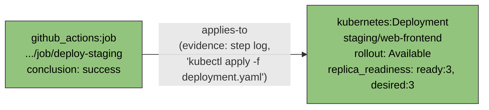
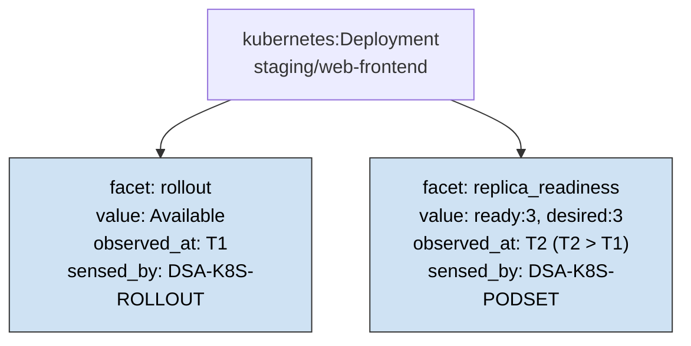
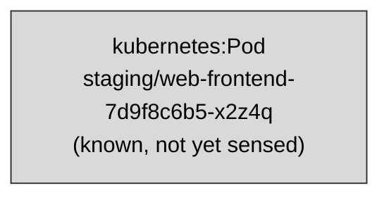
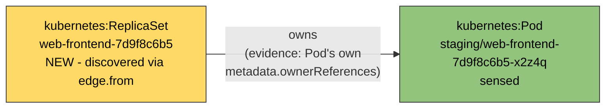

# Infra Discovery: Worked Examples

**Adopted (`D-005` in [`decisions.md`](decisions.md)) - replaces
`examples.md`, which no longer exists in this track.** The fifth register,
alongside `decisions.md`/`findings.md`/`open_questions.md`/`blue_sky.md`,
for content that's neither a decision nor a finding nor an open question
nor speculation: a concrete instance demonstrating what an abstract
definition or claim actually looks like. Built the same way the other four
registers were - consolidated here, not left as a separate un-registered
file - by converting `examples.md`'s three diagrams into entries with a
fixed shape: what the example validates, the instance itself, and what it
surfaced (if anything - a worked example that produces no finding or open
question is still a legitimate entry, just a quieter one).

**Illustrative only**, same caveat `examples.md` used to carry: no
`infra-discovery` implementation exists yet. Every instance below is
hand-authored from `step0_schema.md` and `atomicguard`'s own worked trace,
not generated from a running walk. Treat these as "what the shape looks
like," not "what was observed."

## WE-001: the canonical `applies-to` trace

**Validates:** the base case `BRIDGE-CATALOGUE[applies-to]` is grounded
against - a `github_actions.job` senses successfully, and its step-log
content (already fetched, no new DSA call) reveals it applied a Kubernetes
manifest. The one edge here is the *forward* case: the sensed node is
`edge.from`, the newly-discovered node is `edge.to`. Everything downstream
of that edge (`DSA-K8S-ROLLOUT`, then `DSA-K8S-PODSET`) is facet-sensing on
the same `Deployment` node, not further edge discovery - `DSA-K8S-PODSET`'s
`replica_readiness: {ready, desired}` is a facet value, not a set of
discovered `Pod` nodes (an earlier version of this diagram drew it as an
`owns` edge to three `Pod` nodes; that was wrong, fixed as `F-005` in
[`findings.md`](findings.md)).

**Instance:**

**What it surfaced:** nothing on its own, in the sense of an open question -
this is the one direction the original, unfixed `RESOLVE-BRIDGES`/
`RELEVANT` propagation ever handled, which is exactly the point `WE-003`
exists to complicate. It did surface `F-005` (above) on review: an earlier
version of this diagram invented a second edge the source trace doesn't
have. Worth keeping as the baseline case precisely because it's the one
every other worked example gets compared against.

**Source:** reused directly from `atomicguard`'s own worked example
(`topology_sensing_dsa_belief_state_and_agent_function.md`, Step 3's
"Concrete worked trace" table) - now checked line-by-line against that
table's four steps, not just against its general shape.

## WE-002: multi-facet state, accumulated over separate sense calls

**Validates:** that `state` is `Dict[str, Facet]`, not a single value - one
node, two facets, sensed by two different DSAs at two different times, not
one call learning everything. Demonstrates `step2_environment_analysis.md`'s
"Observable: Partially, and now partially *within* a node too" property row
concretely rather than just asserting it.

**Instance:**

**What it surfaced:** the observation, not previously stated this
concretely, that between `T1` and `T2` this node is "known and partially
observed" - a state `discovery/`'s binary `known`/`visited` can't represent
at all, and `real_discovery/`'s single `sense_edges()` call never produces
either (one call, one artifact, done). Also: nothing forces
`replica_readiness` to ever get sensed - `DECIDABLE(Ψ, belief_state)` might
already be true off `rollout` alone, in which case `F2` never appears. No
finding or open question filed from this one; the demonstration was the
point.

**Source:** hand-authored against `step0_schema.md`'s `Facet` shape; no
direct `atomicguard` precedent, unlike `WE-001`/`WE-003`.

## WE-003: bidirectional discovery via `Pod`/`ReplicaSet` `ownerReferences`

**Validates:** that a sensed node's artifact can reveal an edge where the
*newly-discovered* node is `edge.from`, not `edge.to` - the general claim
`F-001` names as a real gap, worked through here with a real, well-
documented Kubernetes mechanism (`metadata.ownerReferences`) rather than a
guessed one. `owns` is one of the ontology's own named example verbs
(`Node` ontology's `edge_type` bullet: *"a domain's own native verb
(`owns`, `selects`, `contains`)"*).

**Instance:**

**Before** - a `Pod` is already known (surfaced some other way, e.g. from
an alert), not yet sensed:

**After sensing the `Pod`** - its own artifact's `metadata.ownerReferences`
reveals `kind: ReplicaSet, name: web-frontend-7d9f8c6b5`:

Here the sensed node (`Pod`) is `edge.to`, and the newly-discovered node
(`ReplicaSet`) is `edge.from` - the exact case the original, unfixed
propagation (`edge.to` only) would have silently missed. `ownerReferences`
points *up* (child names its owner), so sensing the child reveals the
parent - backward relative to `WE-001`'s top-down `Job → Deployment`
direction.

**What it surfaced:**

- **`F-001`** - this worked example is what turned "the propagation might
  miss a direction" into a concrete, reportable case. Fixed in `atomicguard`
  commits `c6a9f697`/`fdc0f51`.
- **`OQ-003`** - edge identity/de-duplication, sharpened by this case: does
  a second, independent discovery of the same relationship (from the other
  end, later) strengthen confidence or need de-duplicating?
- **`OQ-015`** - the harder problem this example surfaces beyond `F-001`:
  `ReplicaSet` is not a registered `kind` in `DSA-CATALOGUE[kubernetes]`
  (Pods are grouped directly under `Deployment` via `DSA-K8S-PODSET`), so
  once `ReplicaSet` is discovered as `edge.from`, `RELEVANT` has nowhere to
  go. Two ways this could resolve, neither decided: discovery stops one hop
  short, or the sensing DSA is authored to resolve past unregistered
  intermediate kinds itself.

**Source:** hand-authored from the schema and `atomicguard`'s own ontology
document's worked trace - not a corner case invented for the diagram. An
earlier illustration here used `Service`/`Ingress`; replaced with this one
after a PR #16 review correctly flagged uncertainty about whether a
`Service` really reveals its own `Ingress`. `ownerReferences` is standard,
universally-present Kubernetes API behavior, not a guess.

## Related documents

- [`step0_schema.md`](step0_schema.md) / [`step0_ubiquitous_language.md`](step0_ubiquitous_language.md) - the types and vocabulary these examples instantiate.
- [`findings.md`](findings.md) - `F-001`, the finding `WE-003` works through concretely.
- [`open_questions.md`](open_questions.md) - `OQ-003`, `OQ-015`, both surfaced by `WE-003`.
- [`step4_algorithm_fit.md`](step4_algorithm_fit.md) - `SWEEP-CLEARED`/`RELEVANT`/`IN-SCOPE`, the mechanisms these examples' edges and facets feed into.
- [`step5_agent_program.md`](step5_agent_program.md) - `WE-003`'s still-open fork ((a) vs. (b) in `OQ-015`) scheduled as Step 4 (`RECORD-UNCATALOGUED`), not left open indefinitely.
- `thompsonson/atomicguard` PR #369 - the `BRIDGE-CATALOGUE`/`edge.from` type-mismatch finding `WE-003`'s "where this gets genuinely hard" distinguishes itself from. Fixed there (commit `fdc0f51`); `WE-003`'s own "no catalogue at all" problem (`OQ-015`) is a different, still-open finding.
- [`decisions.md`](decisions.md) - `D-005`, the decision adopting this register in place of `examples.md`.

## Not decided

- **Numbering scheme for future entries** - sequential (`WE-004` next) vs. grouped by what they validate, matching the same open question `decisions.md`/`findings.md`/`open_questions.md` already carry about per-track vs. cross-track IDs.
