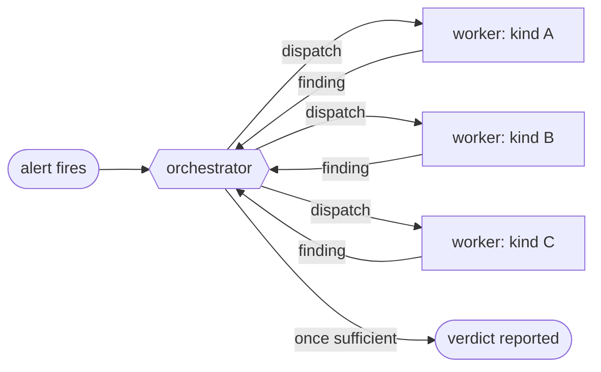
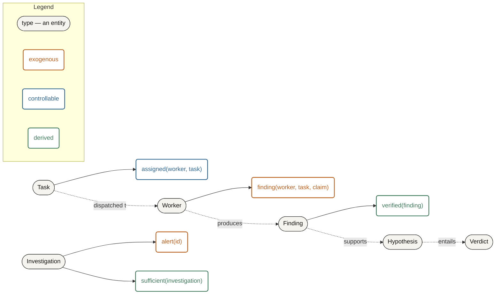
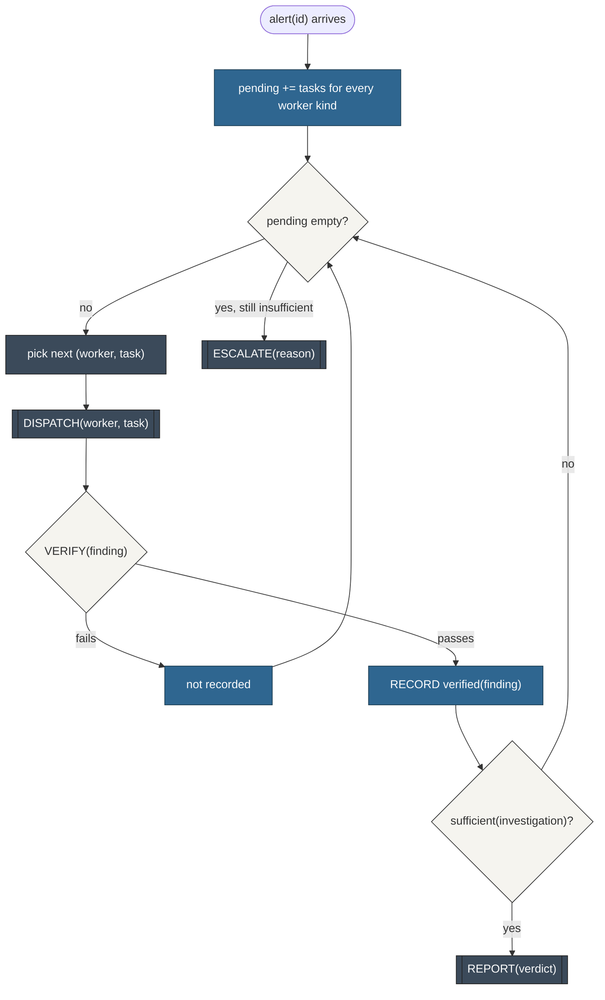
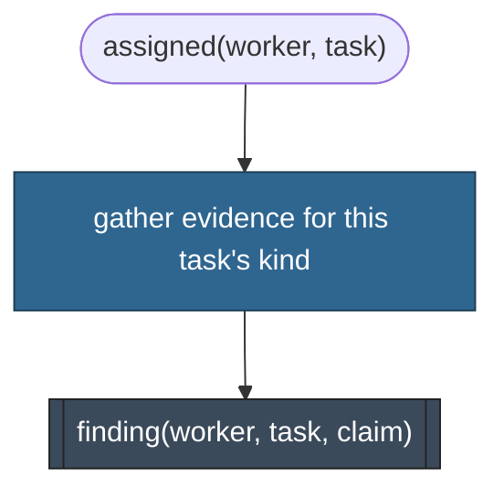

# Investigation Agents: One World, Two Agent Ontologies

*Draft — not a numbered series post. A worked ontology for investigation/conflict-management agents, generalised from `docs/agents/investigation` on the manta-deploy repo (no product-specific detail retained). It extends [IA Series 13](../ia-series/13-ontologies/blog.md)'s ontology work to a two-role architecture: an orchestrator and a set of worker agents, sharing one world ontology but each running its own agent ontology on top of it.*

## Introduction

Most of the worked examples so far have been one agent, one loop. Investigation work isn't: one orchestrator decides what still needs finding out and reports the verdict; a set of worker agents each specialize in one way of gathering evidence and know nothing about the others. That split raises a question the single-agent examples never had to answer — is there one ontology here, or two?

Worked through below: one, at the world level — orchestrator and workers have to agree on what a "finding" *is* before either can use one — and two, at the agent level, because deciding what to investigate next and actually investigating are different jobs with different state. Kind draws the line between them cleanly, and it's also where the neuro-symbolic split from the framework definition already in use lands concretely.

## The world, as instances

An alert fires on some system; the orchestrator doesn't yet know why. It has three worker kinds available — each a specialist at gathering one kind of evidence — and no fixed order to run them in.

## The world ontology

**Entities:**

| Type | Meaning |
|---|---|
| `Investigation` | the unit of work — one alert, one open question |
| `Task` | one thing worth checking, dispatchable to a worker kind |
| `Worker` | a specialist agent type — what kind of evidence it gathers, not which instance ran |
| `Finding` | a claim a worker returned, with its supporting evidence |
| `Hypothesis` | a candidate answer, assembled from findings that support it |
| `Verdict` | the orchestrator's reported conclusion — an answer, or an escalation |

**Predicates, classified by Kind:**

| Predicate | Kind | Why |
|---|---|---|
| `alert(id)` | exogenous | the triggering signal — arrives from outside, starts the investigation |
| `finding(worker, task, claim)` | exogenous | a worker's returned claim — the dispatch returning does not entail the claim is *true*, only that the worker made it |
| `assigned(worker, task)` | controllable | the orchestrator's own dispatch action |
| `verified(finding)` | derived | a symbolic check confirms the claim — see below, this is the seam that matters |
| `sufficient(investigation)` | derived | enough verified findings exist to support a hypothesis |

**Actions:** `DISPATCH(worker, task)`, `VERIFY(finding)`, `RECORD(finding)`, `REPORT(verdict)`, `ESCALATE(reason)`.

**Connections:** a `Task` is dispatched to a `Worker`; a `Worker` produces a `Finding`; `Finding`s that pass `VERIFY` support a `Hypothesis`; a `Hypothesis` entails the reported `Verdict`.

**The world ontology, as a graph:**

Read the Kind column again and the design decision falls out of it rather than being asserted: `finding` is exogenous, not controllable, even though the orchestrator's own `DISPATCH` action is what causes it to arrive. Dispatching doesn't entail the claim — the same synchronous-entailment test from [Series 13](../ia-series/13-ontologies/blog.md#facts-as-justifiably-held-belief) that separates a Deployment's own state from a discovery agent's belief about it applies here identically: a worker returning is an effector's successful return, but the *content* of what it returned is not thereby made true. That gap is not a detail — it's the whole reason `verified(finding)` exists as its own derived predicate instead of findings being trusted on arrival.

## The neuro-symbolic seam

A worker producing a `finding` and a guard producing `verified(finding)` are different kinds of operation, and the ontology already names why: one is generation, the other is verification. This project's own [neuro-symbolic definition](https://github.com/thompsonson/atomicguard) puts it plainly — *"architecture integrating neural generation with symbolic verification; the LLM issues promises, guards verify fulfillment."* A worker is the neural half: it reads evidence and produces a claim, and that claim is only ever a promise, however well the worker is prompted. `VERIFY` is the symbolic half — a deterministic check against the same evidence, or against a structured field the claim should be consistent with — and it is what actually licenses `RECORD` to write the finding into belief as something the orchestrator can build a hypothesis on.

Skipping `VERIFY` is not a smaller version of this architecture; it's a different one, where `finding` is quietly promoted to `controllable` by fiat rather than earned by a check — a "purely semantic" workflow, in the sense that nothing outside the LLM's own claim ever confirms it. That's the version worth being honest about running, if it's the one running: the ontology still applies, it just has one fewer Kind in active use, and `sufficient(investigation)` is resting on beliefs the system has no way to have been wrong about.

## Two agent ontologies over one world

The world ontology above is shared — a worker and the orchestrator have to agree on what a `Finding` is, or a worker's claim and the orchestrator's belief about it silently drift into meaning different things, the exact failure the ubiquitous-language artefact exists to prevent. What isn't shared is the agent function each one runs. The orchestrator holds state across the whole investigation; a worker doesn't hold anything past the one task it was given.

**The orchestrator's agent function** — a dispatch loop, deciding what's still worth checking and whether enough is known yet:

**A worker's agent function** — stateless per task, the same degenerate shape the minimal LLM loop had in [Series 13](../ia-series/13-ontologies/blog.md#the-degenerate-contrast-the-minimal-llm-loop): almost everything it touches is exogenous to *it*, because the task itself arrived from outside and nothing it does persists past the one claim it returns.

The asymmetry is the point, not an oversight: belief accumulates on the controllable side, and the controllable side belongs to whoever is actually deciding — the orchestrator. A worker with its own persistent belief state would be a different, harder-to-reason-about architecture (workers coordinating with each other, not just reporting up), not a refinement of this one.

## This is a shape already built here

The orchestrator's loop above isn't a new architecture — it's the same flat `pending` / `RELEVANT` / `SELECT-NEXT` / `INVOKE` loop the infra discovery agent already runs, with a guard added at the one point Step 1 of that build left as future work.

| Infra discovery agent | Investigation orchestrator |
|---|---|
| `DSA-CATALOGUE[(domain, kind)]` | worker registry, keyed by investigation-technique kind |
| `pending`: `(dsa, subject)` pairs | `pending`: `(worker, task)` pairs |
| `RELEVANT` | which `(worker, task)` pairs are new, not yet dispatched |
| `SELECT-NEXT` | dispatch priority — still named-not-defined, same as `SCORE` |
| `INVOKE(dsa, subject)` | `DISPATCH(worker, task)` — the neural half, a real model call |
| *(not yet built there)* | `VERIFY(finding)` — the symbolic half, this post's addition |
| `belief_state.RECORD` | `RECORD(verified finding)` |
| `SWEEP-CLEARED`, checked every turn | `sufficient(investigation)`, same shape: derived, re-checked every turn |

Moving toward this in practice is mostly a naming exercise before it's a rewrite: name the worker registry, tag every predicate a worker or the orchestrator touches with its Kind, and add the one action the infra discovery agent doesn't have yet — a guard between a worker's claim and the orchestrator recording it as usable.

## A worked trace

An alert fires; the orchestrator has two worker kinds registered.

| Step | Percept | Orchestrator action |
|---|---|---|
| 1 | `alert(id)` | seed `pending` with a task per worker kind; `DISPATCH(worker-A, task-1)` |
| 2 | `finding(worker-A, task-1, claim)` | `VERIFY` passes → `RECORD verified(finding)`; `sufficient` still false; `DISPATCH(worker-B, task-2)` |
| 3 | `finding(worker-B, task-2, claim)` | `VERIFY` fails (claim doesn't match the evidence it cites) → not recorded; `pending` empty, `sufficient` still false |
| 4 | — | `ESCALATE("one finding, unverified second — insufficient to report")` |

Step 3 is the case a purely semantic version of this loop can't produce: without a guard, a plausible-sounding but wrong claim from worker B would have recorded as fact, and the orchestrator would have reported a verdict built on it.

## Honest caveats

- **`SELECT-NEXT`'s priority is still unsolved here** — same open status as the infra discovery agent's own `SCORE`. Nothing above says whether to run all worker kinds in parallel, or pick the cheapest first, or the one most likely to be decisive.
- **`sufficient(investigation)` is named, not defined** — the same honesty [Series 13](../ia-series/13-ontologies/blog.md) already extended to `is_final(response)` and `DECIDABLE`. A real implementation needs a concrete rule (a minimum count of verified findings, a confidence threshold, one finding of a specific kind), and that rule belongs in the agent ontology, not the world ontology — it's a fact about how *this* orchestrator decides, not a fact about investigations in general.
- **Conflicting findings aren't modeled.** Two verified findings that support different, mutually exclusive hypotheses are a real case this ontology doesn't yet have a predicate for. Worth a return pass once it actually happens, not invented speculatively now.

## Re-entry stays open

The world ontology above took one pass to get right because the shape was already proven elsewhere in this series — a sign the ontology-first discipline is paying for itself, not that this case was trivial. What isn't settled is `SELECT-NEXT` and `sufficient`, and those stay open until an actual orchestrator is built against real workers, the same re-entry condition every worked example in this series has ended on.
