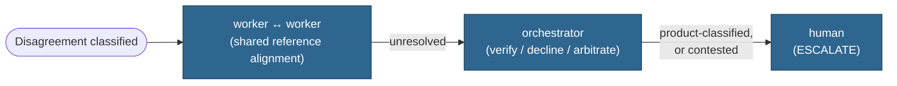
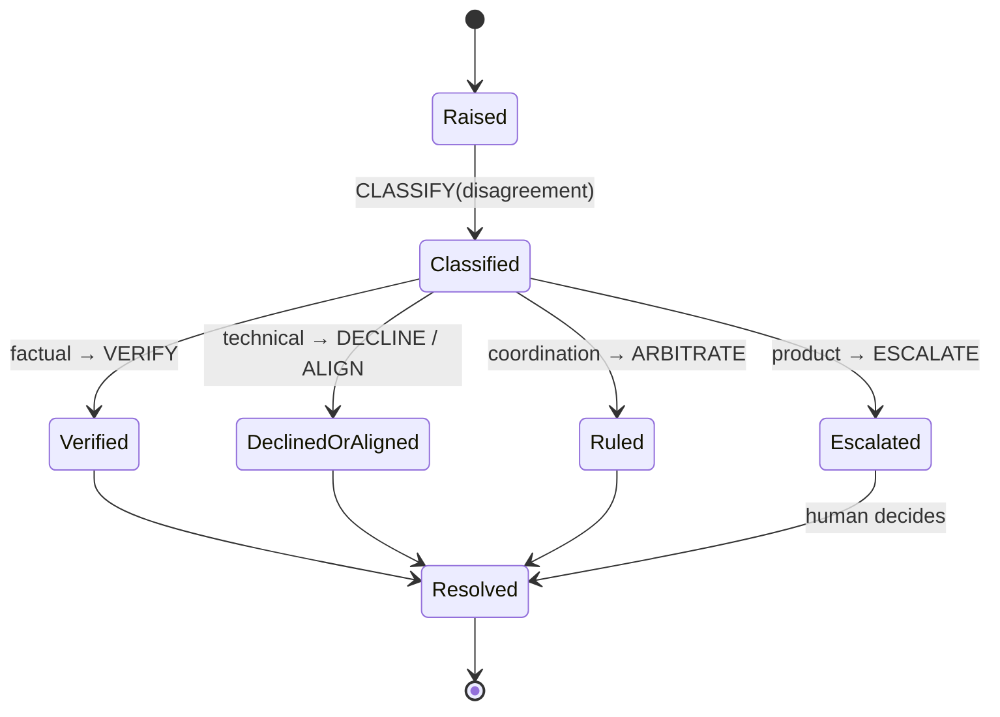

# Draft: Disagreement — a conflict-resolution ontology for investigation agents

*Draft material for further work on the investigation agent example. Extends [IA Series 14](../blog.md)'s world ontology with a `Disagreement` entity: what happens when two workers, or a worker and the orchestrator, don't agree on a claim. IA 14 left this as a caveat — "conflicting findings aren't modeled" — because one path (verify, pass or fail) isn't enough to model it honestly. This draft names the other paths.*

## Why one resolution path isn't enough

IA 14's orchestrator has exactly one way to settle a doubt about a finding: `VERIFY`, pass or fail. That's correct for a claim with a ground truth to check against — but not every disagreement has one. A dispute over *what happened* can be verified. A dispute over *what the right design is*, or *what the task even means*, can't be settled by re-checking evidence, because both sides may already agree on the evidence. Treating every disagreement as a verification problem either forces a false ground truth onto genuinely contested judgment calls, or silently drops them.

So: not one resolution mechanism, four — matched to what kind of disagreement it is.

## The world ontology, extended

**New entity:**

| Type | Meaning |
|---|---|
| `Disagreement` | a dispute over a `Finding`, a `Hypothesis`, or between two `Worker`s — orchestrator-owned bookkeeping, not itself sensed |

**New predicates, classified by Kind:**

| Predicate | Kind | Why |
|---|---|---|
| `classification(disagreement)` | derived | computed from the shape of the dispute, not asserted by either side — see below |
| `declined(finding, reason)` | controllable | a worker's own action: refuses a finding, grounded in evidence it already holds |
| `verified(claim)` | derived | reused from IA 14 — a guard checks the claim against ground truth |
| `aligned(worker, reference)` | controllable | a worker's action: adopts the frozen reference instead of contesting it |
| `ruling(disagreement, decision)` | controllable | the orchestrator's own arbitration action |
| `escalated(disagreement)` | controllable | routes the disagreement to a human |

**Classification is itself derived, not chosen.** The orchestrator doesn't decide what kind a disagreement is — the shape of the claim determines it:

| Classification | What's actually in dispute | Resolved by |
|---|---|---|
| **factual** | what *is* the case — a state claim with a ground truth to check | `VERIFY` — facts win |
| **technical** | which design is correct, given evidence both sides already agree on | `DECLINE` (a grounded refusal) or `ALIGN` (both move to a frozen reference) |
| **product** | a judgment call only a human is positioned to make | `ESCALATE` |
| **coordination** | who does what, or in what order — not a claim about the world at all | `ARBITRATE` — the orchestrator rules by its own standing precedence |

## The four resolution paths

**1. Verification** — reuses `VERIFY(finding)` from IA 14 exactly. A factual disagreement is a special case of the same neuro-symbolic seam: one side's claim is exogenous until a guard checks it. Nothing new here except recognizing the disagreement as this shape.

**2. Decline-with-reason** — new. A worker doesn't just fail a check; it actively refuses a finding, and the refusal is itself a claim that can be right or wrong. `declined(finding, reason)` is controllable — the worker's own action — but whether the decline actually holds is a separate, later judgment: did the reason engage with the finding, or dodge it? That check belongs to the orchestrator, not the worker who made the claim.

**3. Re-alignment** — new, and the one with no verification event at all. Once some upstream artifact is frozen — a contract, a spec, a prior ruling — a disagreement about it doesn't get resolved by checking who's right; it's resolved by both sides moving to the same reference. `aligned(worker, reference)` records that a worker did so. This path exists because re-litigating a frozen decision every time it resurfaces is its own failure mode, distinct from a finding simply being wrong.

**4. Arbitration** — the orchestrator rules directly, by standing precedence rather than by checking anything new: the frozen reference outranks a contested claim, declared order outranks a scheduling dispute. `ruling(disagreement, decision)` is the orchestrator's own controllable action — not derived, because nothing about the world determines it; the orchestrator's own standing rules do.

**5. Escalation** — a `product`-classified disagreement doesn't route through any of the above; it routes straight to a human. Worth naming precisely: this is the *same* `ESCALATE` action IA 14 already has for "insufficient evidence, nothing left to check" — reused for a second, different trigger. That's a deliberate reuse, not a naming collision worth splitting: both cases hand control to a human with a stated reason; only what makes the handoff necessary differs (evidence ran out, versus evidence was never going to settle it).

## The escalation ladder

Not every disagreement reaches a human — most resolve at the first or second rung:

## The Disagreement lifecycle

## A worked trace, continuing IA 14's example

Two workers return findings that disagree about the same task.

| Step | Event | Resolution |
|---|---|---|
| 1 | worker-A: `finding(A, task-1, "cause is X")`; worker-B: `finding(B, task-1, "cause is not X, evidence contradicts it")` | orchestrator raises a `Disagreement` over the two findings |
| 2 | `CLASSIFY(disagreement)` | shape of the claim: both cite the same evidence differently → **technical**, not factual — `VERIFY` alone can't settle whose reading is right |
| 3 | worker-A reviews worker-B's citation, finds it correctly undercuts its own claim | `DECLINE(finding-A, "worker-B's evidence directly contradicts the timing my claim needs")` |
| 4 | orchestrator confirms the decline actually engages worker-B's evidence, not just asserts against it | `ruling` unnecessary — the decline stands on its own; `Resolved` |

Contrast: if worker-A's decline had been "I still think it's X" with no engagement of worker-B's evidence, that's not a decline-with-reason — it's an unresolved technical dispute, and falls to `ARBITRATE` or, if the design question is genuinely open, `ESCALATE`.

## Honest caveats

- **Who classifies, and how, is still hand-waved.** "The shape of the claim determines it" is true but not yet a rule an orchestrator could execute — the same honesty IA 14 already gave `SELECT-NEXT` and `sufficient()`.
- **Decline-with-reason's own verification isn't specified.** Step 4 above says the orchestrator "confirms the decline actually engages" the counter-evidence — that confirmation is itself a judgment call with no defined procedure yet, arguably a second-order version of the same problem this whole draft exists to solve.
- **Multi-way disagreements aren't modeled.** Everything above is two-sided. Three or more workers holding three different positions on one task is a real case with no path here yet.

## Re-entry stays open

The classification table did the real work here — once a disagreement is sorted into one of four shapes, the resolution path follows almost mechanically. What doesn't yet follow mechanically is the sorting itself, and that's where a return pass belongs.
