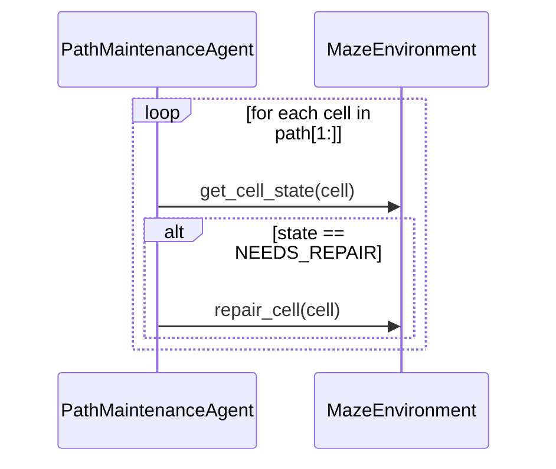

# Experiment 1: `maintenance_lite` — Node Repair Along a Fixed Belief-State Path

**Run this yourself:** `maze_solver/tests/` reproduces every behavior in this experiment (`test_environment.py`, `test_path_maintenance.py`, `test_path_maintenance_view.py`, 21 tests total). Animation: [`path_maintenance_lite.gif`](../../../maze_solver/animations/path_maintenance_lite.gif).

## What this experiment demonstrates

`environment_design.md` specified `CellState`, `MazeEnvironment.get_cell_state()`/`inject_repairs()`/`repair_cell()`, and `PathMaintenanceAgent.walk()` — a route computed once by `AStarSearch` and never touched again, with node-level repair happening along the way. This experiment is that design, built and run against the `maintenance_lite` scenario (`documentation/path-maintenance/scenario.md`): a 17-cell corridor, two cells deliberately injected as `NEEDS_REPAIR` before the walk starts.

## The scenario

```python
config = Config(maze_size=5, maze_id=7, show_exploration=False)
env = MazeEnvironment(config)
path = AStarSearch(env).search(env.start, env.end).path  # 17 cells, one turn
env.inject_repairs([path[6], path[11]], path)             # (1, 7) and (6, 7)
```

## The walk



`PathMaintenanceAgent(env, path).walk()` never calls a search algorithm and never branches on anything but the cell it's about to enter — confirmed by `test_path_maintenance.py::test_never_senses_cells_off_the_path`, which spies on `get_cell_state` and asserts every sensed cell is on `path`.

`result.repairs_performed == [(1, 7), (6, 7)]` — both injected cells, in walk order, and `result.success is True`. `env.get_cell_state((1, 7))`/`((6, 7))` return `CellState.OPEN` after the walk — a real state transition, not a declared outcome.

## What to watch for in the GIF

Nineteen frames: an initial frame with the whole belief path traced in light green and the agent at start, then one frame per `get_cell_state`/`repair_cell` call `record_walk()` captured (see `maze_solver/visualization/path_maintenance_view.py`).

- **Frame 0**: the full 17-cell path already visible in light green — this is the belief state, committed before the first step, exactly as `environment_design.md`'s "belief state, precisely" section describes. Nothing red yet: the agent hasn't sensed anything, so nothing it hasn't arrived at is shown as needing repair, even though the environment already has two cells marked that way. The visualization deliberately doesn't leak information the agent doesn't have.
- **Frame 6** (`arrive (1, 7) → needs_repair`): the first injected cell turns red the moment the agent senses it — not before.
- **Frame 7** (`repair_cell((1, 7))`): red → dark green, immediately — a distinct shade from the lighter green cells the agent walked without ever needing to touch, so a repaired cell stays visually marked as "was broken, now fixed" rather than blending back into "was always fine."
- **Frame 11** (`arrive (6, 7) → needs_repair`) → **frame 12** (`repair_cell((6, 7))`): the same red-then-dark-green pair, second occurrence.
- **Final frame**: every path cell green except the last (goal, purple) — the two repaired cells still dark green against the lighter green of the rest of the corridor, agent one step from the end.

Cell color (state) and the agent's star marker (position) are deliberately independent visual channels — the same separation `environment_design.md`'s resolved "environment mutates itself" open question draws between the environment's own state and what the agent currently knows.

## What this experiment validates that the design doc alone could not

- **The path-only injection restriction actually holds end to end**: `inject_repairs` rejects an off-path cell (`test_environment.py::test_cell_not_on_path_rejected`), so every repair the Driver injects is guaranteed to be one the agent's fixed walk will reach — not just claimed in the design doc, but enforced at the API boundary.
- **No plan recalculation anywhere in the real code path**: `PathMaintenanceAgent` holds one `path` list for its entire lifetime and only ever indexes into it — there's no call to `AStarSearch` inside `walk()`, confirmed by `test_result_path_is_identical_to_input_path` asserting object-level equality between input and output.
- **The event-driven visualization pattern generalizes beyond `task_graph_solver`**: `record_walk()`/`animate_walk()` mirror `graph_view.py`'s `record_events()`/`animate_events()` almost exactly (instrument the real methods, build a snapshot per event, render one frame per real call) — the same pattern applies cleanly to a spatial grid with cell-state color-coding as it did to a DAG with node-status color-coding.

## Related documents

- [`environment_design.md`](../environment_design.md) — the design this experiment implements.
- [`scenario.md`](../scenario.md) — the `maintenance_lite` scenario in full, including why these two cells at these two indices.
- [Experiment 7: `atomicguard`-Backed Repair](../../task-graph/experiments/07_atomicguard_lint_repair.md) — the task-graph analogue: real repair actions instead of a deterministic no-op transition. A natural next step past step 1 is swapping this experiment's `repair_cell()` for something with the same failure modes that experiment's `atomicguard.ActionPair` has.
