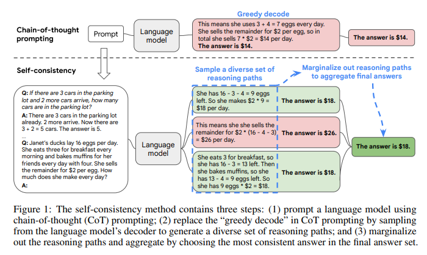
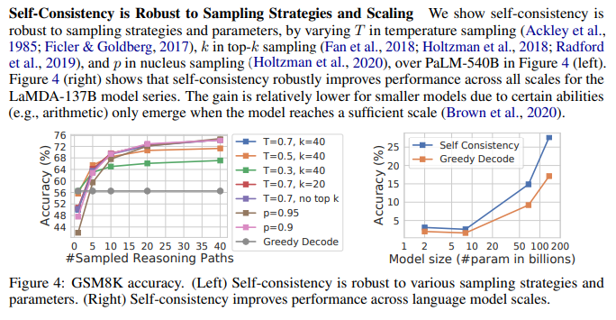
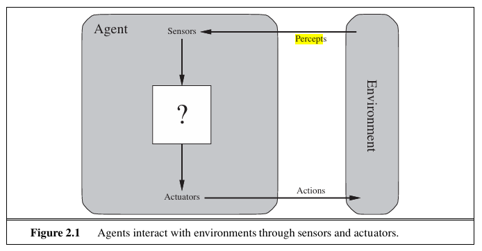
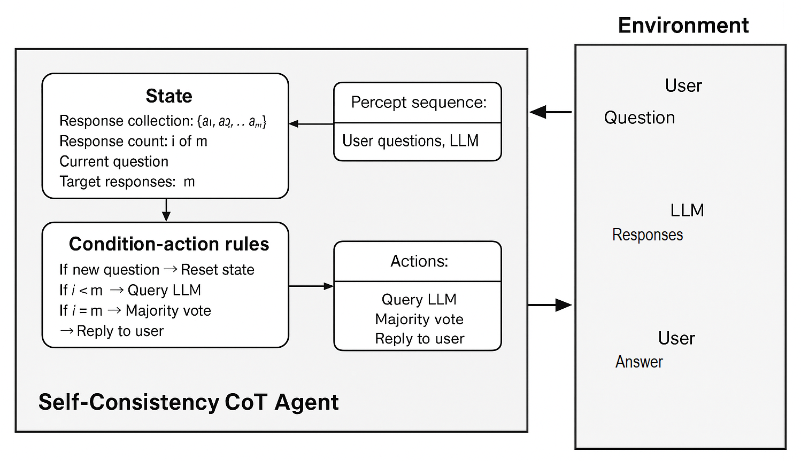

# [IA Series 7/n] Building a Self-Consistency LLM-Agent: From PEAS Analysis to Production Code

The purpose of this post is to bridge the theory of the [Agent Decision Process](https://matt.thompson.gr/2025/05/16/ia-series-n-intelligent-agents.html), derived from Russell and Norvig's work in [AI A Modern Approach](https://aima.cs.berkeley.edu/), to practice, specifically **an agent that will check itself for consistency in its answers**.

Here is a brief reminder of the key steps in the Agent Design Process:

- Environment Analysis
    - **Environment Specification**: Specify the task environment using the PEAS framework (Performance measure, Environment, Actuators, Sensors)
    - **Environment Analysis**: Determine the properties of the Task Environment (observable, deterministic, static, discrete, single/multi-agent)
- Architecture Selection
    - **Agent Function**: Define the ideal behaviour - what the agent ought to do - in abstract terms (mathematical mapping from percept sequences to actions)
    - **Agent Type Selection**: Choose appropriate agent architecture (simple reflex, model-based, etc.) capable of implementing the agent function
- Implementation Considerations
    - **Agent Program**: Implement the chosen architecture within physical constraints (compute availability, performance vs cost, etc.)

At the end we'll have a complete agent that has an element of self-awareness, providing a confidence level in its answer to the question.

## The origins of this agent

### What is consistency and self-consistency?

Consistency is a challenging term. Depending on the context it can mean _similarity_ or _all statements are logically true_. They are clearly different and whilst they can overlap, there is no guarantee of this. With LLMs we see strong movement away from logically consistent and deterministic systems towards stochastic systems.

[det](https://github.com/thompsonson/det) was developed to measure the consistency, that is similarity, of responses from LLMs. It was done to meet a need for deterministic responses. Of course it showed that this wasn't always the case and has been a useful tool in developing repeatable LLM-based workflows.

A paper from Google researchers called [Self-Consistency Improves Chain of Thought Reasoning in Language Models](https://arxiv.org/abs/2203.11171) used the idea of consistency to extract better performance from an LLM. It was built on the original [Chain-of-Thought Prompting Elicits Reasoning in Large Language Models](https://arxiv.org/abs/2201.11903) and proposed a new decoding strategy, self-consistency, to replace the naive greedy decoding used in chain-of-thought prompting. 

In brief; Self-Consistency is **letting the LLM think multiple times and then take the most consistent answer**. 



### The conclusion to apply from the Self-Consistency Improves Chain of Thought Reasoning in Language Models

The paper is well worth a read, it covers three types of reasoning, different models, different sampling methods, as well as when it can hurt the performance. 

The abstract is clear to the benefits

> It first samples a diverse set of reasoning paths instead of only taking the greedy one, and then selects the most consistent answer by marginalizing out the sampled reasoning paths. Self-consistency leverages the intuition that a complex reasoning problem typically admits multiple different ways of thinking leading to its unique correct answer. Our extensive empirical evaluation shows that self-consistency boosts the performance of chain-of-thought prompting with a striking margin on a range of popular arithmetic and commonsense reasoning benchmarks, including GSM8K (+17.9%), SVAMP (+11.0%), AQuA (+12.2%), StrategyQA (+6.4%) and ARC-challenge (+3.9%).

One item that is worth emphasising is the accuracy increased above that of the Greedy Decode method when  **a higher temperature and minimum of five reasoning paths** were used. This suggests a robustness to wayward reasoning paths (i.e. token generation) and that reasoning is a multi-step process which includes a final step of self-reflection. 



### The Mathematical formulation

The paper covers different answer aggregation strategies, in terms of notation of the whole process we can use a probability distribution-like notation to see the key variables:

```
(r_i, a_i | prompt, question)

where:
r = reasoning path
a = answer
i = index of the iteration for prompt, question inference
prompt = the generic prompt that outlines the Chain of Thought requirements
question = the specific question which the LLM is to answer

```

After sampling multiple (r_i, a_i), self-consistency applies a marginalisation of r_i by taking a majority vote over a_i. 

```
argmax_a Σ{i=1}^m 𝟙_a(a_i = a)

where:
a = answer
i = index of the iteration for prompt, question inference
m = maximum iteration count
```

**Note_1**: I think the argmax and Σ are very common notation, however the 𝟙_a (shown just as 𝟙 in the paper) was new to me. It refers to the [Indicator Function](https://en.wikipedia.org/wiki/Indicator_function) and equates the count of the number of a_i values that match each other. This presented some very interesting questions about implementation and complexity, covered later.

**Note_2**: What could using the Probability Distribution rather than the argmax_a give us? A thought for another agent. 

## Designing the agent

### Restating the problem and solution

Before we jump in and design an agent based on the paper let's take a step back and remind ourselves of the wider context.

#### The problem

There are many ways to state this, the most socially understandable is that LLMs "hallucinate". They get things wrong. The details of an hallucination will not be covered here, other than to say that lots of work has and continues to go into managing these "hallucinations". 

#### The solution

Solution is a big word; the [Self-Consistency Improves Chain of Thought Reasoning in Language Models](https://arxiv.org/abs/2203.11171) paper offers an **improvement** that reduces the rate at which LLMs "hallucinate" or plain gets answers wrong. It is not a solution, rather it presents as a useful tool in solving the problem. 

### Definitions from Russell and Norvig

>  An **agent** is anything that can be viewed as perceiving its **environment** through sensors and acting upon that environment through actuators. This simple idea is illustrated in Figure 2.1. A **human agent** has eyes, ears, and other organs for **sensors** and hands, legs, vocal tract, and so on for **actuators**. A robotic agent might have cameras and infrared range finders for sensors and various motors for actuators. A software agent receives keystrokes, file contents, and network packets as sensory inputs and acts on the environment by displaying on the screen, writing files, and sending network packets. 
> 
> We use the term **percept** to refer to the agent’s perceptual inputs at any given instant. An agent’s **percept sequence** is the complete history of everything the agent has ever perceived. In general, **an agent’s choice of action at any given instant can depend on the entire percept sequence observed to date, but not on anything it hasn’t perceived**. By specifying the agent’s  choice of action for every possible percept sequence, we have said more or less everything  there is to say about the agent. Mathematically speaking, we say that an agent’s behavior is described by the **agent function** that maps any given percept sequence to an action.
>
> We can imagine tabulating the agent function that describes any given agent; for most agents, this would be a very large table—infinite, in fact, unless we place a bound on the length of percept sequences we want to consider. Given an agent to experiment with, we can, in principle, construct this table by trying out all possible percept sequences and recording which actions the agent does in response.1 The table is, of course, an external characterization of the agent. Internally, the agent function for an artificial agent will be implemented by an **agent program**. It is important to keep these two ideas distinct. The agent function is an abstract mathematical description; the agent program is a concrete implementation, running within some physical system.




### Agent Design Process

Now that we have clarity on the mathematical formulation and the problem we are working towards solving, we look at the Agent Design Process. 

### Environment specification: PEAS analysis

> Specify the task environment using the PEAS framework (Performance measure, Environment, Actuators, Sensors)

| Element | Description |
|---------|-------------|
| **Performance** | Return most frequent answer |
| **Environment** | User + LLM + prompt/question context |
| **Actuators** | LLM queries, majority vote computation, user response |
| **Sensors** | User text input, LLM response pairs (reasoning, answer) |

#### Sensors and percepts

> A percept is the input that an intelligent agent is perceiving at any given moment.

### Environment Analysis

> Determine the properties of the Task Environment (observable, deterministic, static, discrete, single/multi-agent)

The task environment for this domain has the following characteristics:

- **Partially Observable**: The agent must send m (prompt, question) to the LLM and perform a final argmax to find the most frequent answer.  
- **Single Agent**: Queries to the LLM can be processed in lparallel or sequentially. The last argmax will be done by one agent when all queries are returned  
- **Stochastic**: The environment, specifically the solution space, is stochastic. The selection of the next token uses a random variable to pick the token from a probability distribution.  
- **Episodic**: The final decision - i.e. which answer _a_ is most frequent - is not dependent on other decisions made. It is stateless.   
- **Static**: Neither the problem nor the solution space change during the task.  
- **Discrete**: The output is a collection of strings of tokens.  
- **Known**: Whilst the internals of the LLM are unknown and stochastic, the "physics" of the environment, i.e. Agent sends a prompt and a question m times, it receives m (reasoning, answer) responses. 

### The Agent Function

> Define the ideal behaviour - what the agent ought to do - in abstract terms (mathematical mapping from percept sequences to actions)

#### Reviewing the percepts, and the percept sequence with actions

The percepts are:
- Question
- LLM Responses

The actions that the agent can take are:
- Query the LLM
- Perform a majority vote
- Reply to user

Here is an abstraction of the percept sequence:

| Percept sequence | Action |
|------------------|--------|
| [Question] | QUERY-LLM |
| [Question, Response1] | QUERY-LLM |
| [Question, Response1, Response2] | QUERY-LLM |
| [Question, Response1...Response5] | MAJORITY-VOTE |
| [Question, Responses1-5, Consensus] | REPLY-TO-USER |

First, we look at a partial tabulation of the Self-Consistency CoT agent function for a mathematics question with target_m = 5 and a question "What is 7 × 8?":

| Percept sequence | Action |
|------------------|--------|
| [Question: "What is 7 × 8?"] | QUERY-LLM |
| [Question: "What is 7 × 8?"], [(reasoning: "I can calculate this step by step: 7 × 8 = 56", answer: "56")] | QUERY-LLM |
| [Question: "What is 7 × 8?"], [(reasoning: "7 × 8 = 56", answer: "56")], [(reasoning: "Let me think: 7 times 8 equals 56", answer: "56")] | QUERY-LLM |
| [Question: "What is 7 × 8?"], [(reasoning: "7 × 8 = 56", answer: "56")], [(reasoning: "7 times 8 equals 56", answer: "56")], [(reasoning: "I can use repeated addition: 7+7+7+7+7+7+7+7 = 14+14+14+14 = 28+28 = 56", answer: "56")] | QUERY-LLM |
| [Question: "What is 7 × 8?"], [(..., "56")], [(..., "56")], [(..., "56")], [(reasoning: "7 × 8... let me see, that's 54", answer: "54")] | QUERY-LLM |
| [Question: "What is 7 × 8?"], [(..., "56")], [(..., "56")], [(..., "56")], [(..., "54")], [(reasoning: "Seven times eight is fifty-six", answer: "56")] | MAJORITY-VOTE("56") |
| [Question: "What is 7 × 8?"], [(..., "56")], [(..., "56")], [(..., "56")], [(..., "54")], [(..., "56")], [Consensus: "56"] | REPLY-TO-USER("56") |
| ⋮ | ⋮ |

#### Defining the ideal Agent Function

```
function SELF-CONSISTENCY-COT-AGENT(percept) returns an action
    persistent: state, agent's current state tracking responses
                answers, collection of final answers {a_1, a_2, ..., a_i}
                target_m, number of responses needed
                prompt, chain-of-thought prompt template
                question, current question to answer

    # Update state with new percept
    if percept contains question:
        state.question ← question
        state.response_count ← 0
        state.answers ← []
    elif percept contains (reasoning, answer):
        answers.append(answer)
        state.response_count += 1
    
    # Determine action based on current state
    if state.response_count < target_m:
        action ← QUERY-LLM(prompt, state.question)
    else:
        action ← MAJORITY-VOTE()
    
    return action

function MAJORITY-VOTE()
    count ← {}
    for answer in state.answers:
        count[answer] ← count.get(answer, 0) + 1
    action ← REPLY-TO-USER(argmax(count))
    
    return action 

function REPLY-TO-USER(answer)    
    return answer to user
```

### The Agent Type

> Choose appropriate agent architecture (simple reflex, model-based, etc.) capable of implementing the agent function

The key element to consider here is that the Agent Function needs a state. A model of the agent's world is needed, that is the answers are needed, for the agent to perform the MAJORITY-VOTE. As such a Model-Based Reflex Agent is sufficient for this function.

> Model-Based Reflex Agent: Maintains internal state to track aspects of the environment



### The Agent Program

> Implement the chosen architecture within physical constraints (compute availability, performance vs cost, etc.)

#### Background for the decisions in writing the Agent Program

The implementation will take ideas from [Domain Driven Design](https://martinfowler.com/bliki/DomainDrivenDesign.html) and [SOLID](https://www.digitalocean.com/community/conceptual-articles/s-o-l-i-d-the-first-five-principles-of-object-oriented-design) to manage the code. This allows class names that relate to the problem at hand, immutable data objects, interfaces to enable focused testing, as well as other benefits. 

It is well worth reading more on these Software Architecture subjects, coding tools like [Claude Code](https://www.anthropic.com/claude-code) and [Jules](https://jules.google/) enable planning and good quality code generation, however they still need guidance on the desired architecture. Multiple times I have redirected the agents that I used in generating the code, and a few times I have manually edited aspects that were simply wrong. 

With all that the [CLAUDE.md](https://github.com/thompsonson/intelligent_agents/blob/llm_sc_cot/CLAUDE.md) is an excellent, possibly the most important, resource for the development of this agent. There is a skill to define these with an agent, an informative version is [this version from Bryan Finster](https://github.com/bdfinst/medium-download/blob/master/CLAUDE.md). I cite this for two reasons, one it is well structured and has been collated from conversations with Claude, two Bryan has a wealth of experience in scalable DevOps practices - [Minimum Viable CD](https://minimumcd.org/) is useful for framing how to manage agents to build deployment pipelines.

This project has yet to implement deployment, however you can see both [Continuous Integration (CI) and Continuous Deployment (CD) to Huggingface](https://github.com/thompsonson/bayesian_game/actions) in the Bayesian Learning Agent cover in the [previous blog post](https://matt.thompson.gr/2025/06/18/ia-series-n-an-evidencebased.html).

#### Complexity of the majority vote

We have the core mathematical notation for the final step and defined it as the function MAJORITY-VOTE. It was beneficial to think about Pythonic pseduo-code at this point. The following two psuedo-code blocks highlight the different complexity associated with how the Indicator Function (𝟙_a) is considered.

```
argmax_a Σ{i=1}^m 𝟙_a(a_i = a)

where:
a = answer
i = index of the iteration for prompt, question inference
m = maximum iteration count
```

Geeks for Geeks has a great resource, the [Complexity Cheat Sheet for Python Operations](https://www.geeksforgeeks.org/python/complexity-cheat-sheet-for-python-operations/). In which we can see that iterating over the dictionary has an O(N) average complexity, however, using the get has an O(1) average complexity.

The first iteration is needed, the second can be avoided, thus changing the complexity from O(m²) to O(m).

**Naive approach (O(m²)):**

```python
# For m=1000 responses: 1,000,000 operations
count = {}
for each unique a_j in {a_1, a_2, ..., a_m}:
    for each a_i in {a_1, a_2, ..., a_m}:
        if a_i = a_j: 
           count[a_j] = count[a_j] + 1
return argmax(count)
```

**Optimized approach (O(m)):**

```python
# For m=1000 responses: 1,000 operations
count = {}
for a_i in {a_1, a_2, ..., a_m}:
    count[a_i] = count.get(a_i, 0) + 1
return argmax(count)
```

#### Managing the state

The agent will store the following in its state:
- Config (containing the prompt and value of m)
- Original question
- Responses from the LLM

They are set up like so in Python

```python
class SelfConsistencyAgent:
    """Main agent implementing self-consistency CoT reasoning."""
    
    def __init__(self, config: AgentConfig, question: str):
        """Initialize agent with configuration and question."""
        self._config = config
        self._question = question
        self._llm_responses: List[LLMResponse] = []
```

A data class, called  AgentConfig, can be used for config:

```python
@dataclass
class AgentConfig:
    """Configuration for self-consistency agent."""
    llm_interface: LLMInterface
    target_responses: int = 5
    prompt_template: str = ""
```

The LLM Response percept is multiple and we have used an immutable Domain entity to represent a single LLM response. 

```python
@dataclass(frozen=True)
class LLMResponse:
    """Immutable Domain entity representing a single LLM response."""
    reasoning: str
    answer: str
```

#### Implementing the LLM communication

The Agent Function covers the heart of the agent's raison d'être however, as we saw with the additional thought required for MAJORITY-VOTE, we need additional thought for QUERY-LLM. 

As you saw above, we have included `llm_interface` in the `AgentConfig` dataclass. The purpose of this is to create defined representations of the way the agent communicates with an LLM. It allows abstraction and means that the agent does not need to be changed for each LLM. If anything needs to be changed it would be an Adapter that implements the LLMInterface. In Python, this looks like

```python
class LLMInterface(ABC):
    """Abstract interface for LLM interactions."""
    
    @abstractmethod
    async def generate_llm_response(self, prompt: str, question: str) -> LLMResponse:
        """Generate a single LLM response for the given question."""
        pass

class LiteLLMAdapter(LLMInterface):
    """LiteLLM implementation of LLM interface."""
    
    def __init__(self, model: str, temperature: float = 0.7, **kwargs):
        self.model = model
        self.temperature = temperature
        self.kwargs = kwargs
    
    async def generate_llm_response(self, prompt: str, question: str) -> LLMResponse:
        """Generate LLM response using LiteLLM."""
        pass
```

#### The main domain - SelfConsistencyAgent

```python 
class SelfConsistencyAgent:
    """Main agent implementing self-consistency CoT reasoning."""
    
    def __init__(self, config: AgentConfig, question: str):
        """Initialize agent with configuration and question."""
        self._config = config
        self._question = question
        self._llm_responses: List[LLMResponse] = []
    
    def process_question(self) -> ConsensusResult:
        """Process the question and return consensus result."""
        # Sequential processing:
        # 1. Loop m times (config.target_responses)
        # 2. For each iteration:
        #    - raw_response = self._config.llm_interface.generate_llm_response(self._config.prompt_template, self._question)
        #    - parsed_llm_response = self._parse_llm_output(raw_response)
        #    - Store parsed_llm_response in collection
        # 3. final_answer = self._perform_argmax()
        # 4. Return ConsensusResult
        pass
    
    def _perform_argmax(self) -> str:
        """Private method to perform majority vote aggregation."""
        # Extract answers - O(m) linear pass through responses
        answers = [response.answer for response in self._llm_responses]
        # Counter uses O(1) hash operations for counting, avoiding O(m^2) nested loops
        counts = Counter(answers)
        answer, count = counts.most_common(1)[0]
        return answer, count
    
    def _parse_llm_output(self, raw_response: str) -> LLMResponse:
        """Parse raw LLM output into structured LLMResponse."""
        # Extract reasoning and final answer from LLM text
        # Handle format - TBD here is an example: "reasoning...\n\n\n The answer is X"
        # Return LLMResponse(reasoning, answer)
        pass
```

The final entity is that which is returned to the user. Like the LLM Response this is immutable. 

```python
@dataclass(frozen=True)
class ConsensusResult:
    """Immutable Value object for argmax results."""
    final_answer: str
```

#### Summarising the architectural decisions

Here is a summary of the architectural decisions made during this process. 

- Python shall be used
- The complexity should remain at O(m)
- Claude Code shall be used
- The code shall be arranged into Domains, .... 
- Each Domain, ... , shall be tested
- No CI/CD for the demo
- No linting, typing, or other formatting checks for the demo
- LiteLLM or OpenRouter to be used (a decision in the Cohere Labs ML Agent's group)

## The final demo

The demo is available on GitHub, there is a [Jupyter Notebook](https://github.com/thompsonson/intelligent_agents/blob/llm_sc_cot/self_consistency_demo.ipynb) available to see the agent work. 

The demo is structured to be clear what the code needs and show it is doing as it was designed. The structure is as follows:

1. Setup and Imports (which includes commands to install the prerequisites)
2. Environment configuration check
3. Tests of the connection to liteLLM and Claude
4. Basic example of Self-Consistency
5. Comparative analysis: single vs multiple responses
6. Algorithmic complexity analysis (the O-notation) 
7. Confidence analysis (a stretch goal easily available due to the way Counter works)
8. An interactive experiment cell - change the config as you wish
9. Custom experiments: Change the question
10. A summary
11. Environment/Setup troubleshooting hints and tips. 


