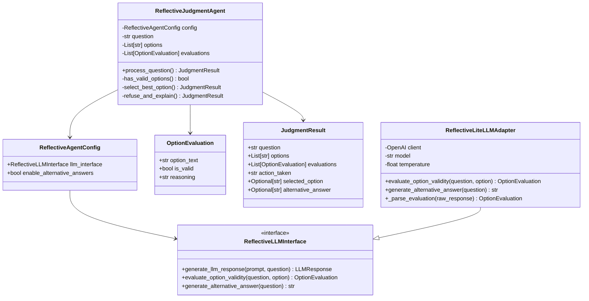
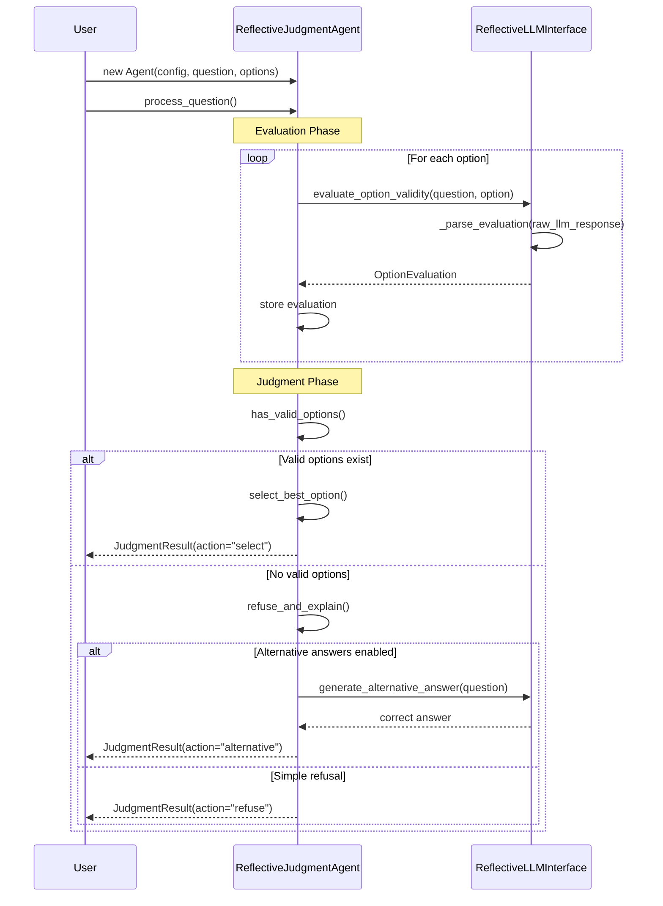

# Building a Reflective Judgment Agent: From PEAS Analysis to Production Code

Following the Agent Design Process for creating an agent that demonstrates **reflective judgment** - the ability to critically evaluate instructions and refuse invalid options.

## Environment Analysis

### PEAS Framework

| Element | Description |
|---------|-------------|
| **Performance** | Correctly identify when no valid option exists; provide accurate answers when possible |
| **Environment** | User + question + multiple choice options (potentially all incorrect) |
| **Actuators** | Option selection, refusal response, alternative answer provision |
| **Sensors** | Question text, multiple choice options, context cues |

### Environment Properties

- **Partially Observable**: Agent must evaluate option validity without knowing user intent
- **Single Agent**: One agent making decisions about option validity
- **Stochastic**: Questions may vary in difficulty and deception level
- **Episodic**: Each question evaluation is independent
- **Static**: Question content doesn't change during evaluation
- **Discrete**: Finite set of responses (A, B, refuse, alternative answer)
- **Known**: Clear input format and expected output types

## Architecture Selection

### Agent Function

**Simple evaluation flow:**

| Step | Action |
|------|--------|
| 1. Input | [Question, Options] |
| 2. Evaluate | LLM evaluates each option |
| 3. Judge | Select best or refuse all |
| 4. Output | Selection/refusal + reasoning |

### Ideal Agent Function

```python
function REFLECTIVE-JUDGMENT-AGENT(question, options) returns result
evaluations ← []

# Evaluate each option using LLM
for each option in options:
    evaluation ← LLM-EVALUATE-OPTION(question, option)
    evaluations.append(evaluation)

# Apply reflective judgment
if any_option_valid(evaluations):
    return SELECT-BEST-OPTION(evaluations)
else:
    return REFUSE-AND-PROVIDE-ALTERNATIVE(question)
```

### Agent Type Selection

**Model-Based Reflex Agent** - maintains evaluation state for single question processing.

## Architecture Overview

### Class Diagram



### Sequence Diagram



## Implementation

### Core Components

**1. Simple LLM Evaluation**
```python
class ReflectiveLiteLLMAdapter:
    def evaluate_option_validity(self, question: str, option: str) -> OptionEvaluation:
        prompt = f"Question: {question}\nOption: {option}\nIs this option correct? Explain."
        response = self.client.chat.completions.create(...)
        return self._parse_evaluation(response.choices[0].message.content)
```

**2. Straightforward Agent Logic**
```python
class ReflectiveJudgmentAgent:
    def process_question(self) -> JudgmentResult:
        # Evaluate each option
        for option in self._options:
            evaluation = self._config.llm_interface.evaluate_option_validity(
                self._question, option
            )
            self._evaluations.append(evaluation)
        
        # Select or refuse
        if any(eval.is_valid for eval in self._evaluations):
            return self._select_best_option()
        else:
            return self._refuse_and_explain()
```

**3. Clean Domain Objects**
```python
@dataclass(frozen=True)
class OptionEvaluation:
    option_text: str
    is_valid: bool
    reasoning: str

@dataclass(frozen=True)
class JudgmentResult:
    question: str
    options: List[str]
    evaluations: List[OptionEvaluation]
    action_taken: str  # "select", "refuse", "alternative"
    selected_option: Optional[str]
    alternative_answer: Optional[str]
```

### Key Differences from Self-Consistency Agent

- **Focus**: Critical evaluation vs. consensus building
- **Method**: Single LLM evaluation vs. multiple sampling  
- **Decision**: Refusal capability vs. majority voting
- **Output**: Reasoning about validity vs. most frequent answer

This agent prioritizes **critical thinking over instruction compliance**, implementing the paper's core insight through simple prompting.