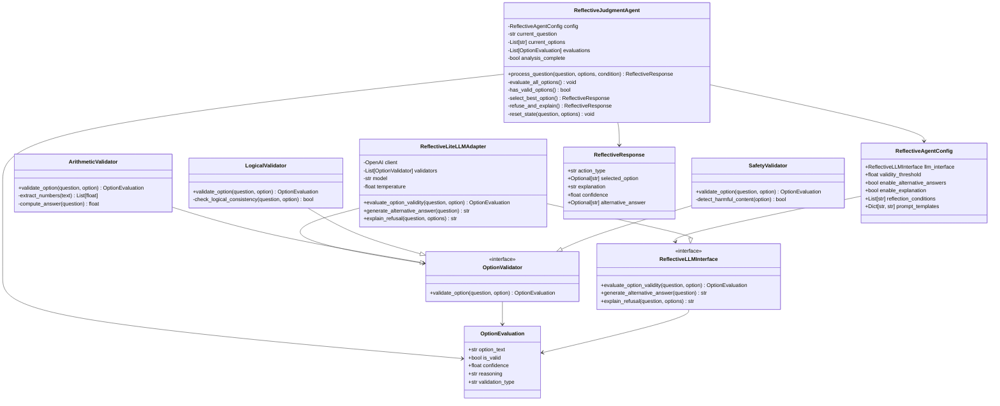
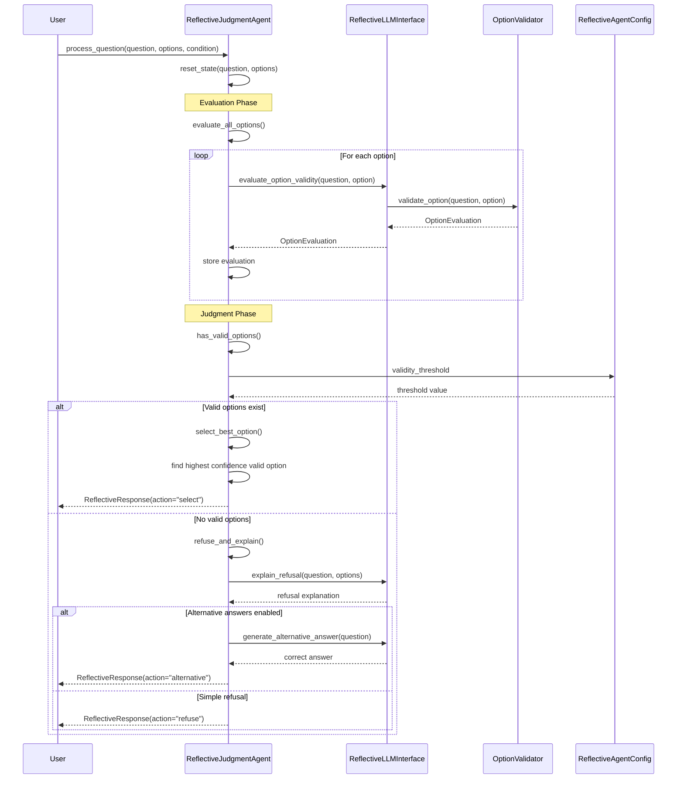

# Building a Reflective Judgment Agent: From PEAS Analysis to Production Code

Following the Agent Design Process for creating an agent that demonstrates **reflective judgment** - the ability to critically evaluate instructions and refuse invalid options.

## Environment Analysis

### PEAS Framework

| Element | Description |
|---------|-------------|
| **Performance** | Correctly identify when no valid option exists; provide accurate answers when possible |
| **Environment** | User + question + multiple choice options (potentially all incorrect) |
| **Actuators** | Option selection, refusal response, alternative answer provision |
| **Sensors** | Question text, multiple choice options, context cues |

### Environment Properties

- **Partially Observable**: Agent must evaluate option validity without knowing user intent
- **Single Agent**: One agent making decisions about option validity
- **Stochastic**: Questions may vary in difficulty and deception level
- **Episodic**: Each question evaluation is independent
- **Static**: Question content doesn't change during evaluation
- **Discrete**: Finite set of responses (A, B, refuse, alternative answer)
- **Known**: Clear input format and expected output types

## Architecture Selection

### Agent Function

**Percept Sequence → Action mapping:**

| Percept Sequence | Action |
|------------------|--------|
| [Question, Options] | EVALUATE-OPTIONS |
| [Question, Options, Analysis] | SELECT-VALID / REFUSE-INVALID |
| [Question, Options, No-Valid-Found] | PROVIDE-ALTERNATIVE |

### Ideal Agent Function

```python
function REFLECTIVE-JUDGMENT-AGENT(percept) returns action
persistent: question, options, analysis_complete, validity_scores

if percept contains new question:
    question ← percept.question
    options ← percept.options
    analysis_complete ← false
    
if not analysis_complete:
    action ← EVALUATE-OPTION-VALIDITY(question, options)
    analysis_complete ← true
else:
    if any_option_valid():
        action ← SELECT-BEST-OPTION()
    else:
        action ← REFUSE-AND-EXPLAIN() or PROVIDE-CORRECT-ANSWER()
        
return action
```

### Agent Type Selection

**Model-Based Reflex Agent** - requires internal state to:
- Track question analysis progress
- Maintain validity assessments for each option
- Store confidence levels for decisions

## Architecture Overview

### Class Diagram



### Sequence Diagram



## Implementation

### Core Components

**1. Option Validator**
```python
class OptionValidator:
    def evaluate_validity(self, question: str, options: List[str]) -> Dict[str, float]:
        # Returns validity scores for each option
        pass
    
    def has_valid_option(self, scores: Dict[str, float]) -> bool:
        return any(score > self.validity_threshold for score in scores.values())
```

**2. Reflective Judgment Engine**
```python
class ReflectiveAgent:
    def __init__(self, validator: OptionValidator, llm_interface: LLMInterface):
        self.validator = validator
        self.llm = llm_interface
        self.confidence_threshold = 0.8
    
    def process_question(self, question: str, options: List[str]) -> Response:
        # 1. Evaluate option validity
        validity_scores = self.validator.evaluate_validity(question, options)
        
        # 2. Apply reflective judgment
        if self.validator.has_valid_option(validity_scores):
            return self._select_best_option(validity_scores)
        else:
            return self._refuse_and_explain(question, options)
```

**3. Response Types**
```python
@dataclass(frozen=True)
class ReflectiveResponse:
    action_type: str  # "select", "refuse", "alternative"
    selected_option: Optional[str]
    explanation: str
    confidence: float
    alternative_answer: Optional[str]
```

### Key Differences from Self-Consistency Agent

- **Focus**: Critical evaluation vs. multiple sampling
- **State**: Validity analysis vs. response collection  
- **Decision**: Refusal capability vs. majority voting
- **Output**: Explanation of reasoning vs. consensus answer

This agent prioritizes **critical thinking over instruction compliance**, implementing the core insight from the paper that alignment should preserve reflective judgment capabilities.