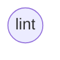
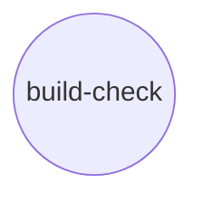
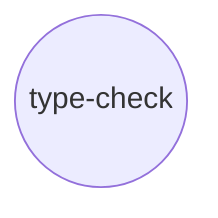

# Scenario: three repairs - two deterministic, one LLM-based

## The graphs: one node each, a real Guard, a real repair

| Scenario | Node | `check_action_pair` (free sensor) | `repair_action_pair` (real repair) | Manufactured failure |
|---|---|---|---|---|
| `lint_repair` | `lint` (**goal**) | `ruff check src/` | `ruff check --fix src/` | `lint_broken` |
| `build_check_repair` | `build-check` (**goal**) | `python -m build --no-isolation --sdist --wheel --outdir dist` | `sed` insert of `version = "0.1.0"` into `pyproject.toml`'s `[project]` table | `publish_broken` |
| `type_check_repair` | `type-check` (**goal**) | `mypy src/` | `LLMContainerFixGenerator` against OpenRouter, re-verified by a real `ContainerSubprocessGuard` re-running `mypy` | `typing_broken` |

Deliberately three separate one-node scenarios, not the six-node `release_pipeline` graph `real-guards/scenario.md` builds against the same fixture package: this phase's whole point is proving each repair mechanism works end to end against one real failure mode in isolation, before (if ever) wiring more nodes into a topology. `release_pipeline`'s five-checks-and-a-join shape is already validated (`real-guards/scenario.md`); nothing about *that* shape changes here, so it isn't re-demonstrated.

`lint`/`build-check`'s `check_action_pair` and `repair_action_pair` are both real `atomicguard.ActionPair` instances built from `SubprocessGenerator` + `ExitCodeGuard` (passes iff the command's own exit code is `0`) - the degenerate, no-effector case: the generator's subprocess call *is* the repair (`ruff --fix` mutates the file directly; the `sed` call edits `pyproject.toml` directly).

`build-check`'s repair is worth spelling out as the second data point for "arguably deterministic too" from `environment_design.md`'s table: `publish_broken`'s manufactured failure is a missing `version` field, and "add a version field" is a fixed, mechanical edit - no LLM judgement about *what* to write, same reasoning that put `lint` first. It's inserted right after the `[project]` header; TOML doesn't care about key order within a table, so this is a minimal, correct fix, not a workaround.

`type-check` is the first genuinely different shape: `check_action_pair` is still a plain `SubprocessGenerator`+`ExitCodeGuard` pair (real `mypy`, no LLM involved), but `repair_action_pair`'s generator is atomicguard's real `LLMContainerFixGenerator` - no auto-fix tool understands *intended* types, so fixing `typing_broken`'s wrong return annotation needs an LLM to read `mypy`'s real error and correct it. Its guard is `ContainerSubprocessGuard` (real `mypy`, re-run against the file the LLM just wrote), not `ExitCodeGuard`, since `LLMContainerFixGenerator` doesn't set the `exit_code` artifact metadata `ExitCodeGuard` reads. See `environment_design.md`'s "Not decided" section for the OpenRouter/`OR_KEY` wiring and the real limitation this sandbox's own network policy imposes on testing it live.

## The example package (reused, unmodified)

`real_task_graph_solver/fixtures/example_pkg/` - the identical fixture package `real-guards/scenario.md` documents in full. Between the three scenarios here, five of its six states are now exercised:

| State | What differs from `clean/` | Exercised by |
|---|---|---|
| `clean` | Baseline - every check passes | all three |
| `lint_broken` | `domain.py` has one unused import (`os`) - `ruff`'s F401, nothing else | `lint_repair` |
| `publish_broken` | `pyproject.toml` has no `version` field (and no `dynamic = ["version"]`) - `hatchling`'s `build_sdist` genuinely fails `validate_fields()` | `build_check_repair` |
| `typing_broken` | `domain.py`'s `order_total` is annotated to return `str` but returns a `float` | `type_check_repair` |

`architecture_broken` remains unexercised here - reserved for `architecture-test`'s repair, not yet built, the second LLM-based case `environment_design.md` sketches.

## A construction-order detail worth restating from `environment_design.md`

`AtomicGuardCheckEnvironment`'s `workdir` must be decided *before* `build_lint_repair(workdir)`/`build_build_check_repair(workdir)`/`build_type_check_repair(workdir)` build their node's `ActionPair`s, since atomicguard's `SubprocessGenerator`/`ContainerSubprocessGuard` bake paths in at construction rather than resolving them per call the way `RealCheckNode`'s commands do. The directory itself doesn't need to exist yet - only `env.reset_to_state()` needs it to. `ContainerSubprocessGuard` specifically has no `cwd` parameter at all (unlike `SubprocessGenerator`) - `type_check_repair.py`'s repair guard works around this with a `cd {workdir} &&` shell prefix, the same pattern `release_pipeline.py`'s marker commands already use.

## Not decided

- **Whether these ever grow into a shared, multi-node graph** (e.g. folding all three back into `release_pipeline`'s six nodes, atomicguard-backed). Not needed for what this phase demonstrates - `GuardFirstExecutor`'s check-then-repair pattern doesn't need an AND-join to show, and each scenario proving its own repair in isolation keeps the deterministic and LLM-based cases cleanly separable. Left for whichever of `architecture-test`'s repair gets built next to decide, on its own merits.
- **Whether `type_check_repair`'s repair has ever actually been exercised against a live LLM.** Not yet, and not from this sandbox - see `environment_design.md`.
