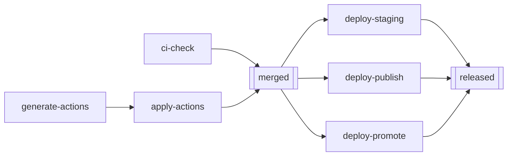
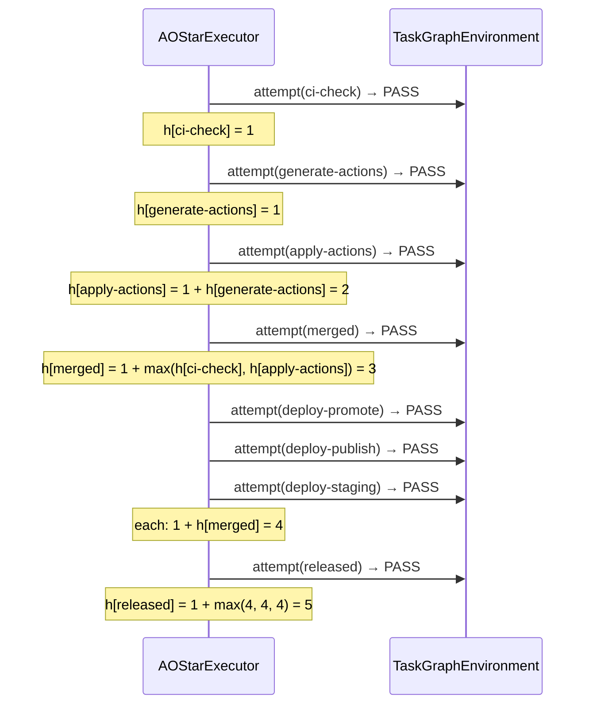

# Experiment 1: AO* Solving `pr_merge_lite`

**Run this yourself:** `task_graph_solver/tests/test_scenarios.py::TestPrMergeLiteScenario` reproduces this exact run (seed `1`, `pass_probability=1.0`). Animation: [`task_graph_solver/animations/ao_star_pr_merge_lite.gif`](../../../task_graph_solver/animations/ao_star_pr_merge_lite.gif).

## What this experiment demonstrates

`pr_merge_lite` has two AND-joins: `merged` (requires both `ci-check` and `apply-actions`) and `released` (requires all three of `deploy-staging`, `deploy-publish`, `deploy-promote`). Neither D* Lite nor LRTA* can represent "wait for all of these" — their update rules are `min`-over-successors (OR-composition, pick the cheapest alternative). `AOStarExecutor` adds the thing this environment actually needs: `h(n) = own_attempts + max(h(child) for child in requires)`, composed bottom-up as each node resolves. This experiment walks through that composition happening, node by node.

## The graph

Double-bordered boxes (`merged`, `released`) are AND-joins — the same shape the animation draws as squares. Everything else is a single-dependency (or no-dependency) node.

## Step by step

Every node in this run has `pass_probability=1.0`, so every attempt passes immediately (own cost = 1 attempt) — the point of this experiment is watching the AND-composition arithmetic, not retry behavior (that's Experiment 3).

| Step | Ready set (before) | Attempted | Outcome | `h` computed |
|---|---|---|---|---|
| 1 | `ci-check`, `generate-actions` | `ci-check` | PASS | `h[ci-check] = 1` (no children → own cost only) |
| 2 | `generate-actions` | `generate-actions` | PASS | `h[generate-actions] = 1` |
| 3 | `apply-actions` | `apply-actions` | PASS | `h[apply-actions] = 1 + h[generate-actions] = 1 + 1 = 2` |
| 4 | `merged` | `merged` | PASS | `h[merged] = 1 + max(h[ci-check], h[apply-actions]) = 1 + max(1, 2) = 3` |
| 5 | `deploy-promote`, `deploy-publish`, `deploy-staging` | `deploy-promote` | PASS | `h[deploy-promote] = 1 + h[merged] = 1 + 3 = 4` |
| 6 | `deploy-publish`, `deploy-staging` | `deploy-publish` | PASS | `h[deploy-publish] = 1 + h[merged] = 4` |
| 7 | `deploy-staging` | `deploy-staging` | PASS | `h[deploy-staging] = 1 + h[merged] = 4` |
| 8 | `released` | `released` | PASS | `h[released] = 1 + max(h[deploy-staging], h[deploy-publish], h[deploy-promote]) = 1 + max(4,4,4) = 5` |

Reading the table left to right at Step 4 is the whole point: `merged` doesn't average or sum its two children's costs (`1` and `2`) — it takes the **max** (`2`), because you're only as done as the slower of the two things you're required to wait for, then adds its own cost (`1`) on top. Step 8 repeats the same rule over three children instead of two.

## Why steps 1–2 and 5–7 tie-break alphabetically

At step 1, both `ci-check` and `generate-actions` are ready with no prior attempts — neither has an `h` entry yet, so `AOStarExecutor`'s selection (sorted by id) picks `ci-check` first. This is a deliberate, documented limitation, not a bug: `h` is only populated *after* a node resolves, so there's no cost information available yet to prefer one un-attempted node over another. See `AOStarExecutor`'s docstring and [`documentation/task-graph/algorithm_fit.md`](../algorithm_fit.md)'s "combinations worth naming" section for what it would take to make this ordering cost-aware (seeding it from a prior `LRTAStarLearner` run).

## Sequence view

## What to watch for in the GIF

Frame by frame, the two square nodes are the tell: `merged` stays white through frames 1–3 (its two children aren't both green yet) and only turns green in frame 4, the instant `apply-actions` (its slower child) resolves. `released` does the same thing at a larger scale — three white-to-green transitions have to complete (in any order — they're independent) before it turns green in the final frame.

## Related experiments

- [Experiment 2: D* Lite break/fix on the same graph](02_d_star_lite_pr_merge_lite.md) — what happens when one of these nodes fails permanently mid-run, and how repair differs from re-running this experiment from scratch.
- [Experiment 3: LRTA* learning a node's true cost](03_lrta_star_convergence.md) — where the `h` values in this experiment would come from if they weren't all trivially `1` (i.e., if nodes actually had variable retry cost).
