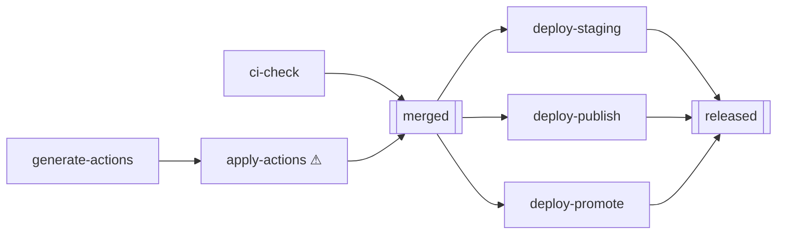
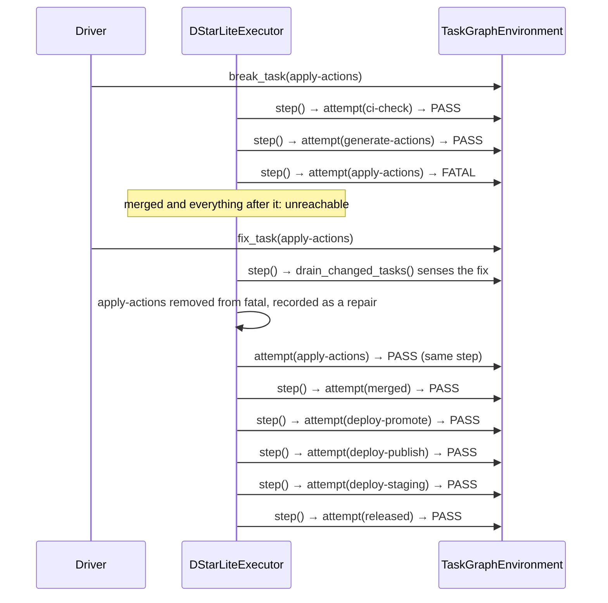

# Experiment 2: D* Lite — Break, Fail, Fix, Repair

**Run this yourself:** `task_graph_solver/tests/test_scenarios.py::TestPrMergeLiteScenario::test_d_star_lite_recovers_from_a_break_on_an_and_join_sibling` reproduces this exact run. Animation: [`task_graph_solver/animations/d_star_lite_pr_merge_lite.gif`](../../../task_graph_solver/animations/d_star_lite_pr_merge_lite.gif).

## What this experiment demonstrates

`apply-actions` is one of `merged`'s two required children (the other is `ci-check`). A Driver breaks it *before* it's ever attempted, forcing a failure partway through the run. This experiment demonstrates two things at once:

1. **Repair locality** — `ci-check` (the sibling) is satisfied independently and is never touched again, even though the run has to stop, wait for a fix, and resume.
2. **No alternate route** — unlike a maze, where D* Lite finds a *different* corridor around a collapsed bridge, this is a strict AND-graph: there is no other way to satisfy `merged` without `apply-actions`. What D* Lite provides here isn't rerouting — it's *not giving up*, by sensing the eventual fix and resuming exactly where it left off.

## The graph, with the break point marked

## Step by step

| # | Actor | Action | State after |
|---|---|---|---|
| — | **Driver** | `break_task(apply-actions)` | `apply-actions` will return `FATAL` on its next attempt, no matter what |
| 1 | Agent | `attempt(ci-check)` → **PASS** | satisfied = `{ci-check}` |
| 2 | Agent | `attempt(generate-actions)` → **PASS** | satisfied = `{ci-check, generate-actions}` |
| 3 | Agent | `attempt(apply-actions)` → **FATAL** (broken) | fatal = `{apply-actions}`. `merged`, both deploy branches, and `released` are now unreachable — none of them have been attempted at all |
| — | **Driver** | `fix_task(apply-actions)` | the block is lifted, but nothing has re-run yet |
| 4 | Agent | senses the fix via `drain_changed_tasks()`, removes `apply-actions` from `fatal`, then `attempt(apply-actions)` → **PASS** — both in the same `step()` call | satisfied = `{ci-check, generate-actions, apply-actions}` |
| 5 | Agent | `attempt(merged)` → PASS | `merged` now satisfied |
| 6–8 | Agent | `attempt(deploy-promote)`, `attempt(deploy-publish)`, `attempt(deploy-staging)` → all PASS | all three satisfied |
| 9 | Agent | `attempt(released)` → PASS | **run complete, success** |

`executor.repairs == ["apply-actions"]` — exactly one repair event, matching exactly one break.

## The point: what step 1–2 prove

Steps 1 and 2 happen *before* the break is even relevant to them. `ci-check` and `generate-actions` have no dependency on `apply-actions` at all, so they proceed and resolve regardless of its state. When the run later resumes after the fix (step 4 onward), neither of them is re-attempted — `ready_nodes()` excludes anything already in `satisfied`, and D* Lite never touches that invariant. The "repair" is entirely local to the one node that broke and whatever was waiting on it.

## Sequence view

## Contrast: what `TopologicalExecutor` does with the identical break

`test_topological_executor_cannot_recover_from_a_fix_after_the_fact` runs the exact same break, with no fix sensing at all:

| | `TopologicalExecutor` | `DStarLiteExecutor` |
|---|---|---|
| Detects the break | Yes — `apply-actions` returns FATAL, same as above | Same |
| Detects the later fix | **No** — once a node is in `fatal`, it's excluded from `ready_nodes()` forever; there's no mechanism to reconsider it | Yes — `drain_changed_tasks()` is polled every `step()` |
| Result if the Driver fixes `apply-actions` after the run finishes | Stays failed. The only way forward is to build a brand new environment and run everything again from scratch | Resumes from exactly where it stopped |

This is the entire value proposition of D* Lite's sensing loop, made concrete: the difference between "start over" and "pick up where you left off" when nothing about the *rest* of the graph needs to be redone.

## What to watch for in the GIF

`apply-actions` is the only node that changes color twice: white → red (frame showing `attempt apply-actions → fatal`) → white again (`Driver fixes apply-actions`, not yet re-attempted) → green (`attempt apply-actions → pass`). `merged` and everything to its right sit gray (blocked, not unreachable-forever — the render distinguishes the two, see the note below) for the entire stretch between the break and the fix, then all turn green in sequence once the fix lands.

**A bug found and fixed while building this animation:** the first version of this GIF marked every not-yet-attempted node gray from frame one, even before anything had failed — conflating "hasn't had its turn yet" with "genuinely blocked." Fixed in `graph_view._blocked_by_fatal_ancestor()`, which only marks a node gray if one of its actual dependencies is in the fatal set. Worth knowing if you're reading the frame-by-frame color transitions closely: gray means *blocked by a specific fatal ancestor*, not merely *not done yet*.

## Related experiments

- [Experiment 1: AO* solving the same graph with nothing broken](01_ao_star_pr_merge_lite.md) — the baseline this experiment perturbs.
- [Experiment 3: LRTA* learning a node's true cost](03_lrta_star_convergence.md) — a different kind of adaptation: learning *how expensive* a node is, rather than *recovering from* a failure.
