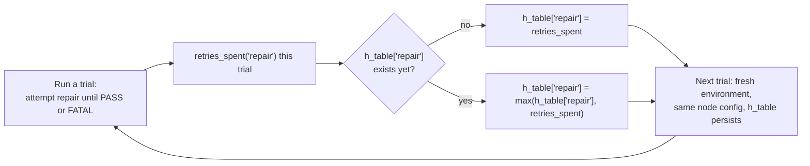

# Experiment 3: LRTA* Learning a Node's True Cost

**Run this yourself:** `task_graph_solver/tests/test_lrta_star.py::TestLRTAStarConvergence` reproduces the underlying mechanics on `repair_packages_lite`; the specific 25-trial run charted here uses a custom node (`pass_probability=0.3`, `rmax=8`) chosen to have enough retry headroom to show a visible climb — see [`documentation/lrta/beyond_the_maze.md`](../../lrta/beyond_the_maze.md) for why `repair_packages_lite`'s own `r_patience=2` caps out too fast to show one. Plot: [`task_graph_solver/animations/lrta_star_convergence.png`](../../../task_graph_solver/animations/lrta_star_convergence.png).

## What this experiment demonstrates

Experiment 1 (AO*) treated every node's cost as if it were known in advance. In reality, a node's cost is *learned* — the whole reason `retry_flavor="repair"` retries matter (`documentation/lrta/beyond_the_maze.md`'s finding) is that they're the one signal that tells you how expensive a node actually is, discovered only by attempting it. This experiment runs the same `repair` node through 25 independent trials and watches `LRTAStarLearner.h_table["repair"]` converge.

## The update rule

The rule only ever raises the estimate, never lowers it — a single unlucky trial permanently updates what "the worst case looks like," matching LRTA*'s formal guarantee (`h` is monotonically non-decreasing, proven in Korf's original paper, tested directly in `test_h_is_monotonically_non_decreasing_across_trials`).

## Trial by trial

Node config: `pass_probability=0.3`, `rmax=8` — each trial draws fresh randomness (independent seed per trial via `env_factory(trial_index)`), so `retries_spent` genuinely varies run to run; `h_table` only ever moves up when a trial's cost exceeds everything seen so far.

| Trial | `retries_spent` this trial | `h_table['repair']` after |
|---|---|---|
| 1 | 4 | **4** (first observation) |
| 2 | 1 | 4 |
| 3 | 3 | 4 |
| 4 | 1 | 4 |
| 5 | 1 | 4 |
| 6 | 7 | **7** (a worse trial than anything seen so far) |
| 7 | 4 | 7 |
| 8 | 2 | 7 |
| 9 | 1 | 7 |
| 10 | 3 | 7 |
| 11 | 4 | 7 |
| 12 | 7 | 7 |
| 13 | 4 | 7 |
| 14 | 1 | 7 |
| 15 | 1 | 7 |
| 16 | 2 | 7 |
| 17 | 7 | 7 |
| 18 | 4 | 7 |
| 19 | 1 | 7 |
| 20 | 7 | 7 |
| 21 | 5 | 7 |
| 22 | 1 | 7 |
| 23 | 2 | 7 |
| 24 | 4 | 7 |
| 25 | 3 | 7 |

Two things worth noticing:

- **Trial 1 doesn't start at the true worst case.** The learner's first data point (4) is a moderate trial, not the ceiling — `h` only reaches 7 once trial 6 happens to be a genuinely bad one. If you stopped after 5 trials, you'd have a confidently wrong (too-low) cost estimate.
- **Trials 6, 12, 17, and 20 all hit exactly 7** (the node's `rmax` is 8, so 7 consecutive failed attempts followed by one more is the worst case actually representable) **without ever exceeding it.** Once the true ceiling has been sampled once, every subsequent trial can only confirm it or come in lower — the plot's staircase has exactly one step because the worst case was found relatively early and nothing since has been worse.

## Why this is the cleanest LRTA* demonstration in this repo

Only `retry_flavor="repair"` nodes are tracked in `h_table` at all — `verify` (the `sensing`-flavor node downstream of `repair` in the real scenarios) never appears in it, no matter how many retries it has of its own (`test_sensing_flavor_node_never_enters_h_table`). This experiment's node has no downstream sibling to confuse the picture, so the climb you see in the plot is attributable entirely to `repair`'s own variability — nothing is being averaged in from a different kind of retry.

## What this is *not*

This is not reinforcement learning in the Q-learning sense. There's no reward signal, no policy being learned, no exploration/exploitation tradeoff — the "trials" are independent draws from a known probability distribution (`pass_probability`), and the update rule is a plain Bellman-style maximum, not a value learned from sampled returns. The precise relationship (this is closer to Real-Time Dynamic Programming than to Q-learning) is worked through in [`documentation/lrta/beyond_the_maze.md`](../../lrta/beyond_the_maze.md)'s "What this is not" section.

## Related experiments

- [Experiment 1: AO* solving pr_merge_lite](01_ao_star_pr_merge_lite.md) — used a fixed cost of `1` for every node's own attempt. This experiment is what would actually populate that cost if `pr_merge_lite`'s nodes had variable, learnable difficulty instead of `pass_probability=1.0`.
- [Experiment 2: D* Lite break/fix](02_d_star_lite_pr_merge_lite.md) — a different response to uncertainty: instead of learning a node's typical cost over many trials, D* Lite reacts to a single node's state changing mid-run.
