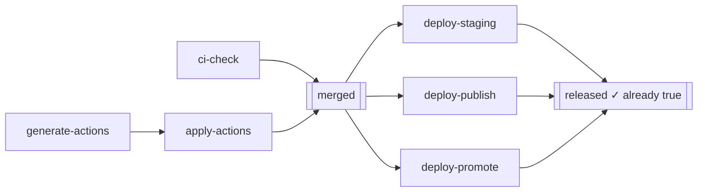
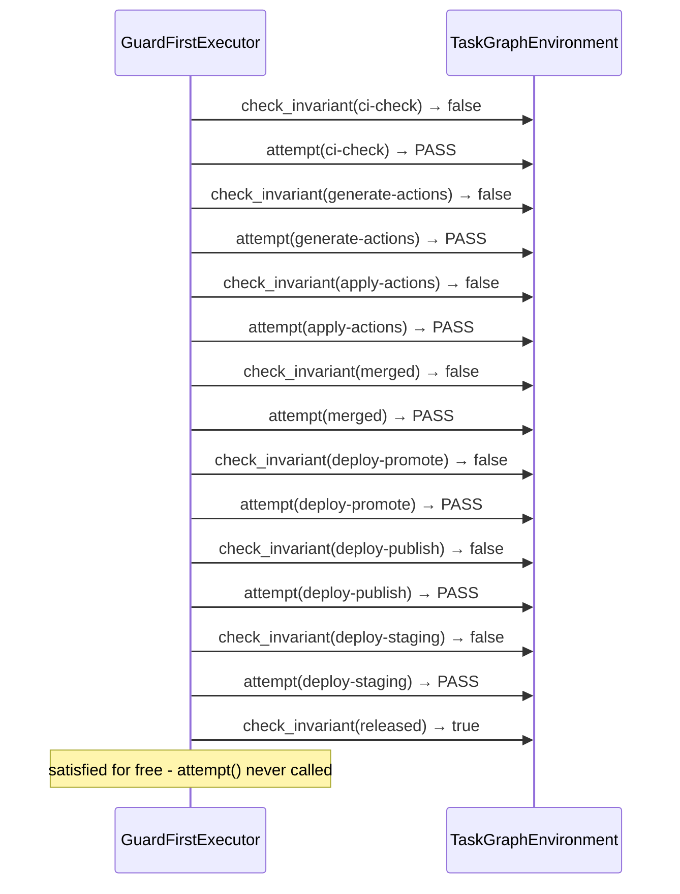

# Experiment 4: Guard-First — Check Before You Repair

**Run this yourself:** `task_graph_solver/tests/test_scenarios.py::TestGuardFirstVsPlanningOnPrMergeLite::test_guard_first_still_walks_the_whole_chain_before_reaching_released` reproduces this exact run (seed `1`, `pass_probability=1.0`, `invariant_overrides={"released": 1.0}`). Animation: [`task_graph_solver/animations/guard_first_pr_merge_lite.gif`](../../../task_graph_solver/animations/guard_first_pr_merge_lite.gif).

## What this experiment demonstrates

Grounded in a real gap in `atomicguard`'s own `ActionPair.execute()` (`documentation/task-graph/guard-first/environment_design.md`): Phase 1 always calls the generator, unconditionally, with no phase that asks "does this already hold?" before paying for an LLM call. `GuardFirstExecutor` is the toy version of closing that gap — `TopologicalExecutor` plus one addition: check the node's invariant for free, before ever paying for a repair.

This run gives `released` (the last node in the chain) an `invariant_pass_probability` of `1.0` — the toy equivalent of "this workflow already completed in a previous, interrupted run." Every other node keeps the default `0.0`, so it behaves exactly as `pr_merge_lite` always has.

## The graph

## Step by step

| Step | Node | `check_invariant` | `attempt` | Outcome |
|---|---|---|---|---|
| 1 | `ci-check` | `False` (default `0.0`) | called | PASS |
| 2 | `generate-actions` | `False` | called | PASS |
| 3 | `apply-actions` | `False` | called | PASS |
| 4 | `merged` | `False` | called | PASS |
| 5 | `deploy-promote` | `False` | called | PASS |
| 6 | `deploy-publish` | `False` | called | PASS |
| 7 | `deploy-staging` | `False` | called | PASS |
| 8 | `released` | **`True`** | **never called** | satisfied via free check |

Seven nodes cost exactly what they always have: one free check (that returns `False`) followed by one paid attempt. Only the eighth, `released`, is satisfied without ever calling `env.attempt()` — `result.trace` has 7 entries, not 8; `result.free_checks == {"released"}`.

## The point: this executor still had to walk the whole chain

`GuardFirstExecutor` only ever checks the node it's currently standing on, in the same frontier order as `TopologicalExecutor`. It has no way to know `released` is already true without first resolving everything between here and there — the free check saves exactly one paid attempt, on exactly one node, and only once it's actually reached. That's a real, if modest, capability: on a graph where nothing is pre-satisfied, this executor behaves identically to `TopologicalExecutor` (every check comes back `False`, every node still gets repaired) — checking first costs nothing and changes nothing until something happens to already be true.

`documentation/task-graph/goal-directed-planning/`'s `PlanningExecutor` is the executor that gets more out of this exact scenario — see Experiment 5.

## Sequence view

## Contrast: what `TopologicalExecutor` does with the identical override

`TopologicalExecutor` never calls `check_invariant()` at all, so `invariant_overrides={"released": 1.0}` is invisible to it — it goes straight to `attempt(released)`, which still passes here (`pass_probability=1.0`), so the *outcome* is identical (`released` ends up satisfied either way). The difference is cost, not correctness: `TopologicalExecutor` paid for a repair attempt on `released` that `GuardFirstExecutor` got for free. If `released`'s `pass_probability` were low enough that a real attempt could exhaust `rmax`, this stops being a cost-only difference — `TopologicalExecutor` could fail a run that `GuardFirstExecutor` succeeds at, since a free check is never subject to `rmax`/`r_patience` at all.

## What to watch for in the GIF

Every node turns green in frontier order, same as the original AO* animation — except the last one. `released` turns **cyan**, not green, and its caption reads `check_invariant(released) → true`, not an `attempt` line. That one color difference, on one frame, is the entire capability.

## Related experiments

- [Experiment 1: AO* solving the same graph with nothing pre-satisfied](01_ao_star_pr_merge_lite.md) — the baseline topology this experiment reuses.
- [Experiment 5: PlanningExecutor — sense-then-plan and goal-directed scope](05_planning_executor_sense_and_scope.md) — the same scenario, solved by an executor that checks the goal *first* and never walks the chain at all.
- [Experiment 6: real guards](06_real_guards_release_pipeline.md) — why this executor's specific capability (free check before paid repair) doesn't get a meaningful demonstration once the checks are real: without a repair action, the two operations collapse into the same subprocess call.
