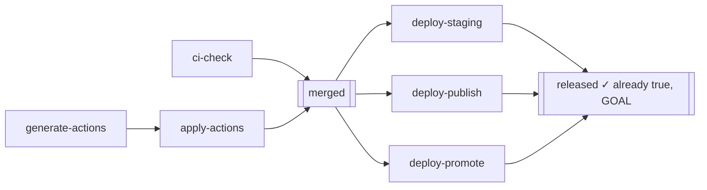
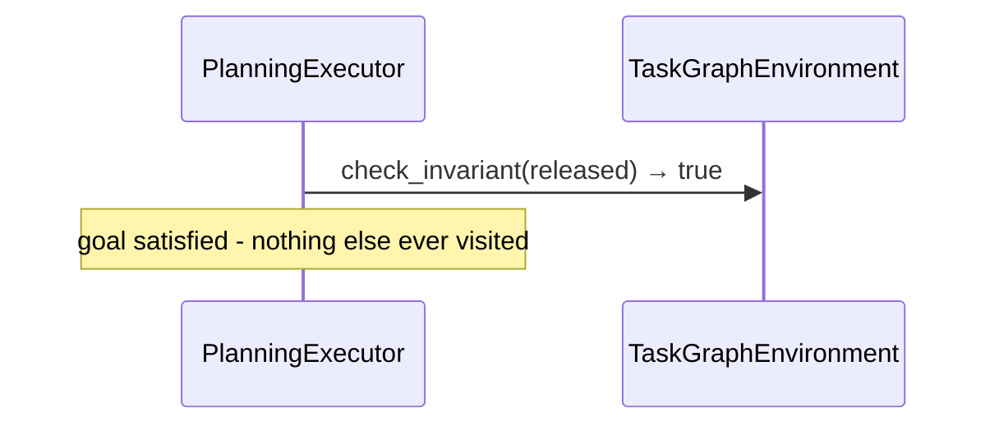
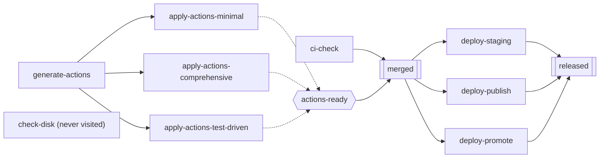

# Experiment 5: `PlanningExecutor` — Sense-Then-Plan and Goal-Directed Scope

**Run this yourself:** `task_graph_solver/tests/test_scenarios.py::TestGuardFirstVsPlanningOnPrMergeLite::test_planning_executor_skips_the_entire_chain_in_one_check` (Part A) and `TestPlanningExecutorGoalDirectedScopeOnPrMergeWithVariants` (Part B). Animations: [`planning_short_circuit.gif`](../../../task_graph_solver/animations/planning_short_circuit.gif) and [`planning_goal_directed_scope.gif`](../../../task_graph_solver/animations/planning_goal_directed_scope.gif).

## What this experiment demonstrates

`documentation/task-graph/goal-directed-planning/environment_design.md` found that two capabilities — check the whole goal-relevant graph before committing to any plan, and never touch a node outside the goal's dependency closure — fall out of one recursive function, `_ensure(node_id)`, not two mechanisms. This experiment shows both halves on the two scenarios that isolate them most cleanly.

## Part A: sense-then-plan short-circuit

Identical scenario to Experiment 4 — same override, same goal, same seed. Only the executor differs:

`PlanningExecutor` works backward from `goal="released"`. `_ensure("released")` calls `check_invariant("released")` **before ever reading `released.requires`**. It comes back `True`. Done.

| Step | Call | Result |
|---|---|---|
| 1 | `check_invariant(released)` | `True` |

That's the entire run. `result.trace == []` — zero paid attempts. `ci-check`, `generate-actions`, `apply-actions`, `merged`, and all three `deploy-*` branches appear in none of `result.satisfied`, `result.fatal`, or `result.unreachable` — not because they're unreachable in the graph-theoretic sense, but because nothing ever asked about them at all.

### The point: this is not the same saving as Experiment 4's

`GuardFirstExecutor` (Experiment 4) also reaches `released` for free — but only after walking and paying for seven other nodes to get there. `PlanningExecutor` never walks anything: because it works backward from the goal, checking it is the *first* thing that happens, not the last. This is a capability walk-as-you-go execution cannot have no matter how it's tuned — it isn't a matter of checking being cheap, it's a matter of not needing to visit the upstream chain **at all** to discover the goal is already satisfied.

## Part B: goal-directed scope and OR-group pruning

`build_pr_merge_with_variants`, unmodified (the OR-groups scenario) — chosen because it already has both a true orphan (`check-disk`) and an OR-group (`actions-ready`, three variant strategies):

| Step | Node | Event | Note |
|---|---|---|---|
| 1 | `ci-check` | check → false, attempt → PASS | on the path back from `released` |
| 2 | `generate-actions` | check → false, attempt → PASS | required by all three variants |
| 3 | `apply-actions-comprehensive` | check → false, attempt → PASS | first member tried (sorted order), satisfies the group |
| — | `apply-actions-minimal`, `apply-actions-test-driven` | **never called** | group already satisfied — recorded in `result.not_needed`, not attempted |
| 4 | `merged` | check → false, attempt → PASS | both `ci-check` and `actions-ready` now satisfied |
| 5–7 | `deploy-promote`, `deploy-publish`, `deploy-staging` | check → false, attempt → PASS each | |
| 8 | `released` | check → false, attempt → PASS | goal reached |
| — | `check-disk` | **never called** | not on any path back from `released` — never a parameter to `_ensure` at all |

`result.not_needed == {"apply-actions-minimal", "apply-actions-test-driven"}` — identical to what `AOStarExecutor` produces on the same graph (`documentation/task-graph/or-groups/`). `check-disk` is the row that differs from `AOStarExecutor`: it still gets attempted there (forward-frontier, ready from the start), but never appears in any `PlanningExecutor` result set here — not `satisfied`, not `fatal`, not `unreachable`, not `not_needed`. It simply was never asked about.

## What to watch for in the GIFs

- [`planning_short_circuit.gif`](../../../task_graph_solver/animations/planning_short_circuit.gif) — **two frames, total.** Frame 0: the whole graph white. Frame 1: only `released` turns cyan. Nothing else in the graph ever changes, because nothing else is ever visited. Contrast directly against [`guard_first_pr_merge_lite.gif`](../../../task_graph_solver/animations/guard_first_pr_merge_lite.gif)'s sixteen frames on the identical scenario.
- [`planning_goal_directed_scope.gif`](../../../task_graph_solver/animations/planning_goal_directed_scope.gif) — `check-disk` and two of the three `apply-actions-*` variants stay white for the entire animation. One honest cosmetic note: `actions-ready` (the OR-group itself) also renders as a plain white circle — it's never attempted directly (no Guard exists for a group), so it has no other status to show, and looks identical to a not-yet-touched node. Distinguishing "a group construct, never directly attemptable by design" from "a plain node nobody got to" visually is a real gap, not modeled here — `result.not_needed` and the orphan's total absence from every result set are the honest source of truth, not the render alone.

## Related experiments

- [Experiment 4: `GuardFirstExecutor` on the identical scenario](04_guard_first_pr_merge_lite.md) — walk-as-you-go, still reaches the free check, but only after paying for everything upstream of it.
- [Experiment 1: AO* solving `pr_merge_lite`](01_ao_star_pr_merge_lite.md) — the AND-composition rule `PlanningExecutor` reuses (`h(n) = own_attempts + max(h(child))`) without needing to re-derive it.
- [Experiment 6: real guards](06_real_guards_release_pipeline.md) — this exact short-circuit, backed by a real, measured wall-clock saving (2.37s vs. 0.00s) instead of a saved simulated retry count.
