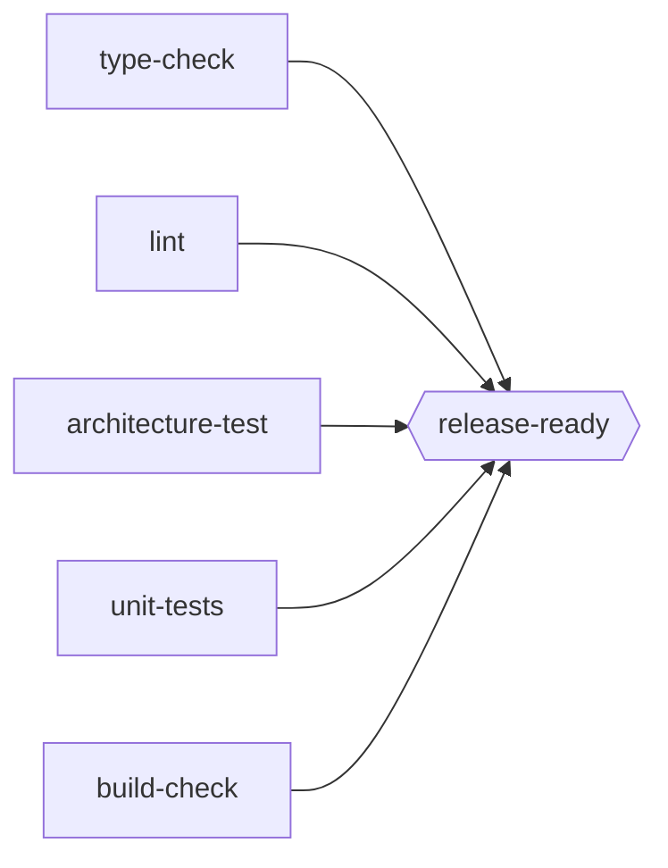
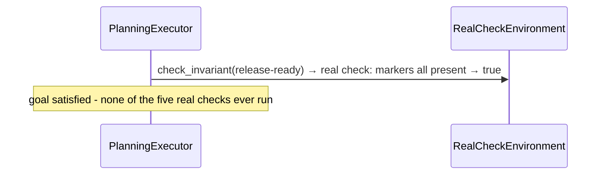

# Experiment 6: Real Guards — Same Executors, Real `mypy`/`ruff`/`pytest`/`build`

**Run this yourself:** `real_task_graph_solver/tests/test_release_pipeline.py` reproduces every run in this experiment. Animations: [`real_guards_topological_typing_broken.gif`](../../../task_graph_solver/animations/real_guards_topological_typing_broken.gif) and [`real_guards_planning_short_circuit.gif`](../../../task_graph_solver/animations/real_guards_planning_short_circuit.gif).

## What this experiment demonstrates

Every experiment before this one ran against a simulated `pass_probability` draw. This one points the exact same executors - `TopologicalExecutor` and `PlanningExecutor`, imported unmodified from `task_graph_solver.algorithms` - at `real_task_graph_solver`'s `release_pipeline` scenario: five real checks (`mypy`, `ruff`, two `pytest` invocations, `python -m build`) against a small, purpose-built example package, feeding one real AND-join, `release-ready`. Nothing here is a coin flip; every PASS or FATAL below is a real subprocess exit code. See [`documentation/task-graph/real-guards/`](../real-guards/) for the full design.

## The graph

## Part 1: `TopologicalExecutor` meets a real `mypy` failure

`typing_broken` is `clean/` with one line changed: `domain.py`'s `order_total` is annotated to return `str` but actually returns a `float`. Nothing else differs - `ruff`, both `pytest` runs, and `python -m build` all still pass for real.

| Step | Node | Real command | Outcome |
|---|---|---|---|
| 1 | `architecture-test` | `pytest tests/architecture/ -q` | PASS |
| 2 | `build-check` | `python -m build --no-isolation ...` | PASS |
| 3 | `lint` | `ruff check src/` | PASS |
| 4 | `type-check` | `mypy src/` | **FATAL** - real type error |
| 5 | `unit-tests` | `pytest tests/ --ignore=tests/architecture -q` | PASS |
| — | `release-ready` | never attempted | `type-check` is fatal, so `release-ready` lands in `unreachable`, not `fatal` - the same distinction every other executor in this repo has always drawn |

`result.success is False`; `result.fatal == {"type-check"}`; `result.satisfied` holds the other four.

### What to watch for in the GIF

Four nodes turn green in frontier order - real passes, not simulated ones. `type-check` turns red on the real `mypy` failure. `release-ready` stays gray for the entire animation: blocked by a real fatal ancestor, never attempted at all, drawn with the exact same `_blocked_by_fatal_ancestor` logic Experiment 2's D* Lite animation established (and the same logic that needed a group-aware fix for the OR-groups scenario, `documentation/task-graph/or-groups/`).

## Part 2: `PlanningExecutor`'s short-circuit, backed by a real, measured cost

`released` is `clean/` with `.status/*.ok` already present for all five checks - the toy equivalent of "this pipeline already succeeded in a previous run." `release-ready`'s own command reads those five markers rather than re-running anything (`documentation/task-graph/real-guards/scenario.md` explains why this replaced an earlier, wrong no-op design).

Measured by hand, same fixture state, same machine, same tools:

| Executor | Real checks run | Wall-clock time |
|---|---|---|
| `PlanningExecutor` | 0 | 0.00s |
| `TopologicalExecutor` | 5 | 2.37s |

This is the sharpest version of the point `documentation/task-graph/goal-directed-planning/` made with simulated data: `PlanningExecutor` checks the goal *first*, and if it's already true, nothing upstream is ever visited - not checked, not attempted. Here, "nothing upstream is visited" means real `mypy`/`ruff`/`pytest`/`python -m build` invocations that genuinely never ran, not merely a hypothetical saved retry count.

### What to watch for in the GIF

Two frames, total. Frame 0: the whole graph white. Frame 1: only `release-ready` turns cyan (a free `check_invariant()` pass, not a paid `attempt()`), captioned `check_invariant(release-ready) → true`. Nothing else in the graph ever changes, because nothing else is ever run.

## Related experiments

- [Experiment 4: `GuardFirstExecutor`](04_guard_first_pr_merge_lite.md) and [Experiment 5: `PlanningExecutor`'s sense-then-plan](05_planning_executor_sense_and_scope.md) — the simulated versions of the same two ideas this experiment validates for real. `documentation/task-graph/real-guards/algorithm_fit.md` explains why `GuardFirstExecutor` specifically doesn't get a real-world demonstration here: without a repair action, its free check and a paid attempt run the identical subprocess.
- [Experiment 2: D* Lite break/fix](02_d_star_lite_pr_merge_lite.md) — `real_task_graph_solver`'s own break/fix recovery test reuses this exact mechanism against real `mypy` calls, deliberately scoped smaller than this experiment's full pipeline; `algorithm_fit.md` explains the real limitation (a whole-tree reset wiping other checks' markers) that scoping works around.
