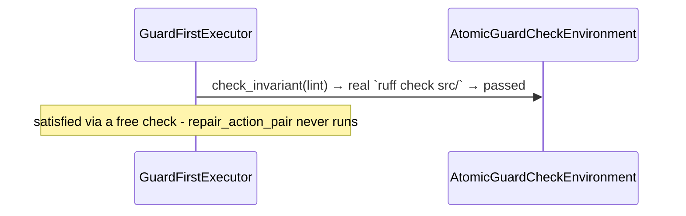

# Experiment 7: `atomicguard`-Backed Repair — `GuardFirstExecutor`'s Free Check, Finally Meaningful

**Run this yourself:** `real_task_graph_solver/atomicguard_backed/tests/test_lint_repair.py` reproduces every run in this experiment. Animations: [`atomicguard_lint_clean_free_check.gif`](../../../task_graph_solver/animations/atomicguard_lint_clean_free_check.gif) and [`atomicguard_lint_broken_real_repair.gif`](../../../task_graph_solver/animations/atomicguard_lint_broken_real_repair.gif).

## What this experiment demonstrates

Experiment 6 pointed this project's own executors at real subprocess checks, but every node there was sensing-only: no repair action existed, so `GuardFirstExecutor`'s free check and a paid `attempt()` always ran the identical command and produced the identical answer. This experiment closes that gap. `GuardFirstExecutor` - the exact same class, imported unmodified from `task_graph_solver.algorithms` - now runs against a node whose Guard is a real, production `atomicguard.ActionPair`, with a second, real `ActionPair` behind it that genuinely repairs the problem when the first one fails. See [`documentation/task-graph/atomicguard-variant/`](../atomicguard-variant/) for the full design.

## The graph

One node, deliberately: the point of this experiment is the check-then-repair mechanism itself, not a new topology - `release_pipeline`'s six-node AND-join shape is already validated in Experiment 6 and isn't re-demonstrated here.

## Part 1: the free check, backed by a real repair action that's never called

On `clean`, `lint`'s `check_action_pair` (`ruff check src/`) passes on the first try - a real, free sensor call, no side effects.

`result.success is True`; `result.satisfied == {"lint"}`; `result.free_checks == {"lint"}`; `result.trace == []`; `env.retries_spent("lint") == 0`.

### What to watch for in the GIF

One frame beyond the initial white state: `lint` turns cyan (a free `check_invariant()` win, same color convention Experiment 4/5's simulated `GuardFirstExecutor`/`PlanningExecutor` GIFs established), captioned `check_invariant(lint) → true`. Nothing else ever runs.

## Part 2: the real repair, genuinely mutating the file

`lint_broken` is `clean/` with one line changed: `domain.py` has an unused `import os` - `ruff`'s F401. `check_action_pair` genuinely fails first; only then does `GuardFirstExecutor` call `attempt("lint")`, which runs `repair_action_pair` (`ruff check --fix src/`) and re-checks.

| Step | Action | Real result |
|---|---|---|
| 1 | `check_invariant(lint)` → `ruff check src/` | fails - real F401 |
| 2 | `attempt(lint)` → `ruff check --fix src/`, then re-check | passes - the unused import is genuinely gone |

`result.success is True`; `result.satisfied == {"lint"}`; `result.free_checks == set()` (no free win this time); `env.retries_spent("lint") == 1`. Confirmed by hand, not just asserted: `domain.py`'s content contains `import os` before the run and does not contain it after - a real file mutation, not a declared pass.

### What to watch for in the GIF

Two frames beyond the initial white state: `lint` first turns red on the failed free check (captioned `check_invariant(lint) → false`), then turns green on the real repair (captioned `attempt lint → pass`) - the same red-then-green sequence a genuinely fixable node produces in any of this project's D* Lite recovery experiments, except here the "fix" is a real `ruff --fix` invocation, not a Driver call flipping a simulated probability.

## What this experiment validates that Experiment 6 alone could not

`real-guards/algorithm_fit.md` had to say, in its own words, that `GuardFirstExecutor` "gets no meaningful demonstration here, as predicted" - without a repair action, check and attempt were the same operation. This experiment is that prediction's resolution: the identical executor, unmodified, distinguishing a free win from a paid, genuinely effective repair, against real `ruff` invocations and a real file on disk.

## Related experiments

- [Experiment 4: `GuardFirstExecutor`](04_guard_first_pr_merge_lite.md) — the simulated version of the same check-then-repair idea; there, "repair" was a probability draw resetting on retry. Here it's a real `ruff --fix` call, confirmed to mutate the actual file.
- [Experiment 6: Real Guards](06_real_guards_release_pipeline.md) — the sensing-only real environment this one builds on, and the experiment whose `algorithm_fit.md` predicted `GuardFirstExecutor` would need exactly this kind of follow-up to get a meaningful demonstration.
