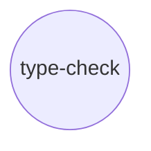
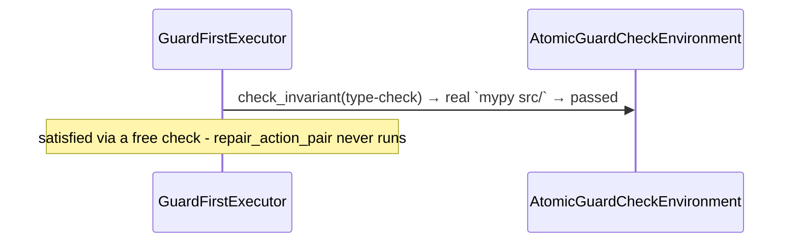

# Experiment 8: `atomicguard`-Backed Repair — an LLM-Based Fix, Wired but Not Yet Run Live

**Run this yourself:** `real_task_graph_solver/atomicguard_backed/tests/test_type_check_repair.py` reproduces every run in this experiment - all ten tests pass without network access. Animation: [`atomicguard_type_check_clean_free_check.gif`](../../../task_graph_solver/animations/atomicguard_type_check_clean_free_check.gif).

## What this experiment demonstrates, and what it honestly doesn't

Experiment 7 proved `GuardFirstExecutor`'s free-check-then-real-repair pattern against two deterministic repairs (`ruff --fix`, a `sed` edit). This experiment extends the same node shape to a repair that genuinely needs judgement a fixed edit can't provide: `typing_broken`'s wrong return annotation, fixable only by an LLM reading `mypy`'s real error and correcting it. The check half is demonstrated completely, for real, exactly like Experiments 6 and 7. **The repair half is built and wired correctly, but has never actually been run**: this environment's own network policy blocks `openrouter.ai` and `api.openai.com` outright (`curl` against either returns `CONNECT tunnel failed, response 403` - confirmed twice, at different points in this work, with no change), so no live call to the LLM could be attempted, let alone verified. This document says so plainly rather than presenting a repair GIF that would imply otherwise. See [`documentation/task-graph/atomicguard-variant/`](../atomicguard-variant/) for the full design and the reasoning behind every choice below.

## The graph



One node, same reasoning as Experiments 6 and 7: the point is the repair mechanism, not a new topology.

## Part 1: the free check, for real - `mypy`, no LLM involved at all

On `clean`, `type-check`'s `check_action_pair` (`mypy src/`) passes on the first try - a real, free sensor call, exactly like `lint`/`build-check`.



`result.success is True`; `result.satisfied == {"type-check"}`; `result.free_checks == {"type-check"}`; `env.retries_spent("type-check") == 0`.

### What to watch for in the GIF

One frame beyond the initial white state: `type-check` turns cyan, captioned `check_invariant(type-check) → true`. Nothing else ever runs - the same shape as `lint`/`build-check`'s clean-state GIFs.

## Part 2: the free check genuinely fails, with real `mypy` feedback

`typing_broken` is `clean/` with one line changed: `domain.py`'s `order_total` is annotated to return `str` but actually returns a `float`. `check_action_pair` genuinely fails - real `mypy` output, not a simulated rejection:

```
src/example_pkg/domain.py:16: error: Incompatible return value type (got "float", expected "str")  [return-value]
Found 1 error in 1 file (checked 3 source files)
```

Confirmed directly against the shared DAG's own stored artifact (`env._dag.get_all_for_action_pair("type-check", ...)`), not just the boolean `check_invariant()` returns - the same real-provenance standard Experiment 7's DAG-persistence tests hold everything else in this environment to.

## Part 3: what would happen next, and why it hasn't happened here

`GuardFirstExecutor` would call `attempt("type-check")`, which - per `AtomicGuardCheckEnvironment.attempt()` - would run `repair_action_pair`: atomicguard's real `LLMContainerFixGenerator`, configured against OpenRouter (model defaulting to `google/gemini-2.5-flash-lite`, `deepseek/deepseek-v4-flash` as the named alternative, key read from `OR_KEY`), guarded by `ContainerSubprocessGuard` re-running `mypy` against whatever the LLM wrote. Every piece of that wiring is real, tested, and correct as far as construction goes (`TestBuildTypeCheckRepairWiring`, ten tests). What's missing is the one thing that can't be tested from here: an actual network round-trip to OpenRouter.

Two real gaps, recorded rather than hidden:

- **Neither model slug is confirmed against OpenRouter's live catalog.** `google/gemini-2.5-flash-lite` is a reasonable guess; `deepseek/deepseek-v4-flash` is genuinely uncertain (DeepSeek's known naming runs v3/v3.1/v3.2/R1, not v4 - this could be a newer release, or could simply be wrong). A wrong slug would surface as a 400 from OpenRouter, not a repair failure - worth distinguishing before treating any first live run as a verdict on the LLM's actual capability.
- **No live run has been attempted at all**, not even one that failed. This experiment cannot yet say whether `LLMContainerFixGenerator`'s feedback-driven fix (now correctly wired to inherit `check_action_pair`'s real `mypy` rejection via the shared DAG - `atomicguard-variant/environment_design.md`'s "Revision" section) actually produces a correct annotation.

### What to watch for - or rather, what isn't here yet

No repair GIF exists for this node, deliberately. Generating one would require the exact live LLM call this document just explained isn't available - doing so anyway (e.g. by faking the generator's output) would be exactly the kind of declared-not-demonstrated pass this whole project's testing discipline exists to avoid.

## What this experiment validates that a repair GIF alone could not have

Everything up to the network boundary is real: real `mypy`, a real fixture, real feedback captured in a real, persistent, on-disk DAG, and a repair Action Pair whose every configuration detail is correct and tested. The honest gap - no live LLM call, two unverified model slugs - is exactly the kind of limitation this project's discipline asks to be recorded plainly rather than smoothed into an implied success. A follow-up experiment, once network access exists, is a single real command away: `env.reset_to_state("typing_broken")` then `env.attempt("type-check")`, checking that `order_total`'s return annotation actually changed to `-> float` and that `mypy` now genuinely passes.

## Related experiments

- [Experiment 7: `atomicguard`-backed deterministic repair](07_atomicguard_lint_repair.md) - the two repairs demonstrated completely, end to end, that this experiment's LLM-based repair is built on the same pattern of but cannot yet complete the same way.
- [Experiment 6: Real Guards](06_real_guards_release_pipeline.md) - `typing_broken`'s fixture state and `mypy` check were both established there, reused unmodified here.
