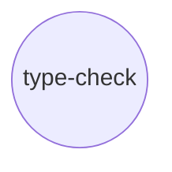
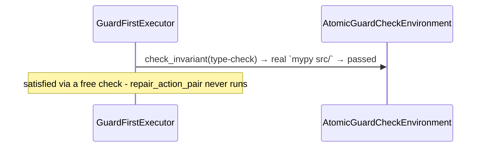
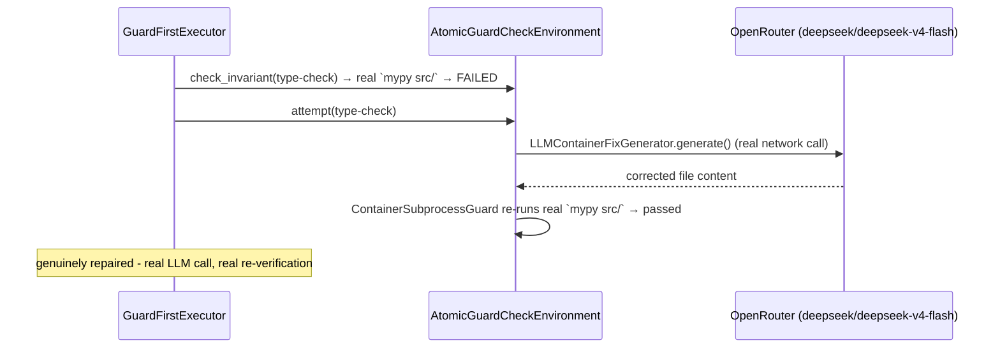

# Experiment 8: `atomicguard`-Backed Repair — a Real, Live LLM-Based Fix

**Run this yourself:** `real_task_graph_solver/atomicguard_backed/tests/test_type_check_repair.py` reproduces every run in this experiment - twelve tests pass without network access; a thirteenth (`TestLiveOpenRouterRepair`, `skipif`-gated on `OR_KEY`) reproduces the live repair itself when a real OpenRouter key is set. Animations: [`atomicguard_type_check_clean_free_check.gif`](../../../task_graph_solver/animations/atomicguard_type_check_clean_free_check.gif) and [`atomicguard_type_check_broken_real_repair.gif`](../../../task_graph_solver/animations/atomicguard_type_check_broken_real_repair.gif).

## What this experiment demonstrates, and what it found along the way

Experiment 7 proved `GuardFirstExecutor`'s free-check-then-real-repair pattern against two deterministic repairs (`ruff --fix`, a `sed` edit). This experiment extends the same node shape to a repair that genuinely needs judgement a fixed edit can't provide: `typing_broken`'s wrong return annotation, fixable only by an LLM reading `mypy`'s real error and correcting it. The check half was demonstrated completely from the start, exactly like Experiments 6 and 7. **The repair half was originally built and dry-run only to the network boundary** (an earlier sandbox's network policy blocked `openrouter.ai` outright) - **a follow-up session with real network access then ran it live**, and this document now records what actually happened: a genuine successful repair, plus two real findings a dry run could never have surfaced. See [`documentation/task-graph/atomicguard-variant/`](../atomicguard-variant/) for the full design and the reasoning behind every choice below.

## The graph



One node, same reasoning as Experiments 6 and 7: the point is the repair mechanism, not a new topology.

## Part 1: the free check, for real - `mypy`, no LLM involved at all

On `clean`, `type-check`'s `check_action_pair` (`mypy src/`) passes on the first try - a real, free sensor call, exactly like `lint`/`build-check`.



`result.success is True`; `result.satisfied == {"type-check"}`; `result.free_checks == {"type-check"}`; `env.retries_spent("type-check") == 0`.

### What to watch for in the free-check GIF

One frame beyond the initial white state: `type-check` turns cyan, captioned `check_invariant(type-check) → true`. Nothing else ever runs - the same shape as `lint`/`build-check`'s clean-state GIFs.

## Part 2: the free check genuinely fails, with real `mypy` feedback

`typing_broken` is `clean/` with one line changed: `domain.py`'s `order_total` is annotated to return `str` but actually returns a `float`. `check_action_pair` genuinely fails - real `mypy` output, not a simulated rejection:

```
src/example_pkg/domain.py:16: error: Incompatible return value type (got "float", expected "str")  [return-value]
Found 1 error in 1 file (checked 3 source files)
```

Confirmed directly against the shared DAG's own stored artifact (`env._dag.get_all_for_action_pair("type-check", ...)`), not just the boolean `check_invariant()` returns - the same real-provenance standard Experiment 7's DAG-persistence tests hold everything else in this environment to.

## Part 3: the dry run, the bug it caught, and where it used to stop

`env.attempt("type-check")` was first run against `typing_broken` with a dummy `OR_KEY` - not to fake a repair, but to exercise every real step short of a genuine LLM response. It caught a real bug on the very first call, before the network was ever reached: `PromptTemplate.render()` raises `ValueError: feedback_wrapper must be defined when feedback_history is present` unless `feedback_wrapper` is set, and since `check_action_pair`/`repair_action_pair` share one `action_pair_id`, `feedback_history` is non-empty on the repair's *first* call, always - the check's real rejection is already sitting in the shared DAG. `_REPAIR_PROMPT` had been built without `feedback_wrapper` (following `lint`/`build-check`'s empty-prompt pattern, whose `ExitCodeGuard`-based nodes never call `render()` at all - a gap that only an LLM-shaped generator would expose). Fixed with `feedback_wrapper="mypy reported this error:\n{feedback}"`; `test_repair_prompt_template_renders_with_feedback_history_present` proves it directly, without network.

At that point the earlier session's dry run reached the actual OpenRouter connection attempt cleanly and failed only there - a real network policy boundary, not a code failure. That boundary is what a later, network-capable session crossed.

## Part 4: the live repair - real, successful, and not quite what was expected

With a real `OR_KEY` and real network access, `env.attempt("type-check")` was run against `typing_broken` for real, repeatedly, against both named model candidates.

**`deepseek/deepseek-v4-flash` (now `DEFAULT_MODEL`):** succeeds consistently. `AttemptOutcome.PASS`; the real `mypy` re-check genuinely passes afterward; `env.retries_spent("type-check") == 1`; `env.time_spent("type-check")` measured **8-16s** across several runs - real LLM latency plus the mandatory re-check, an order of magnitude past `build-check`'s ~0.57s and two past `lint`'s ~0.03s (see `algorithm_fit.md`'s `time_spent` section).



**`google/gemini-2.5-flash-lite`:** also produces a plausible-looking fix, but wraps its response in a markdown code fence (```` ``` ````) that `LLMContainerFixGenerator` never strips before writing `target_path`. The written file ends with a stray closing fence - a Python syntax error - so the real `mypy` re-check fails on a syntax error rather than the original type error, and `attempt()` reports `AttemptOutcome.FATAL` (measured ~11s) despite the LLM's actual textual fix being correct. Confirmed by hand: re-running `mypy` against the exact written bytes reproduces `Invalid syntax [syntax]` at the fence line. This is a real gap in `atomicguard`'s own generator (no fence-stripping on write), not something this repo can fix - recorded here and in `core/llm_config.py`'s comment rather than quietly working around it or switching `DEFAULT_MODEL` without explanation.

**A second, independent finding: the successful repair itself is nondeterministic.** Across repeated live `deepseek` runs, `order_total`'s fix sometimes corrects the annotation:

```diff
-def order_total(unit_price: float, quantity: int) -> str:
+def order_total(unit_price: float, quantity: int) -> float:
```

and sometimes instead coerces the return value to match the (wrong) annotation:

```diff
-    return unit_price * quantity
+    return str(unit_price * quantity)
```

Both satisfy `mypy` genuinely - `check_action_pair`'s re-run is real and would pass either way - but only the first preserves `order_total`'s actual runtime behavior; the second silently changes what callers get back. Nothing in this pipeline distinguishes them: the Guard only ever asks "does `mypy` pass now?", never "does the function still do the same thing?" That's a genuine limitation of guard-based repair verification in general, not a bug specific to this node - and it's the kind of thing only a real, repeated live run could have surfaced. `TestLiveOpenRouterRepair`'s assertions were deliberately written to check the mypy-visible outcome only, not the exact diff, once this was observed.

**A third finding, this time in this repo's own code, not `atomicguard`'s or the LLM's:** the same live runs exposed a bug in `AtomicGuardCheckEnvironment._run()`. `attempt()` calls `_run()` twice on a successful repair (once for the repair, once for the mandatory re-check), and the original `_run()` wrote directly into `self._time_spent[node_id]` - so the second call silently overwrote the first, and `time_spent()` after a *successful* repair reported only the free re-check's duration. The first live run surfaced this concretely: a reported `time_spent` of `0.14s` for a call that made a real network round-trip, implausible on its face. Fixed: `_run()` now returns `(passed, elapsed)` instead of recording it directly, and `attempt()` sums both calls' durations. The `8-16s` figures above are measured after that fix.

### What to watch for in the repair GIF

Two frames: `type-check` starts red (`check_invariant(type-check) → false`, the real `mypy` failure), then turns green (`attempt(type-check) → pass`, a real, live `deepseek/deepseek-v4-flash` repair that genuinely mutated the file and passed real re-verification) - the same two-act shape as `lint`/`build-check`'s repair GIFs, this time with a real network call in the middle.

## What this experiment validates that a dry run alone could not

Everything up to the network boundary was already real: real `mypy`, a real fixture, real feedback captured in a real, persistent, on-disk DAG, a repair Action Pair whose every configuration detail was correct and tested, and a dry run that found and fixed a genuine bug (`feedback_wrapper`) no wiring test alone would have caught. Crossing that boundary for real added three more findings a dry run structurally cannot produce: a real gap in `atomicguard`'s own fence-handling (model-dependent, only visible with a real completion), a real behavioral nondeterminism in what "the LLM fixed it" can mean (only visible across repeated real runs), and a real bug in this repo's own `time_spent()` instrumentation (only visible once a real call had a real, measurable duration to lose). This project's discipline throughout has been to record what's real and what isn't rather than smoothing the gap - this experiment is that discipline applied to the moment the gap actually closed.

## Related experiments

- [Experiment 7: `atomicguard`-backed deterministic repair](07_atomicguard_lint_repair.md) - the two repairs demonstrated completely, end to end, on the same pattern this experiment's LLM-based repair now also completes.
- [Experiment 6: Real Guards](06_real_guards_release_pipeline.md) - `typing_broken`'s fixture state and `mypy` check were both established there, reused unmodified here.
