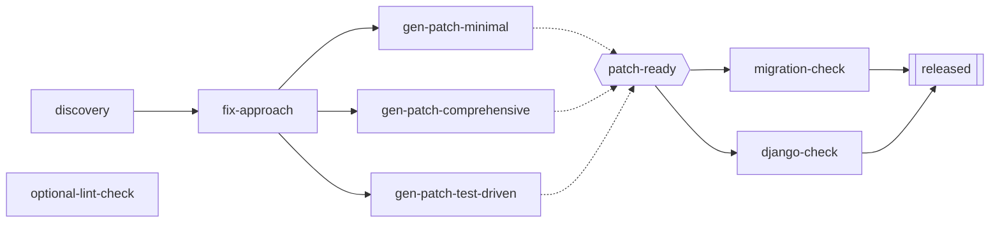

# Scenario: `fix_pr_with_variants`

## Grounded in a real proposal, not invented

`atomicguard/docs/archive/notes/2026-02-25T18-multi-path-rl-design.md` proposes, as the highest-priority fix for the real system's "single-exit corridor" problem:

> Add multiple `gen_patch` APs with genuinely different strategies... `ap_gen_patch_minimal`, `ap_gen_patch_comprehensive`, `ap_gen_patch_test_driven`, `ap_gen_patch_high_temp`... The RL agent chooses which variant to try... **Key design question**: These variants are mutually exclusive (only one needs to succeed).

This scenario is a toy-scale, faithful model of exactly that proposal — not a synthetic example invented for the occasion. Where `pr_merge_lite` modeled the real `pr_merge` workflow family, this models the real *proposed fix* to the real bottleneck those workflows hit.

## The graph

`patch-ready` (hexagon) is the OR-group — satisfied the instant any *one* of the three `gen-patch-*` variants passes. `released` (double border) is the goal, an AND-join requiring both checks, same shape convention as `pr_merge_lite`'s `merged`/`released`. `optional-lint-check` is drawn disconnected on purpose: nothing requires it, and it requires nothing — a true orphan, per `environment_design.md`'s taxonomy.

## Node table

| Node | kind | retry_flavor | requires | Role |
|---|---|---|---|---|
| `discovery` | sensing | sensing | — | Collapsed stand-in for the real system's 10 discovery APs (`pr_merge_lite` did the same collapse for `comments-resolved`/`threads-resolved`) |
| `fix-approach` | acting | generation | `discovery` | Collapsed analysis/localize/fix-approach |
| `gen-patch-minimal` | acting | repair | `fix-approach` | OR-group member: "make the smallest possible change" |
| `gen-patch-comprehensive` | acting | repair | `fix-approach` | OR-group member: "rewrite the affected function(s)" |
| `gen-patch-test-driven` | acting | repair | `fix-approach` | OR-group member: "work backward from the failing test" |
| `patch-ready` (GroupNode) | — | — | members: the three `gen-patch-*` | Satisfied by any one variant passing |
| `migration-check` | sensing | sensing | `patch-ready` | |
| `django-check` | sensing | sensing | `patch-ready` | |
| `released` (**goal**) | sensing | sensing | `migration-check`, `django-check` | AND-join, same shape as `pr_merge_lite`'s `released` |
| `optional-lint-check` | sensing | sensing | — | True orphan — nothing requires it, it requires nothing, `released` doesn't need it |

Nine attemptable nodes plus one `GroupNode` — deliberately close in size to `pr_merge_lite` (eight nodes) so it reads as a sibling scenario, not a different scale of problem.

## What this scenario is *for*

- **`patch-ready`** is the losing-OR-sibling case: whichever `gen-patch-*` variant is attempted first and passes satisfies the group; the other two variants are, from that point on, unnecessary to attempt. Whether an algorithm attempts them anyway (wasting budget) or correctly stops is exactly the distinction `algorithm_fit.md` walks through per algorithm.
- **`optional-lint-check`** is the true-orphan case: it's always safe to skip, in every run, regardless of what happens elsewhere. No algorithm needs to reason about it specially — a correct agent simply never has a reason to attempt it, since it's never on the path to `released`.
- **The `migration-check`/`django-check`/`released` tail** is unchanged AND-composition, identical in shape to `pr_merge_lite` — this scenario isn't replacing what AND-joins demonstrate, it's adding OR on top of the same foundation.

## Not decided

- **Pass probabilities per variant.** The real proposal's whole point is that variants differ in cost/reliability (a "difficulty-aware agent," per the archive note, would prefer `gen_patch_minimal` for easy bugs). This scenario's `build_fix_pr_with_variants()` should probably default the three variants to different `pass_probability`/`rmax` values rather than identical ones, so LRTA* (once extended, per `algorithm_fit.md`) has something real to distinguish. Exact numbers not chosen here.
- **Whether `optional-lint-check` should have a non-trivial guard at all**, or whether making it an always-`pass_probability=1.0` node is enough to make the point (it exists, it's harmless, it's irrelevant). Leaning toward the latter for simplicity — its role is structural, not behavioral.
