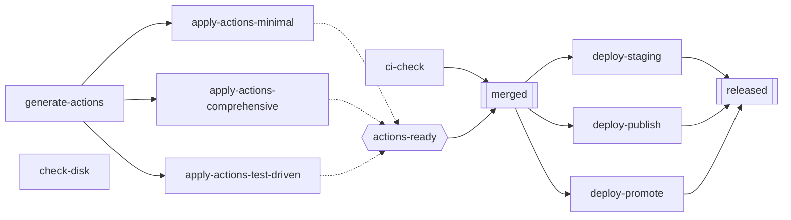

# Scenario: `pr_merge_with_variants`

## Same topology as `pr_merge_lite`, not a new domain

The first version of this document borrowed node names (`migration-check`, `django-check`) from `atomicguard/docs/archive`'s Django/SWE-Bench automated bug-fixing pipeline — a different real system from the one every other scenario in this repo is grounded in. `disk_check_lite`, `repair_packages_lite`, and `pr_merge_lite` are all modeled on the *same* `atomicguard/examples/sysadmin/workflows-guard/pr_merge/` workflow family. This scenario should be too: it's `pr_merge_lite`, unchanged, with one node split into an OR-group of variant strategies — not a different graph shape wearing a different domain's vocabulary.

The idea being borrowed — "variant APs sharing a slot, only one needs to succeed" — comes from `atomicguard/docs/archive/notes/2026-02-25T18-multi-path-rl-design.md`, proposed there for the Django pipeline's `gen_patch` AP. But `pr_merge_lite`'s *own* `README.md` already documents a real precedent for the identical idea inside the PR-merge family itself: `apply-action-list` (the current AP) replaced the older `dispatch-dev-opencode` AP as a strategy for the same role — "consumes `generate-action-list`'s structured JSON plan... instead of independently re-fetching CI results and sending them as unstructured free text." Multiple `apply-actions` strategies is a direct extension of something that's already happened once in the real workflow, not an import from elsewhere.

## The change from `pr_merge_lite`: one node becomes three

Every node keeps its exact role from `pr_merge_lite` **except** `apply-actions`, which splits into three variants — same `requires`, same `retry_flavor="repair"`, same position in the graph, just three different strategies competing for the same slot:

`actions-ready` (hexagon) is the OR-group — satisfied the instant any *one* of the three `apply-actions-*` variants passes, taking over `apply-actions`'s exact old position feeding `merged`. `merged` and `released` (double borders) are AND-joins, unchanged in shape from `pr_merge_lite`. `check-disk` is drawn disconnected on purpose — see below.

## Node table

| Node | kind | retry_flavor | requires | Changed from `pr_merge_lite`? |
|---|---|---|---|---|
| `ci-check` | sensing | sensing | — | No |
| `generate-actions` | acting | generation | — | No |
| `apply-actions-minimal` | acting | repair | `generate-actions` | New — replaces `apply-actions`, strategy: "smallest possible change" |
| `apply-actions-comprehensive` | acting | repair | `generate-actions` | New — replaces `apply-actions`, strategy: "rewrite the affected function(s)" |
| `apply-actions-test-driven` | acting | repair | `generate-actions` | New — replaces `apply-actions`, strategy: "work backward from the failing test" |
| `actions-ready` (GroupNode) | — | — | members: the three `apply-actions-*` above | New — takes over `apply-actions`'s old position in `merged`'s `requires` |
| `merged` | acting | repair | `ci-check`, `actions-ready` | `requires` now names the group instead of `apply-actions` directly; otherwise identical |
| `deploy-staging` | sensing | sensing | `merged` | No |
| `deploy-publish` | sensing | sensing | `merged` | No |
| `deploy-promote` | sensing | sensing | `merged` | No |
| `released` (**goal**) | sensing | sensing | `deploy-staging`, `deploy-publish`, `deploy-promote` | No |
| `check-disk` | sensing | sensing | — | Reused as-is from `disk_check_lite` — see below |

Eleven attemptable nodes plus one `GroupNode` — three more than `pr_merge_lite`'s eight (the variant split adds two, `check-disk` adds one more), still the same order of magnitude, still hand-verifiable.

## The two "doesn't help the goal" cases, both grounded in existing material

- **`actions-ready`'s losing siblings** — the OR-group case. Whichever `apply-actions-*` variant is attempted first and passes satisfies `actions-ready`; the other two are, from that point on, unnecessary. Whether an algorithm attempts them anyway (wasting budget) or correctly stops is exactly the distinction `algorithm_fit.md` walks through per algorithm.
- **`check-disk`** — the true-orphan case, and deliberately *not* a new invented node. It's `disk_check_lite`'s own single node, dropped into this environment unmodified: nothing in `pr_merge_with_variants` requires it, and it requires nothing. Reusing it directly demonstrates that two independent toy workflows can share one environment without interfering, using material this repo has already built and tested rather than inventing a fresh "optional lint check" concept for the occasion.

## Not decided

- **Pass probabilities per variant.** The real motivation (`atomicguard`'s "difficulty-aware agent" proposal) is that variants differ in cost/reliability. `build_pr_merge_with_variants()` should probably default the three `apply-actions-*` variants to different `pass_probability`/`rmax` values rather than identical ones, so LRTA* (once extended, per `algorithm_fit.md`) has something real to distinguish. Exact numbers not chosen here.
- **Whether `check-disk` needs any parameterization at all**, or whether reusing `disk_check_lite`'s own default (`pass_probability=0.9`, `rmax=1`) unmodified is enough — leaning toward reusing it unmodified, consistent with the "don't invent new content" fix this revision makes.
