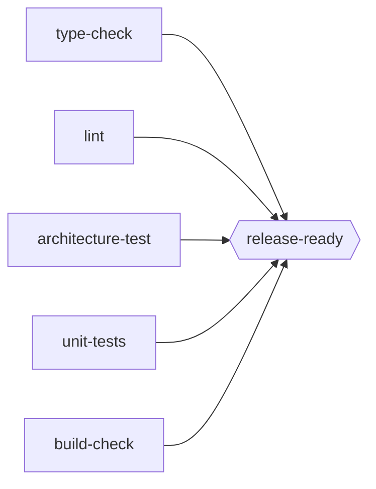

# `real_task_graph_solver`: Real Guards Against a Real Codebase

## Purpose

Every scenario in `task_graph_solver` simulates a Guard's outcome: `attempt(node_id)` draws PASS/RETRY/FATAL from a configured `pass_probability`. That's been the right choice for demonstrating AND/OR composition, repair locality, and learned cost cheaply and reproducibly — but it can't demonstrate one real thing atomicguard's own theoretical foundation is actually about: that a Guard's determinism is what makes it usable as a planning checkpoint at all (`autonomous-goal-net`'s `Bounded-Indeterminacy-Theory.md`: "G(artifact) = G(artifact) always" — no LLM calls, no random sampling, mechanical verification only). A simulated `pass_probability` is the opposite of that by construction.

`real_task_graph_solver` is a new, sibling environment: the same node/DAG/executor machinery, but a node's Guard is a **real, deterministic check run against a real, small, purpose-built example codebase** — `mypy`, `ruff`, an architecture test, a package-build check — mirroring `atomicguard`'s own `ContainerSubprocessGuard` (`infrastructure/guards/container_subprocess_guard.py`), which already "runs the command itself on every call, providing fresh sensing" rather than reading anything from an artifact. `autonomous-goal-net`'s guard-determinism hierarchy (Structural → Syntactic → Semantic tool-based → Semantic LLM-based → Heuristic, `Bounded-Indeterminacy-Theory.md`) is the concrete taxonomy this environment's checks are drawn from — this first cut sticks to the first three (fully deterministic) tiers; the fourth (LLM-based) only becomes relevant once repair exists (see "What comes after this document," below).

**Scope, stated up front:** this document specifies **sensing only**. There is no repair action in this environment yet — every node's Guard either already passes or doesn't; nothing here attempts to fix anything. That's a deliberate, sequenced choice, not an oversight: the next phase (explicitly not started here) is giving the DS-PDDL Action Pair's nondeterministic half — the Generator — something real to do, using this environment's checks as its Guards. Building that requires this environment to exist, be documented, and be running correctly first.

## What sensing-only costs us, and what it gives us instead

Working through this before writing any code, one thing falls out immediately: `GuardFirstExecutor`'s specific capability — check for free before paying for a repair — has nothing to demonstrate here. Without a repair action, `check_invariant()` and `attempt()` would run the identical subprocess and get the identical answer, every time; that's not a limitation of this environment, it's what "deterministic Guard" *means*. `GuardFirstExecutor` isn't a good fit for this scenario, and that's fine — not every executor needs a demonstration on every environment (`AOStarExecutor` doesn't get one from `disk_check_lite` either).

What replaces it as the interesting new thing: **real cost**. A simulated node's cost was an abstract retry count; a real node's cost is however long `mypy`/`pytest`/an architecture-test suite actually takes to run. That's the actual, honest reason `autonomous-goal-net`'s `SequentialGuard` cascades cheap-to-expensive (structural/syntactic checks first, tool-based checks after, LLM-based checks last) — a reason the simulated environment could never really justify, since every simulated attempt cost the same abstract "1." `PlanningExecutor`'s goal-directed short-circuit is the one capability that *does* carry over meaningfully unchanged: if the goal node's check already passes, none of the other checks ever need to run at all — a real, measurable saving (real seconds not spent running `pytest`), not just a hypothetical one.

## Environment Analysis

| Element | Description |
|---|---|
| **Performance** | Discover which real checks currently pass/fail against a target codebase, as cheaply (in wall-clock time) as possible |
| **Environment** | A small, purpose-built example Python package with deliberately manufacturable failure states, checked into this repo as fixtures |
| **Actuators** | Run a real check (subprocess) against the codebase's current working-tree state; reset the working tree to a named fixture state (Driver-only, not an agent action) |
| **Sensors** | Real exit code / structured pass-fail per check, wall-clock time taken |

## Environment properties

| Property | Value | Why |
|---|---|---|
| **Topology** | Known and fixed | The DAG of checks is declared up front, same as every `task_graph_solver` scenario |
| **Outcomes** | **Deterministic**, not stochastic | The entire point of this environment - contrast with `task_graph_solver`'s seeded `pass_probability` draws, see comparison table below |
| **Static vs. dynamic** | Dynamic via `reset_to_state()` | The Driver hook here isn't `break_task`/`fix_task` acting on one node's probability - it's swapping which fixture state the whole working tree currently reflects. `break_task(node_id)`/`fix_task(node_id)` are kept as thin convenience wrappers over this, for interface parity with `DStarLiteExecutor` |
| **Sequential** | Yes | Wall-clock cost accumulates across a run, same role retry cost played before |
| **Discrete** | Yes | A fixed, small set of checks and a fixed, small set of manufactured states |

## Core primitives

### The example package: small, real, purpose-built

Not a real open-source repo — that would make the DAG large and impossible to hand-verify, the opposite of every scenario built so far (`disk_check_lite` is one node on purpose). A minimal package instead, small enough to read in full:

```
real_task_graph_solver/fixtures/example_pkg/
├── clean/                    # baseline: every check passes
│   ├── pyproject.toml
│   ├── src/example_pkg/
│   │   ├── __init__.py
│   │   ├── domain.py         # pure domain logic, no infrastructure imports
│   │   └── infrastructure.py # the thing domain.py must never import
│   └── tests/
│       ├── test_domain.py
│       └── architecture/
│           └── test_layering.py   # domain-never-imports-infrastructure, ported near-verbatim from atomicguard's own G10 example (Bounded-Indeterminacy-Theory.md)
├── typing_broken/             # one function's return type contradicts its body
├── lint_broken/               # one real ruff violation (e.g. an unused import)
├── architecture_broken/       # domain.py imports infrastructure.py - the exact violation test_layering.py exists to catch
└── publish_broken/            # pyproject.toml missing required build metadata - `python -m build` fails for real
```

Each state directory is a **complete, independent copy** of the package, not a diff/overlay against `clean/` — simpler to reason about, trivially resettable (`reset_to_state` is always "wipe the scratch dir, copy one directory in," never a merge), and matches `disk_check_lite`'s "smallest thing that demonstrates the point" ethos scaled up just enough to have more than one distinguishable failure mode. Exactly one thing is broken per state, mirroring how `pr_merge_lite`'s D* Lite experiments (`documentation/task-graph/experiments/02_d_star_lite_pr_merge_lite.md`) also only ever break one node at a time — not a limitation being worked around, a deliberate scope match to established precedent.

### The DAG: five real checks, one release gate



| Node | Real command | Manufactured failure |
|---|---|---|
| `type-check` | `mypy src/` | `typing_broken` |
| `lint` | `ruff check src/` | `lint_broken` |
| `architecture-test` | `pytest tests/architecture/` | `architecture_broken` |
| `unit-tests` | `pytest tests/ --ignore=tests/architecture` | (none manufactured yet - always passes in every state; see "Not decided") |
| `build-check` | `python -m build --no-isolation --sdist --wheel` | `publish_broken` |
| `release-ready` (**goal**) | see below | Never independently fails; satisfied once all five above are |

**Revised while implementing this, worth recording rather than silently fixing:** the first draft gave `release-ready` a literal no-op command (`["true"]`), reasoning it was a pure aggregation gate the same way GitHub branch protection's "require status checks" has no independent check of its own. That's wrong in one important way this document didn't catch until writing the code: `PlanningExecutor` calls `check_invariant("release-ready")` *before* ever reading its `requires` - with a command that's unconditionally `true`, that call would *always* return `True`, regardless of whether the other five checks actually pass, making `PlanningExecutor` report success without ever running a single real check. A vacuously-true goal breaks the one capability this environment exists to validate honestly.

The fix: each of the five leaf checks now runs as `<real check> && mkdir -p .status && touch .status/<name>.ok` - a marker file, written only on real success - and `release-ready`'s own command is `test -f .status/type-check.ok && test -f .status/lint.ok && ...`, genuinely reading whether the other five have actually, recently succeeded rather than re-deriving or assuming it. This is the real GitHub-branch-protection mechanism, precisely: the check is a query against *stored* status, not a live re-verification - branch protection doesn't re-run your test suite either, it reads the result CI already reported.

Five independent checks feeding one AND-join is deliberately the same shape as `pr_merge_lite`'s `released` (three independent branches feeding one join) — reusing an already-validated composition pattern rather than inventing a new graph shape for this environment too.

**A second fixture state beyond the five in the table above:** `released/` — `clean/` with `.status/*.ok` already present for all five checks, the toy equivalent of "this pipeline already succeeded in a previous run." This is what actually lets `PlanningExecutor`'s short-circuit be demonstrated for real: `check_invariant("release-ready")` reads the five existing markers, returns `True` immediately, and none of the five real checks ever run - a genuine, measurable saved cost (real seconds of `mypy`/`pytest`/`python -m build` not spent), not a hypothetical one.

**A real limitation this surfaced, not worked around:** `reset_to_state` (and therefore `break_task`/`fix_task`, both thin wrappers over it) swaps the *entire* working tree, which wipes every node's marker, not just the one node actually being broken or fixed. A `DStarLiteExecutor` run that breaks and fixes one check *after* other checks have already passed and marked themselves done would find those markers gone too - not because those checks became unsatisfied, but because the reset mechanism has no way to touch only the one thing that changed. `DStarLiteExecutor`'s own in-memory `satisfied`/`fatal` bookkeeping is unaffected (it never re-attempts a node it already believes is done, regardless of what the filesystem currently shows) - but `release-ready`'s marker-based gate would then, incorrectly, still report failure. Demonstrating break/fix recovery on this scenario therefore deliberately uses a smaller subgraph without `release-ready` in it, rather than overclaiming recovery all the way to the goal. A more surgical `reset_to_state` (touching only the files relevant to one manufactured state, not swapping the whole tree) would fix this properly; not attempted here, since it trades away the "always a complete, independent directory per state" simplicity this document chose deliberately.

### `RealCheckNode` — deliberately smaller than `TaskNode`

```python
@dataclass
class RealCheckNode:
    """A real, deterministic Guard: a command run against the environment's
    current working tree. No pass_probability - a real check has no
    probability, it has an answer. No rmax/r_patience/retry_flavor either:
    those exist to bound and classify RETRY, and nothing in this
    environment ever retries - a deterministic check run twice without an
    intervening repair gives the same answer both times. All three return
    when repair exists (see "What comes after this document").

    Attributes:
        id: Unique identifier within a RealCheckEnvironment.
        command: Argv to run, e.g. ("mypy", "src/") - executed with cwd set
            to the environment's current working tree.
        requires: AND-dependencies, identical semantics to TaskNode's.
    """
    id: str
    command: Tuple[str, ...]
    requires: Tuple[str, ...] = ()
```

No `GroupNode` equivalent yet either - nothing in this first graph needs an OR-choice, and inventing one before a concrete scenario needs it would be building ahead of a real question, the same reasoning `task_graph_solver/environment_design.md` originally gave for not having OR-groups until `or-groups/` had a concrete reason to add them.

### `RealCheckEnvironment`

```python
class RealCheckEnvironment:
    """Same public shape as TaskGraphEnvironment - ready_nodes(), attempt(),
    check_invariant(), retries_spent(), break_task()/fix_task(),
    drain_changed_tasks(), is_goal_reached() - so TopologicalExecutor,
    AOStarExecutor, DStarLiteExecutor, and PlanningExecutor all run against
    this environment with ZERO code changes. Proving that is a real goal of
    this design, not an incidental convenience: none of those executors
    were ever actually coupled to simulated outcomes, only to this
    interface - GuardFirstExecutor is the one exception, see above.

    New, not present on TaskGraphEnvironment:
        reset_to_state(state_name): wipe the scratch working tree, copy
            fixtures/example_pkg/{state_name}/ into it. The environment's
            equivalent of TaskGraphConfig's seed - the thing that makes a
            run reproducible, called before a run starts (or mid-run, for
            a DStarLiteExecutor-style break/fix story).
        time_spent(node_id): wall-clock seconds the real command took, the
            last time it was run. Pure instrumentation, alongside
            retries_spent() rather than replacing it - see "Resolved",
            below.
    """
```

`attempt(node_id)`: runs `node.command` via `subprocess.run(cwd=self._workdir)`, records elapsed time, returns `PASS` if exit code `0` else `FATAL` — never `RETRY`, since nothing between one attempt and the next could change the answer. `check_invariant(node_id)`: the identical check, without recording to `trace` — kept for interface parity and because `PlanningExecutor` gets real, non-redundant value from it (checking `release-ready` first and skipping every upstream check if it already passes is a genuine saved cost); calling it from `GuardFirstExecutor` would just run the same subprocess twice in a row, which is harmless but not illuminating.

`break_task(node_id)` / `fix_task(node_id)`: thin wrappers — `break_task("type-check")` calls `reset_to_state("typing_broken")`; `fix_task(node_id)` calls `reset_to_state("clean")`. `drain_changed_tasks()` is unchanged in spirit: it reports which nodes' underlying state changed since it was last called, populated whenever `reset_to_state` runs.

## Comparison: `task_graph_solver` vs. `real_task_graph_solver`

| | `task_graph_solver` | `real_task_graph_solver` |
|---|---|---|
| Guard outcome source | Seeded draw from `pass_probability` | Real subprocess exit code |
| Cost model | Abstract retry count | Wall-clock seconds (`time_spent`), alongside a still-present but now-trivial retry count |
| Exogenous change | `break_task`/`fix_task` flip one node's outcome | `reset_to_state` swaps the whole working tree; `break_task`/`fix_task` are convenience wrappers over it |
| Repair | Modeled as repeated `attempt()` calls against the same `pass_probability` | Out of scope for this document - see below |
| `GuardFirstExecutor`'s free-check capability | Meaningful (a node can be pre-satisfied) | Not meaningful (check and attempt are the same operation without repair) |
| `PlanningExecutor`'s short-circuit | Meaningful | Still meaningful, and for the first time backed by a real, spent-or-not-spent cost |

## What comes after this document

Explicitly not started here, named so this document doesn't read as a dead end. Checked against `atomicguard`'s own formal notation (`docs/masters_report/chapters/appendix_b_notation.tex`) once this design was written: `RealCheckNode` is not a competing abstraction to the Dual-State Agent's Action Pair, it's a strict subset of one — specifically the `a_guard_eff` slot alone (a post-effector Guard sensing `W` directly), with `a_gen` and `a_eff` both absent, since there's nothing to generate yet. `S_workflow = {σ : G → {⊥,⊤}}` is exactly this environment's `satisfied: Set[str]`.

Two more phases follow, in this order, and deliberately not combined into one:

1. **A second, independent example variant that actually depends on `atomicguard`** — same fixture package, same DAG, same manufactured states, but driven by `atomicguard`'s real `ActionPairInterface`/`GuardInterface`/`EffectorInterface` (reusing `ContainerSubprocessGuard` directly rather than a bespoke `RealCheckNode.command` runner) instead of this document's own minimal classes. This is where repair actually gets built — giving the Action Pair's Generator something real to do, on a real `FATAL`, using this environment's checks as its Guards. Building that on top of `atomicguard`'s existing `ActionPair.execute()` four-phase transaction, `RetryBudgetTracker`, and `Idempotency` handling avoids re-deriving all of that as a second bespoke implementation only to end up wanting the real thing anyway — this document's own environment stays the cheap, independent, sensing-only baseline; the `atomicguard`-backed variant is where the nondeterministic half lives. `atomicguard` becomes an actual dependency for that variant, not just a repo read for reference, which is new for this project and worth its own line in that variant's design doc when it's written.
2. Once that variant exists, `rmax`/`r_patience` (a repair attempt genuinely can differ from the last one), `retry_flavor="repair"` (so `LRTAStarLearner` has something real to learn a cost for), and `GuardFirstExecutor`'s free-check capability (repair now has a real cost worth skipping) all become meaningful again — none of that is designed here, deliberately; this document is just the sensing half, built to be solid on its own before anything nondeterministic is added on top of it.

## Not decided

- **`unit-tests` has no manufactured failure state yet.** Every fixture state that isn't `clean` breaks exactly one of the other four checks; `unit-tests` passes in all of them. Worth a fifth broken state (a genuinely failing test) once the fixture package is actually being built, or worth leaving as the one check that's always green as a deliberate contrast - not decided here.
- **Whether `time_spent()` should feed into `AOStarExecutor`'s `h` composition at all**, or stay purely separate instrumentation reported alongside it. Leaning toward *separate* - keeping `retries_spent()` as the thing `_compose_cost` reads means `AOStarExecutor` needs zero code changes to run against this environment (the stated goal above), and `time_spent()` becoming real, additional, reportable data is enough of a new thing on its own without also changing what `h` means.
- **Exact `mypy`/`ruff`/`pytest` invocation flags and Python version pinning** for the example package - left to whoever writes the fixtures, not a design-level decision.
- **Whether `real_task_graph_solver` is the final name** for the new top-level folder, or something else once the code exists and a better name suggests itself - matches this project's own history of renaming a scenario mid-design when a clearer name showed up (`fix_pr_with_variants` → `pr_merge_with_variants`).
- **Name and location for the `atomicguard`-backed second variant** ("What comes after this document," above) - not decided here, since it doesn't exist yet. Its own design doc should get written once this environment is solid, not bundled into this one.
