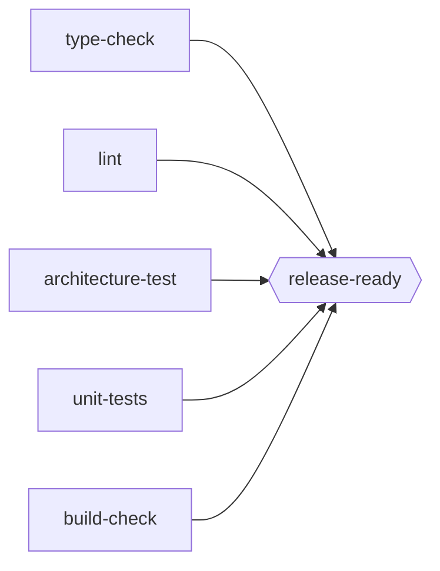

# Scenario: `release_pipeline`

## The graph: five real checks, one release gate

| Node | Real command | Manufactured failure |
|---|---|---|
| `type-check` | `mypy src/` | `typing_broken` |
| `lint` | `ruff check src/` | `lint_broken` |
| `architecture-test` | `pytest tests/architecture/` | `architecture_broken` |
| `unit-tests` | `pytest tests/ --ignore=tests/architecture` | (none manufactured yet) |
| `build-check` | `python -m build --no-isolation --sdist --wheel` | `publish_broken` |
| `release-ready` (**goal**) | reads five `.status/*.ok` markers | never independently fails |

Each of the five leaf checks actually runs as `<check> && mkdir -p .status && touch .status/<name>.ok` - a marker written only on real success. `release-ready`'s own command is `test -f .status/type-check.ok && test -f .status/lint.ok && ...` - it genuinely reads whether the other five have already, recently succeeded, rather than re-deriving or (worse) assuming it. See `environment_design.md`'s "revised while implementing this" note for why a plain no-op command was tried first and rejected.

Five independent checks feeding one AND-join is the same shape as `pr_merge_lite`'s `released` (three branches feeding one join) - a validated composition pattern, not a new graph shape invented for this environment.

## The example package

`real_task_graph_solver/fixtures/example_pkg/` - a minimal package with a `domain.py`/`infrastructure.py` split (the layering rule `architecture-test` exists to check, ported near-verbatim from `atomicguard`'s own G10 example), one pytest-covered function, and a `pyproject.toml` real enough for `python -m build` to actually succeed or fail on.

## Six fixture states, one thing broken per state

| State | What differs from `clean/` |
|---|---|
| `clean` | Baseline - every check passes |
| `typing_broken` | `domain.py`'s `order_total` is annotated to return `str` but returns a `float` - a pure static-analysis error. Runtime behavior (and `unit-tests`) is unaffected, since Python never enforces return annotations - only `mypy` catches it |
| `lint_broken` | `domain.py` has one unused import (`os`) - `ruff`'s F401, nothing else |
| `architecture_broken` | `domain.py` imports and calls `infrastructure.save_order` directly - correctly typed, correctly used (so `mypy`/`ruff` both stay clean), but a real layering violation `architecture-test` exists to catch |
| `publish_broken` | `pyproject.toml` has no `version` field and no `dynamic = ["version"]` - `hatchling`'s `build_sdist` fails `validate_fields()` for real; nothing else in the file changes, so `mypy`/`ruff`/`pytest` are unaffected |
| `released` | `clean/` plus `.status/*.ok` already present for all five checks - the toy equivalent of "this pipeline already succeeded in a previous run" |

Each state is a **complete, independent copy** of the package, not a diff/overlay against `clean/` - `reset_to_state` is always "wipe the scratch dir, copy one directory in," never a merge. Verified by hand before writing any Python: each broken state was run through all five real checks and confirmed to fail exactly its one named check, with the other four (and `unit-tests`, always) passing.

## Not decided

- **`unit-tests` has no manufactured failure state.** Carried over unresolved from `environment_design.md` - worth a seventh state (a genuinely failing test) if a future demonstration needs one, or worth leaving as the one check that's always green as a deliberate contrast.
- **Whether `released` needs a sibling "partially released" state** (some but not all markers present) to demonstrate a case between "nothing done" and "everything done." Not needed for the executors demonstrated in `algorithm_fit.md` - `PlanningExecutor`'s short-circuit only needs the all-or-nothing case to make its point.
